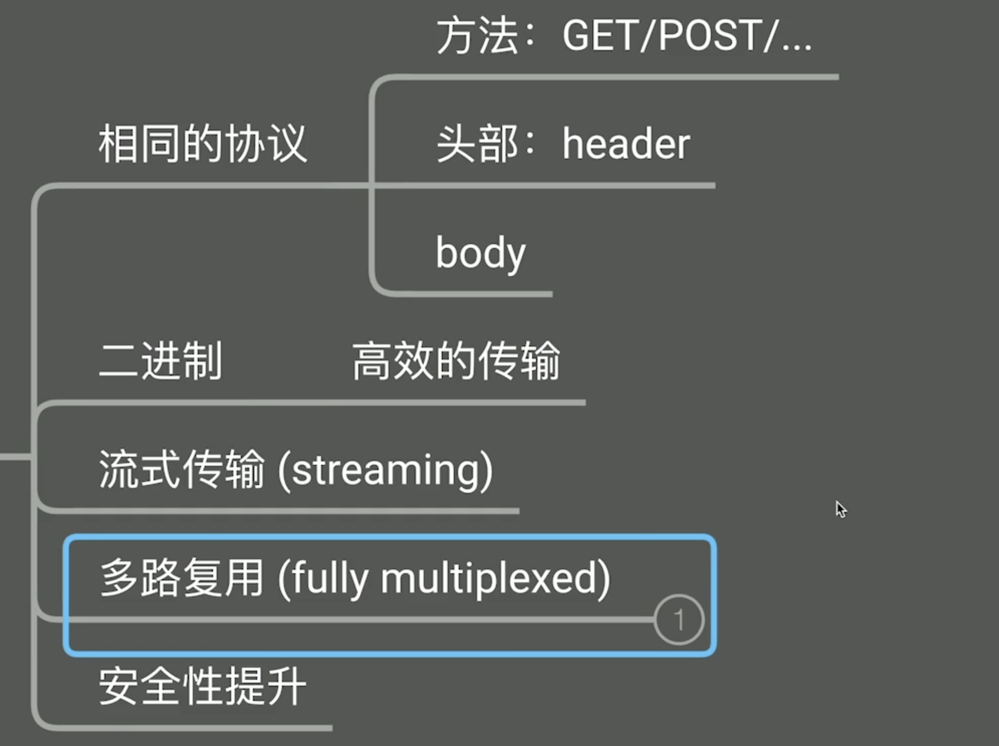
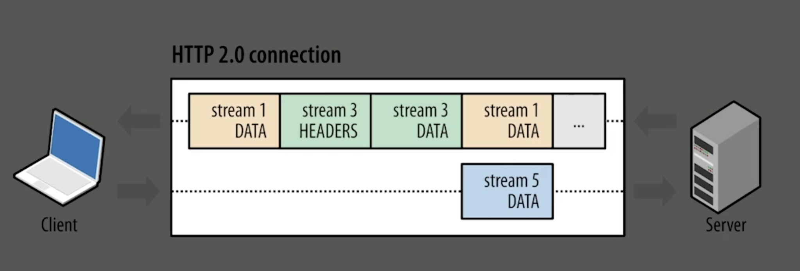
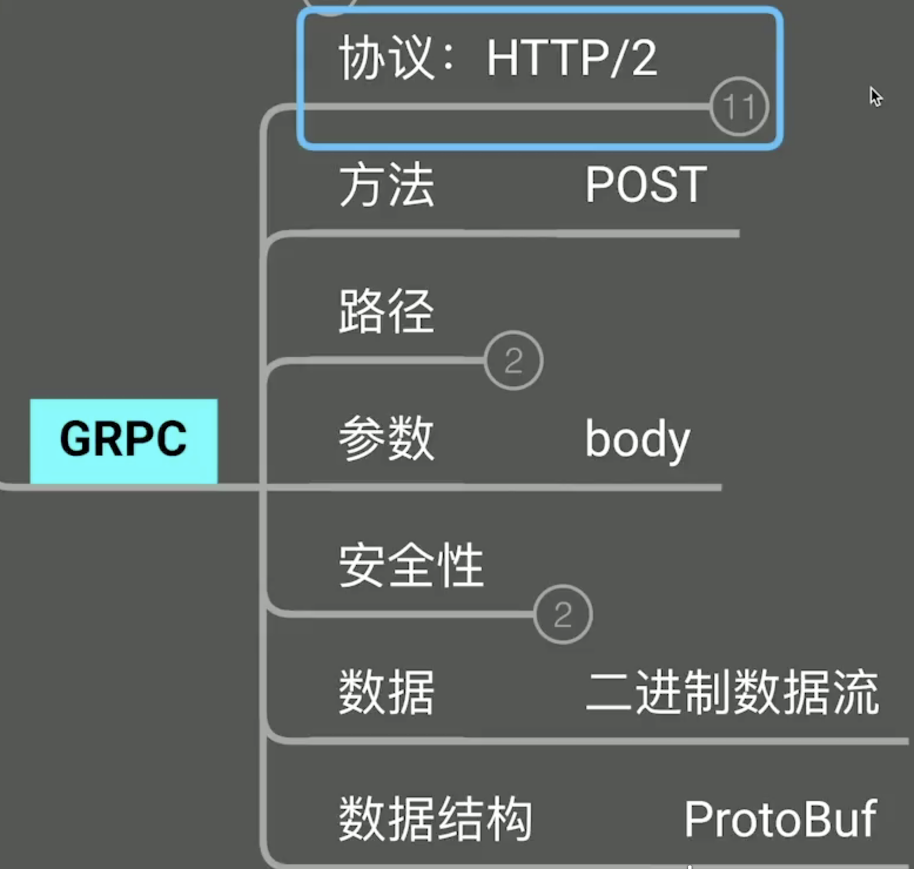

# GRPC 简介

传统的服务之间通信方式REST需要指定各种规范：
- 协议(HTTP)
- 服务器地址(HTTPS://api.test.com)
- 路径(/api)
- 参数
- 数据类型
- 数据编码(JSON)
- 安全性(Header with token)
- 错误处理(HTTP status)

可以看出来我们发一个请求非常复杂，这些数据一旦出错请求就会失败，GRPC就是解决这个问题的。


## HTTP1与HTTP2区别



首先HTTP1与HTTP2有相同的协议，包括方法，头部，body，这是他们的相同点。

不同之处在于，HTTP2采用二进制数据传输，传输效率更高。

另外，HTTP2采用流式传输，HTTP1的请求服务器需要把这个请求所有的数据和头部都生成完成然后再返回给客户端，这期间的时间就浪费了。但流式传输就不同了，采用流式传输的服务器生成多少数据就返回给客户端多少数据，服务器一边在生成数据，客户端一边在渲染，这样速度就快很多。

再者，HTTP2采用多路复用机制，HTTP1对没个请求都会创建一个连接，建连接需要TCP三次握手，这是一个耗时的操作，下图是官方的图片，stream1，stream3，stream5是三个请求，这三个请求在共用这个连接。

虽然HTTP1也可以共用连接，但是HTTP1无法复用连接，就像图中的例子，请求1（stream1）在这个连接上发送，请求3（stream3）不能在这个连接上发送，必须等待请求1返回后才能发请求3。



## GRPC 特性



- GRPC基于HTTP2协议

  GRPC调用和参数都是通过HTTP2进行编码

- 请求方法

  GRPC请求方法都是POST

- 请求路径
   
  请求路径格式是：/service/method，比如说：/TripService/GetTrip，路径的定义规范与HTTP截然不同，这里采用的是动词而非名词。

- 参数

  请求参数还是放在body中

- 安全性

  连接层面的安全性主要靠HTTP2协议，而应用层的安全性比如用户的token放到header中。

- 数据传输

  数据传输采用二进制数据流，真正传输的数据会以二进制的形式放到body中。

  ::: tip 提示
  HTTP2是二进制传输并不一定说明它的body也是二进制数据，真正传输什么类型的数据是由应用层决定的，HTTP2的二进制传输是指方法，头部等编码是二进制编码，但是真正的body数据有应用层决定，可以理解为给什么传什么，它不会把给的文本转二进制。而GRPC body中的数据存放的是二进制数据。
  :::  
  
- 二进制数据如何编码

GRPC二进制数据如何编码？使用ProtoBuf


## GRPC优点

- 高效数据传输
  
- 语言无关的领域模型定义

  二进制数据里的字段和值需要一个语言无关的领域模型定义，一个字段是整数，那它到底是32位的还是64位的呢？占用多大空间呢？大端在前还是小端在前呢？这些都是由ProtoBuf统管的。

其他领域模型定义DSL/IDL:
- Thrift
  
  facebook推出的二进制传输数据框架
  
- Swagger
  
  使用YAML描述REST API，相当于对JSON数据结构进行了规定
  
- Goa

  使用Go语言描述，通过Goa工具生成真正可以运行的代码，可以生成其他语言的代码，甚至可以生成Swagger和GRPC

## ProtoBuf

我们定义一个message，并且给字段加上编号，字段名最好表义清楚，例如下面的 duration_sec 和 fee_cent：

```protobuf
message Trip {
    string start = 1;
    string end = 2;
    int64 duration_sec = 3; // 定义变量时最好说明类型，这里duration就是second
    int64 fee_cent = 4;
}
```

定义生成文件路径，位置是 coolcar/proto/gen/go，包的名字叫 trippb：

```sh
option go_package="coolcar/proto/gen/go;trippb";
```

通过命令生成 Go 代码：

```sh
protoc -I=. --go_out=paths=source_relative:gen/go trip.proto
```

生成 Go 语言的 Trip 结构体：

```protobuf
type Trip struct {
	Start                string   `protobuf:"bytes,1,opt,name=start,proto3" json:"start,omitempty"`
	End                  string   `protobuf:"bytes,2,opt,name=end,proto3" json:"end,omitempty"`
	DurationSec          int64    `protobuf:"varint,3,opt,name=duration_sec,json=durationSec,proto3" json:"duration_sec,omitempty"`
	FeeCent              int64    `protobuf:"varint,4,opt,name=fee_cent,json=feeCent,proto3" json:"fee_cent,omitempty"`
	XXX_NoUnkeyedLiteral struct{} `json:"-"`
	XXX_unrecognized     []byte   `json:"-"`
	XXX_sizecache        int32    `json:"-"`
}
```

对这个结构体转换为二进制流，下面相当于模拟了客户端和服务器对二进制流的处理，服务器将 message 编码为二进制流（即：0a03616263120364656618901c20904e）发到网络上，客户端拿到二进制流解码为 ProtoBuf 的 message：

```go
    trip := trippb.Trip{
		Start:       "abc",
		End:         "def",
		DurationSec: 3600,
		FeeCent:     10000,
	}
	fmt.Println(&trip) // start:"abc" end:"def" duration_sec:3600 fee_cent:10000 

	// 序列化二进制流
	b, _ := proto.Marshal(&trip) 
	fmt.Printf("%x\n", b) // 0a03616263120364656618901c20904e

	// 将二进制流转换为message
	var trip2 trippb.Trip
	_ = proto.Unmarshal(b, &trip2)
	fmt.Println(&trip2) // start:"abc" end:"def" duration_sec:3600 fee_cent:10000 
```

当然我们也可以编码成 json 格式数据：

```go
    b, _ = json.Marshal(&trip2)
	fmt.Printf("%s\n", b) // {"start":"abc","end":"def","duration_sec":3600,"fee_cent":10000}
```

**复合类型：**

假设我们在上面 Trip 基础上加新的字段，由于我们的数据是以二进制流传输的，我们为字段加上序号就不用担心字段在二进制流中的顺序问题了，它是按照序号排的。

另外，对于已经上线的一个版本我们新加字段时不能随意修改序号，否则会导致字段顺序改变，我们要加字段需要序号往上加。

我们新增两个复合类型和 repeated 字段，序号是递增的，

```protobuf
message Location {
    double latitude = 1;
    double longitude = 2;
}

message Trip {
    string start = 1;
    Location start_pos = 5; // 复合类型
    repeated Location path_locations = 7; // repeated字段
    string end = 2;
    Location end_pos = 6; // 复合类型
    int64 duration_sec = 3; 
    int64 fee_cent = 4;
}
```

生成Go代码，repeated 字段被翻译成了切片类型：

```go
type Location struct {
	Latitude             float64  `protobuf:"fixed64,1,opt,name=latitude,proto3" json:"latitude,omitempty"`
	Longitude            float64  `protobuf:"fixed64,2,opt,name=longitude,proto3" json:"longitude,omitempty"`
	XXX_NoUnkeyedLiteral struct{} `json:"-"`
	XXX_unrecognized     []byte   `json:"-"`
	XXX_sizecache        int32    `json:"-"`
}

type Trip struct {
	Start                string      `protobuf:"bytes,1,opt,name=start,proto3" json:"start,omitempty"`
	StartPos             *Location   `protobuf:"bytes,5,opt,name=start_pos,json=startPos,proto3" json:"start_pos,omitempty"`
	PathLocations        []*Location `protobuf:"bytes,7,rep,name=path_locations,json=pathLocations,proto3" json:"path_locations,omitempty"`
	End                  string      `protobuf:"bytes,2,opt,name=end,proto3" json:"end,omitempty"`
	EndPos               *Location   `protobuf:"bytes,6,opt,name=end_pos,json=endPos,proto3" json:"end_pos,omitempty"`
	DurationSec          int64       `protobuf:"varint,3,opt,name=duration_sec,json=durationSec,proto3" json:"duration_sec,omitempty"`
	FeeCent              int64       `protobuf:"varint,4,opt,name=fee_cent,json=feeCent,proto3" json:"fee_cent,omitempty"`
	XXX_NoUnkeyedLiteral struct{}    `json:"-"`
	XXX_unrecognized     []byte      `json:"-"`
	XXX_sizecache        int32       `json:"-"`
}
```


**枚举类型：**

定义枚举类型 TripStatus：

```protobuf
enum TripStatus {
    TS_NOT_SPECIFIED = 0;
    NOT_STARTED = 1;
    IN_PROGRESS = 2;
    FINISHED = 3;
    PAID = 4;
}

message Trip {
    string start = 1;
    Location start_pos = 5;
    repeated Location path_locations = 7;
    string end = 2;
    Location end_pos = 6;
    int64 duration_sec = 3; 
    int64 fee_cent = 4;
    TripStatus status = 8; // 枚举类型
}
```

生成Go代码：

```go
type TripStatus int32

const (
	TripStatus_TS_NOT_SPECIFIED TripStatus = 0
	TripStatus_NOT_STARTED      TripStatus = 1
	TripStatus_IN_PROGRESS      TripStatus = 2
	TripStatus_FINISHED         TripStatus = 3
	TripStatus_PAID             TripStatus = 4
)
```


**字段可选性：**

前端有小程序，网页，手机端，后端也有很多微服务，当系统部分上线后新老系统之间的数据交互怎么解决？

我们要增加一个 TripStatus 字段，只有部分系统更新了，还有部分是老的系统，把新系统的消息传给老系统和把老系统的消息传给新系统都可能因为考虑不周而出问题，比如新系统增加了第8个字段 TripStatus 而老系统只有7个字段，这种情况就需要考虑字段可选性问题了。ProtoBuf中所有字段都是可选的，TripStatus 如果不填那就是类型的零值，针对这种情况该如何区分某个字段是设置成了0还是压根就没有设置这个字段呢？

例如下面代码不设置 DurationSec 生成的二进制流是 0a036162631203646566：

```go
	trip := trippb.Trip{
		  Start:       "abc",
		  End:         "def",
	}

	b, _ := proto.Marshal(&trip) 
	fmt.Printf("%x\n", b) // 0a036162631203646566
```

设置 DurationSec=0 生成的二进制流同样是 0a036162631203646566：

```go
	trip := trippb.Trip{
		  Start:       "abc",
		  End:         "def",
      DurationSec: 0,
	}

	b, _ := proto.Marshal(&trip) 
	fmt.Printf("%x\n", b) // 0a036162631203646566
```

而且上面两段代码由于 omitempty tag 原因我们解码得到的 message 没有 DurationSec字 段，那我们怎么判断这个字段到底是不是设置成0还是干脆没被设置呢？

答案是不能区分！

如果实在要区分的话，那就添加一个新字段 has_duration_sec 表示 duration_sec 到底是不是0：

```protobuf
message Trip {
    string start = 1;
    Location start_pos = 5;
    repeated Location path_locations = 7;
    string end = 2;
    Location end_pos = 6; 
    int64 duration_sec = 3; 
    bool has_duration_sec = 9; // 新加一个字段
    int64 fee_cent = 4;
    TripStatus status = 8;
}
```

最好是我们在设计字段时考虑到零值的影响，比如，我们新系统新增加一个 isPromotionTrip 字段，老系统是没有这个字段的，但是老系统判断 isPromotionTrip 是 false，所以可以判断行程是一个没有促销的行程，并不影响业务逻辑。

```protobuf
message Trip {
    string start = 1;
    Location start_pos = 5; 
    repeated Location path_locations = 7;
    string end = 2;
    Location end_pos = 6; 
    int64 duration_sec = 3; 
    int64 fee_cent = 4;
    TripStatus status = 8;
    bool isPromotionTrip = 9; // 新增字段
}
```

但是如果我们加一个 isFromLoggedInUser 字段，一旦这个系统上线，所有的老系统的用户都是未登陆的用户，这就影响到了我们的业务逻辑。

```protobuf
message Trip {
    string start = 1;
    Location start_pos = 5; 
    repeated Location path_locations = 7;
    string end = 2;
    Location end_pos = 6; 
    int64 duration_sec = 3; 
    int64 fee_cent = 4;
    TripStatus status = 8;
    bool isPromotionTrip = 9;
    bool isFromLoggedInUser = 10; // 新增字段
}
```

怎样才是正确的字段名呢？应该是 isFromGuestUser，这样新老系统都不受影响。

```protobuf
message Trip {
    string start = 1;
    Location start_pos = 5; 
    repeated Location path_locations = 7;
    string end = 2;
    Location end_pos = 6; 
    int64 duration_sec = 3; 
    int64 fee_cent = 4;
    TripStatus status = 8;
    bool isPromotionTrip = 9;
    bool isFromGuestUser = 10; // 新增字段
}
```

