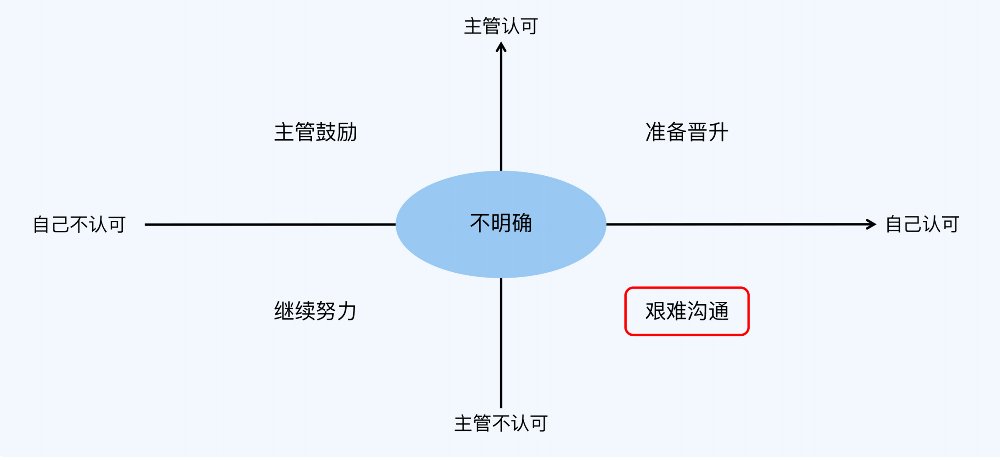

# 晋升流程：你需要通过多少“关卡”才能晋升？

上一讲我给你介绍了两种常见的职级体系，帮助你从宏观上了解晋升的游戏总规则。但是只掌握总规则还不够，你还需要详细地了解，在一次晋升流程中到底需要经过哪些关卡，因为这些关卡直接决定了哪些人能晋升，哪些人不能晋升。

一次完整的晋升流程，一般可以分为 6 个阶段：

1.提名阶段：主管决定要不要提名你去参加晋升。

2.预审阶段：部门对提名的名单进行预审，如果你跟其它竞争者 PK 失败，就失去了晋升机会。

3.评审阶段：评委团对你进行评审，考察你的能力有没有满足要求。

4.复审阶段：部门对评审结果进行复审，确认你的晋升结果。

5.审批阶段：复审的结果上报高层审批，审批通过之后，你的晋升结果就最终确定了。

6.沟通阶段：主管或 HR 跟你沟通晋升结果。

在这 6 个阶段中，你直接参与的是“提名阶段”“评审阶段”和“沟通阶段”。其中“评审阶段”是最关键的，它在很大程度上决定了晋升是否能通过，但是在“提名阶段”“预审阶段”和“复审阶段”，你也可能会被刷掉。

如果公司要完整并且严格地执行这 6 个阶段，需要投入很大的人力成本，所以很多公司可能会删减或者简化某些阶段。具体的做法各有不同，今天这一讲我就不展开了。

接下来，我会为你详细地介绍每个阶段常见的操作方式。

# 提名阶段

整个晋升流程的起点就是提名阶段，相当于九九八十一难的第一关。

**硬性条件**

如果你想申请晋升，至少要满足以下 4 个条件：

1.绩效条件：你的绩效不能差，至少要达到“正常”水平。你要是绩效垫底，恐怕就不能参加晋升了。

2.年限条件：你在当前级别的工作年限，必须满足晋升的硬性规定。不同职级体系要求不同，阶梯式职级一般要满 1 年，跨越式一般要满 2 年。

3.红线条件：有的公司有内部处罚的政策，要是违反这些政策，你就会被取消当年甚至几年之内的晋升资格。你也需要满足这一类涉及红线的条件。

4.附加条件：有的公司为了鼓励员工重视某些事情，可能会将它跟晋升挂钩，最典型的就是专利。比如，公司规定，晋升到某个级别必须要有专利，没有专利就一票否决。所以你也需要满足这类条件。

不过，并不是只要满足这四个条件，你就一定能够申请晋升。因为它们只是硬性条件，至于你的能力有没有达到下一级别的要求，没法硬性规定，只能由人来判断。

在提名阶段，做这个判断的人就是你的直接主管，而判断结果可能会出现五种不同的情况，我都总结到了下面这张图里：

如果你和主管都认可，那你直接准备后续的晋升流程就行了；都不认可，那你就继续努力。这两种情况是最容易处理的。

如果自己不认可，但是主管认可，他会过来鼓励你，如果鼓励完你又有信心了，那么不妨去试一试。可要是鼓励完，你还是不敢申请，我建议这次就不要勉强自己了。毕竟后面写材料和答辩的过程都是你本人亲自参与，如果你自己都不相信自己的话，是很难做好的。

**最难处理的情况**

最难处理的情况是什么呢？那就是你认为自己能力够了，但主管不认可。

这个时候要怎么办呢？我建议你主动找主管开诚布公地谈一次，听一听他对你的真实评价。要是他真的有充分的理由判断你的能力不足，你就要请他给出明确的指导意见，以及后续有针对性的工作安排。

举个例子，主管如果只是简单地说“你要提升 Java 编程能力”，这是不够的。你可以要求他明确地告诉你，提升哪方面的 Java 编程能力，是虚拟机原理和调优，数据结构和算法，还是多线程？除此之外，他还应该说明未来一段时间给你安排什么样的工作，才能让你提升这些能力。比如要提升虚拟机原理和调优能力，可以给你安排线上问题处理和线上性能优化这样的工作。

**不明确的情况**

还有一种情况，也值得专门提一下，那就是主管不太好明确判断的时候。

主管之所以会纠结，是因为一方面他担心自己会不会太严格，导致你错失了晋升机会，结果别的团队跟你水平差不多的员工都晋升了；另一方面，他也会担心自己会不会太宽松，结果你在后续的晋级过程中表现不太好，影响团队声誉（我确实遇到过某个团队提名了 4～5 个候选人，最后却一个都没通过的情况）。

所以这时候，你要主动跟他提出晋升想法，表达积极进取的意愿和规划。要是当年团队内部的提名较少，就有机会优先补位；如果当年团队提名人数已经超额了，那么下一次晋升他也会优先考虑你。

# 预审阶段

提名之后就是预审。预审阶段主要是针对提名晋升的名单，进行部门内的一次横向拉通对比。

这样做的目的主要有两个，第一个是防止主管放水，提名太多。

在提名阶段，你的主管可能因为管理压力，没有直接拒绝你的晋升请求。在预审阶段公司就可以识别这种情况，因为负责预审的人会进行横向比较。如果两个团队规模和绩效都差不多，其中一个团队的提名人数大大超出另外一个，对应的主管必须给出强有力的原因，否则就很容易被其他主管质疑是否在放水。

第二个目的则是防止主管之间的能力评价标准相差太远。

刚才我也提到过，能力评价本身其实是比较主观的，每个人的标准可能不一样。也许 A 主管的标准比较严格，B 主管的标准比较宽松，这样 A 团队的员工就比较吃亏了。通过横向拉通对比，公司基本上就能统一各个团队的能力评价标准，尽量做到公平公正。

因此，如果你想要提名晋升，主管也同意了，但是一段时间后他又说你现在的能力还达不到晋升要求，那么基本就可以确定，你是在“预审阶段”被刷掉了。 

预审通常有两种方式，书面预审和会议预审。

书面预审一般用于 P7 以下级别的晋升，由管理者自己通过提名材料来审核。他会查看材料中关于你的能力和项目的描述，再结合自己平时对你的了解来评估。所以，提名材料写得好不好就很关键了，后续课程中我也会讲到提名材料的写法。

会议预审用于 P7 及以上级别的晋升，由管理者组织会议，让其他主管一起来审核。主管需要介绍自己提名的员工，然后接受其他人的“挑战”。因此，各个主管对你的了解程度就很关键。这就意味着你在平时的工作中，不要以为对方不是你的主管就可以不理他，甚至直接“怼”他，毕竟有人的地方就有江湖。

# 评审阶段

整个晋升流程中最核心的阶段是评审阶段。你需要向评委团展现自己的能力，并且经受他们的考察。这个阶段的标准流程可以分为 5 个环节：

整个评审阶段和多人面试基本类似，你需要先准备答辩 PPT（材料准备），然后面对评委团（3 个以上评委）先进行自述，展现自己的亮点（晋升自述）。

你讲完后，会有多个评委来通过问答的方式来对你进行考察，验证和判断你是否达到了晋升要求（晋升答辩）。答辩完成后，评委会指出你的优缺点，并提出后续改进建议（能力评价，有的公司可能没有这个环节）。对你来说，到这里这次答辩就结束了。

最终，评委团基于答辩情况以及评委们的判断，做出你是否晋升通过的判断，但这个环节的结果还不是最终晋升结果（结果确定）。评委团可以通过两种方式来给出评审结果：集体讨论和独立投票。

集体讨论是指，几位评委现场讨论你的这次答辩有没有通过。这种方式有利于评委之间互相验证，但可能出现“熟人”问题。有“熟人”帮你说好话和有“熟人”给你说坏话，结果会差别很大，总的来说，“熟人”问题可能会影响结果的公平性。 

独立投票是指，几位评委各自单独给出是否通过的意见，最后系统根据“多数票原则”判定你的晋升有没有通过。

这种方式可以避免“熟人”问题，但是却可能出现“隔行如隔山”问题。如果有专家的业务领域跟你差别太大，可能很难准确评估你的能力。比如你是做金融业务的，现在让一个做社交应用的专家来评估，结果就可能出现比较大的偏差。

所以，评委团的不确定性是你遇到的第一个和运气相关的因素。你无法选择晋升评委，只能尽力提升自己的能力，争取将评委团的不确定性的影响降到最低。

# 复审阶段

评审阶段的结果出来之后，公司还会做一次部门级的拉通分析，这就是复审。

复审阶段主要是通过总体的数据来判断晋升情况，这个数据一般是晋升通过率。各个公司会根据实际情况给出一个指导性的参考值，只要不偏离太远，都是可以的。

但是如果偏离太远，公司就会再次对晋升结果进行调整。因此，复审阶段有两个因素可能影响你的晋升结果。

第一个因素是，公司给出的通过率参考指标可能存在“大小年”的现象。比如 2018 年的通过率比较高，2019 年可能就会调低一些。如果你正好在 2019 年参与晋升，也许就会受到影响。

公司通过率指标的不确定性是你可能遇到的第二个和运气相关的因素。

复审阶段第二个影响你晋升结果的因素是，如果你的水平处在中间位置的话，可能因为部门通过率调控而被刷下来。

比如 3 个评委当中只有 2 个认为你可以通过晋升，这个时候，就算公司整体的晋升通过率是正常的，但如果你所在的部门晋升通过率太高（显著高于其他部门），也有可能导致你被刷下来。

部门通过率调控的不确定性就是晋升者可能遇到的第三个和运气相关的因素。

复审阶段的这两个运气因素，你同样不能控制，只能尽力提升自己的能力，争取避免成为被调控的对象。而如果晋升不通过，也不要过于悲观。因为这一方面说明，自己的能力确实还不是毫无争议的；另一方面，只要你持续地提升自己的能力，多参加几次晋升，总有一次运气会好的。

# 审批阶段

复审之后，公司层面会对各个部门上报的晋升结果做最终的确认，然后确定薪资涨幅和股权激励之类的方案。这部分的操作已经不是一般员工能够介入的范围了，你就不用关心了，只要知道有这么一个阶段就可以了。

# 沟通阶段

晋升流程的最后一步就是沟通阶段，主管（有时候会拉上 HR 一起）会把最终的晋升结果反馈给你。你要是顺利通过了，这次沟通肯定是比较愉快和顺畅的；但你要是不幸没有通过，主管的沟通压力就又上来了。

好在走到这一步，大部分申请者对于自己能否通过，心里还是有数的，所以整体来说，沟通不算太难。

不过，无论你的晋升通过还是不通过，你的主管都需要明确地给出指导意见，并安排相应的工作来帮助你成长。如果他忘了，记得提醒他。

# 小结

这一讲，我为你介绍了在一次完整的晋升流程中，你要经历哪些阶段的哪些考验。一次成功的晋升就像西天取经一样，要经过重重关卡的磨练。

现在，我们回顾一下这一讲的重点：

1.晋升流程分为个 6 阶段，你直接参与的是“提名”“评审” 和“沟通”这 3 个阶段。其中“评审阶段”是最关键的，很大程度上决定了你能不能晋升。不过在“提名”“预审”“评审”和“复审”这 4 个阶段中，你都有可能被刷下来。

2.晋升路上还有一些跟运气有关的因素，主要有三个，分别是评委团的不确定性，公司通过率指标的不确定性，还有部门通过率调控的不确定性。

3.不要以为对方不是你的主管你就可以不理他，甚至直接怼他，有人的地方就有江湖。平时给其他部门的合作伙伴留个好印象，晋升的时候也许有意想不到的帮助。

