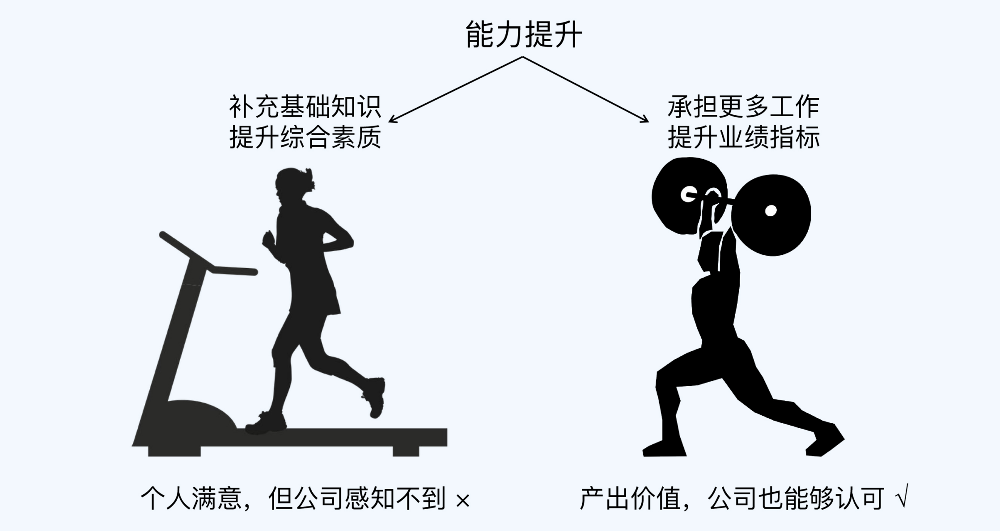

# 晋升原则：什么样的人更容易晋升？

当你了解了晋升的游戏规则和通关流程之后，自然就会产生一个疑问：我应该怎么做才能更快地晋升？

其实这门课后续的所有内容，都是在回答这个问题。但毕竟晋升涉及的因素太多了，不同的行业、公司和团队，你本人的经历、性格和爱好，可能都会影响晋升策略的选择。

虽然大部分的情况下，你可以直接套用我在这门课中传授的方法，但总是会有一些特殊情况，你需要靠自己来做出判断和选择。

所以，我给你总结了三条晋升的核心原则，告诉你什么样的人更容易晋升成功。当你在准备晋升的过程中，遇到困惑、挫折等各种问题的时候，就可以根据你的实际情况来逐一对比这三条原则，找到自己做得不够好的地方，然后有针对性地进行提升

# 主动原则：主动做事

工作要积极主动，这句话你一定听过吧，但你对它的理解真的准确吗？很多人，尤其是刚进入职场的同学，可能会以为“服从命令听指挥”“领导指哪打哪”就是积极主动，结果反而容易养成两个不好的习惯。

第一个不好的习惯是，认为主管肯定会帮你搞定晋升。

你可能非常信任主管，认为自己只要把主管安排的任务做好，晋升就是水到渠成的事情。

所以你就算觉得现在分配的任务对自己的成长帮助不大，也不会主动跟主管沟通，而是认为“他这么安排肯定是有道理的”“也许过一段时间他就会给我安排新的任务”。这其实是不对的。

首先，并不是每个主管都会关注组员的成长。主管的做事风格可能有很多种。

- 有的主管特别关注业务目标是否达成，所以会花很多时间跟产品经理和项目经理沟通交流；
  
- 有的主管特别关注团队形象，要求所有对外承诺的事情都一定不能延期、一定不能出问题，所以会特别重视进度、质量和风险等情况的跟进和监控；
  
- 有的主管特别关注自己的职位爬升，所以团队成员对他来说，只是一种可利用的资源……

所以，如果你遇到的恰好是不关注组员成长的主管，就不要等着他给你分配任务了。不然你就只能长时间地留在当前的级别，做他手底下的“工具人”。

其次，就算主管关注组员的成长，他的判断也有可能跟你的判断不一致。

比如主管认为你还需要在当前岗位继续锻炼，而你却觉得自己应该尝试新的挑战了。这时候如果你不去找他沟通，他还会继续给你安排熟悉的重复任务。这样你肯定很没意思，工作状态不会太好，工作积极性也不会太高。

所以，如果你觉得自己的岗位没有太多挑战和能力提升空间的时候，就不要等着主管给你分配任务了。不然你身上的潜力就激发不出来，没法以最快的速度晋升。

**第二个不好的习惯是，被动接收信息。**

你可能认为把自己的本职工作做好就够了，其他事情自然有对应岗位的人去负责，因此你很少去主动了解很多工作相关的信息。比如下面这些信息，对于技术人员来说，它们不属于自己岗位职责的范畴，但是在晋升的时候，它们却是评判技术人员综合能力的重要考察内容：

- 业务功能上线后业务效果如何？
  
- 业务效果不好的可能原因是什么？
  
- 整体的业务机房的部署结构是什么样的？

这些信息，有的需要找产品运营要数据，有的需要跟业务负责人探讨，还有的需要和另外的团队交流，都需要你主动去找机会才有可能获取的。

主动规划工作任务，主动跟别人了解更多信息，合起来就是我说的主动做事。主动做事的人，比等着别人安排的人更容易晋升，这就是我总结的第一条原则，**主动原则。**

掌握主动原则之后，我们就知道要具体要怎么做了。

**第一，我们要主动找主管沟通工作。**

不管主管是什么风格，你都应该**定期或者不定期**地找他沟通关于工作任务的想法和意愿。

一方面是听听他对自己的看法，获取指导建议；

另一方面，你也可以借此机会了解更多关于团队、业务和部门的信息，有机会的情况下尽量主动承担有挑战性的工作。

不要以为主管会自己把知道的所有信息都一一跟组员分享。很多隐藏信息、非正式信息和小道信息，如果你不主动找他聊天，他不一定跟你讲的。

第二，我们要主动找别人沟通，了解更多信息。

很多人害怕主动找别人要东西，可能有性格方面的原因，但更主要的原因还是动力不足。如果你能够意识到主动沟通带来的价值，很多时候就敢放开手脚干了。这就像一个笑话说的，一个人问：“打一巴掌给 100 块，你干不干？”结果另一个人回答说：“我能让你打到破产。”

怎么获得动力呢？有个方法特别有效，就是从晋升答辩的角度来看。每当你想退缩的时候，就可以问问自己：“如果评委问到这个问题，自己能回答上来吗？”

事实上，晋升答辩的时候评委很可能会对这些问题感兴趣，比如“这个业务上线后效果怎么样？”“没有达到预期，主要原因是什么？”“机房的部署结构是什么样的？”“新加坡机房跟美国机房怎么同步？”……想到这一层，你就会逼着自己去沟通了。

# 成长原则：不断挖掘成长点

掌握了主动原则之后，你是不是已经壮志满怀，准备好大包大揽地干活儿了呢？先等一下，这里可能还有两个思维陷阱等着你。

**第一个陷阱是，以为事情做得多，自然就能晋升。**

这个陷阱很有迷惑性。不过你仔细想想，一匹马拉磨拉了 10 年，另一匹马则是征战 10 年，这两匹马的经验能一样吗？虽然拉磨的马走的距离可能更长，但如果征战的马见过的场面一定更复杂、更多样。

其实人也是这样。只做自己会做的事情，不断地重复，你只会变成熟练工，而不会成为技术专家。所以，不要把 1 年的工作经验重复 10 年，而要真正积累 10 年的工作经验。

**第二个思维陷阱更有迷惑性，那就是以为事情做得好，自然就能晋升。**

很多人都有一种朴素的想法：“我把老板安排的任务做完，保证效率和质量，拿到好的绩效，晋升肯定没问题。”结果，他们虽然拿到了好的绩效，但晋升却屡屡碰壁。

为什么会出现这种情况呢？因为不同级别的能力要求是有本质的区别的，而不仅仅是熟练度的区别。能够把事情做好，只能说明你已经熟练掌握当前级别所要求的能力，但并不一定意味着你的能力就自动达到下一职级的要求了。

现在，你可能觉得更乱了，怎么多做事、把事情做好反倒不对了呢？其实，多做事、把事情做好，当然是有用的。但它们的作用，主要体现在帮你拿到更好的绩效，更多的奖金和一定程度的工资提升。至于晋升，不光要看功劳和苦劳，更要看成长。

所以，**一边做事一边挖掘成长点、提升自己能力的人，比光顾着做事的人更容易晋升，** 这就是我总结的第二条原则，**成长原则。**

现在我们再来看看，基于成长原则，我们做事时正确的做法是什么。

如果现在的工作，你已经可以得心应手地轻松完成了，就应该尝试更高难度、更高复杂度的事情了，而不是一味地刷熟练度，沉迷在自我感觉良好的状态里。

比如你一直做业务开发，已经成为了组里的骨干，不但效率高，而且质量又好。那么你就可以试着完成方案设计、架构设计、架构重构和系统优化等工作。

另外，不管事情做好了还是没做好，你都应该多做复盘总结，找到可以提升优化的点。

对于踩了坑、犯了错的事情，你肯定知道要复盘，毕竟教训的印象是非常深刻的；但是做得顺利的事情，你可能做完就完事了，不会主动去挖掘可以成长的点，这样无形中就失去了很多成长的机会，即使把事情做好了，能力提升也不大。

# 价值原则：学习为公司产出价值的技能

掌握了成长原则之后，你是不是又像“打了鸡血”一样，准备好好学习，提升几项技能了呢？别着急，我先给你讲一个真实的故事。

有一次，一个老同学问我：“华仔，你是怎么学习编译原理的？”

我觉得有点奇怪，因为他是做 Android App 业务开发的，怎么会想到要学编译原理呢？于是，我们有了下面这段对话。

我问：“你怎么想到学编译原理了？”

他说：“编译原理是所有编程语言的基础，这个算基础的技术能力吧，我觉得肯定要学。”

我又问：“你们什么时候会用到编译原理呢？”

他想了一会，说：“好像没有用到的时候。不过我觉得，多学点技术总没坏事，说不定哪天就用上了。”

我接着问：“那你学了多久了，效果怎么样？”

他叹了口气，说：“学了半年了，但是感觉没学懂，所以来问问你，看看你有什么经验。”

我说：“我也不懂，而且我建议你别学了。编译原理虽然是基础技术，但它跟你现在的工作基本没有什么关系，学习编译原理并不能让你把开发做得更好，或者给你的业务带来新的有用的功能。”

我想你一定能看出来，这位老同学很有上进心，也非常努力。但是很遗憾，编译原理这个技能对他目前的工作其实没什么帮助。换句话说，如果从晋升角度考虑，他学习的技能无法为当前的公司创造价值，这六个月的时间其实白白浪费掉了。

为什么我会这么说呢？其实你站在公司的角度来看，就很好理解了。

公司设计职级体系的初衷，是为了衡量不同员工的能力级别，然后根据级别来制定相应的薪酬、福利、管理等制度，同时鼓励员工尽量提升自己的能力，为公司产出更大的价值。

这里面有两个关键点，能力级别和公司价值，但是大部分人都只关注了能力级别，而忽略了公司价值这个点。

这也是晋升和面试最大的区别之一。面试的时候，面试官主要考察你的能力级别，因为这时候没有办法准确评估你能为公司带来的价值；**但是在晋升的时候，不论你把能力吹得多么天花乱坠，如果不能体现在对公司价值的实际产出上，那一切都是废话。**

所以，也许你为了晋升，花了很多的时间和精力来提升一些“很重要”“很基础”的能力，但实际上它们可能对你的晋升根本起不到什么作用。学习编译原理，研究 Linux 内核源码，天天刷 LeetCode 题目，关注人工智能发展前沿……这些都是技术人员提升能力的时候经常踩的坑。

当然，我绝对不是说这些技能一定没有用，任何人都不应该学；而是说如果你想晋升，在投入时间和精力学一项技能之前，不妨先思考一下，你学了这个，能为公司带来什么。

让能力为公司产出价值的人，比空有一身能力的人更容易晋升。这就是我总结的第三条原则，**价值原则。**

所以，能为公司产出价值的能力，才是值得优先学的能力。现在我们以“人工智能”为例，用价值原则来判断一下，如果你的时间很宝贵，还值不值得学。

- 如果你是 P5/P6 级别，做 Android App 业务功能开发，那么用不着学人工智能，因为你现在主要工作还是把开发任务做好。
  
- 如果你是 P7/P8 级别，是带一个团队做 Android 开发的 Team Leader，或者是负责 App 架构设计的技术专家，可能就有必要学人工智能了，因为你需要规划和思考团队与业务下一步的技术演进方向跟实施步骤。
  
- 如果你是 P9 级别，那么不管是什么技术方向，肯定都要了解人工智能，因为这是一个新的技术领域和方向，而新的技术往往会带来业务上质的突破。

价值原则除了告诉我们某项技能值不值得学以外，还能告诉我们要学到什么程度。还是以“人工智能”为例，不同的人来学，学习的方法和深度也是不一样的，一定要避免陷入“学习等于看源码”这个误区。

- 如果你是做算法的，人工智能应用场景、算法原理、框架源码都需要去学习；
  
- 如果你是做 App 开发的，学习的重点可能就是人工智能的原理和应用场景了；
  
- 如果你是 P9 级别，学习的重点可能是人工智能的基本原理、行业的发展现状、成功和失败的案例，还有相关的产业链信息。

# 小结

现在我们做个总结，这一讲我为你介绍了三条晋升的核心原则：

1.第一条原则是主动原则，主动做事的人，比等着别人安排的人更容易晋升。所以你应该定期或者不定期地主动找主管沟通，交流关于工作任务的想法和意愿，寻求机会；同时，你也要主动找同事沟通，了解更多工作相关信息。

2.第二条原则是成长原则，一边做事一边挖掘成长点、提升自己能力的人，比光顾着做事的人更容易晋升。所以如果你已经能得心应手地完成现在的任务，就应该主动跳出舒适区，尝试更高难度和更高复杂度的事情；同时，不管事情做好了还是没做好，你都应该多做复盘总结，找到可以提升优化的点。

3.第三条原则是价值原则，让能力为公司产出价值的人，比空有一身能力的人更容易晋升。所以，如果你的时间很宝贵，就应该优先学能为公司产出价值的技能。

当你理解了这些原则，并且在实际做事过程中有意识地去应用这些原则之后，既能够为公司创造更大的价值，拿到好的绩效；又能够快速地提升自己的能力，满足晋升的要求。下次晋升的不是你，还能是谁呢？

（笔者记录：程序员三大坑：深入浅出MFC、Linux内核源码、编译原理）

