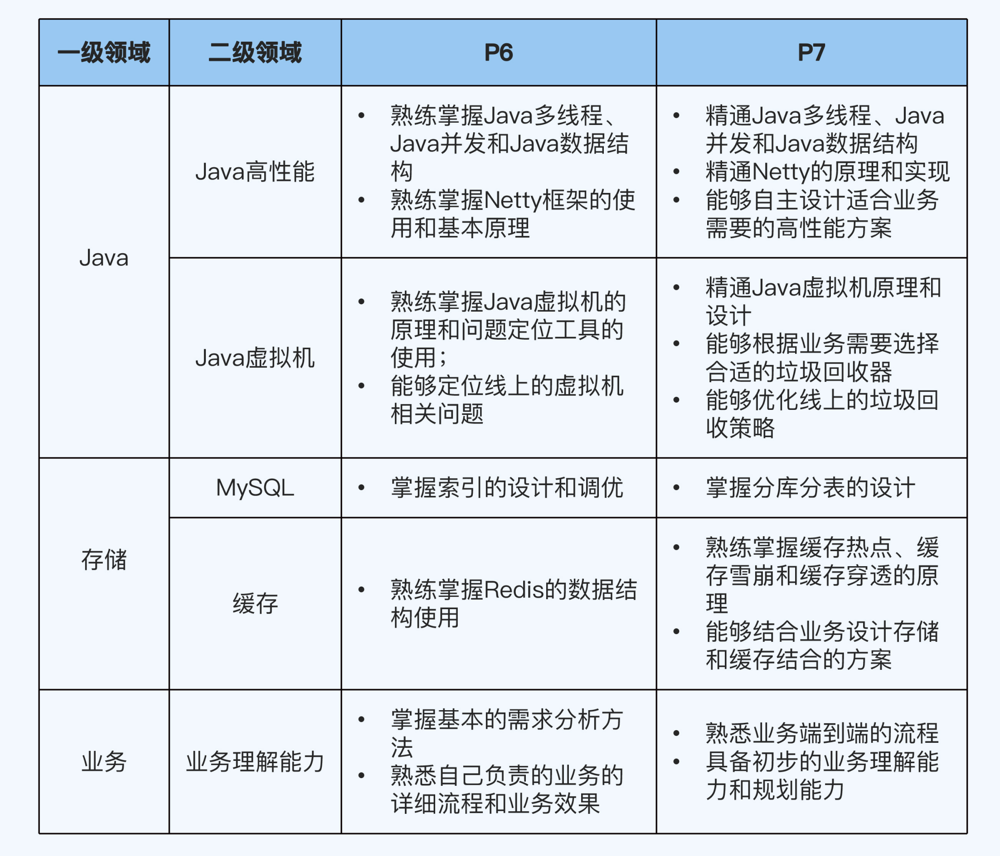
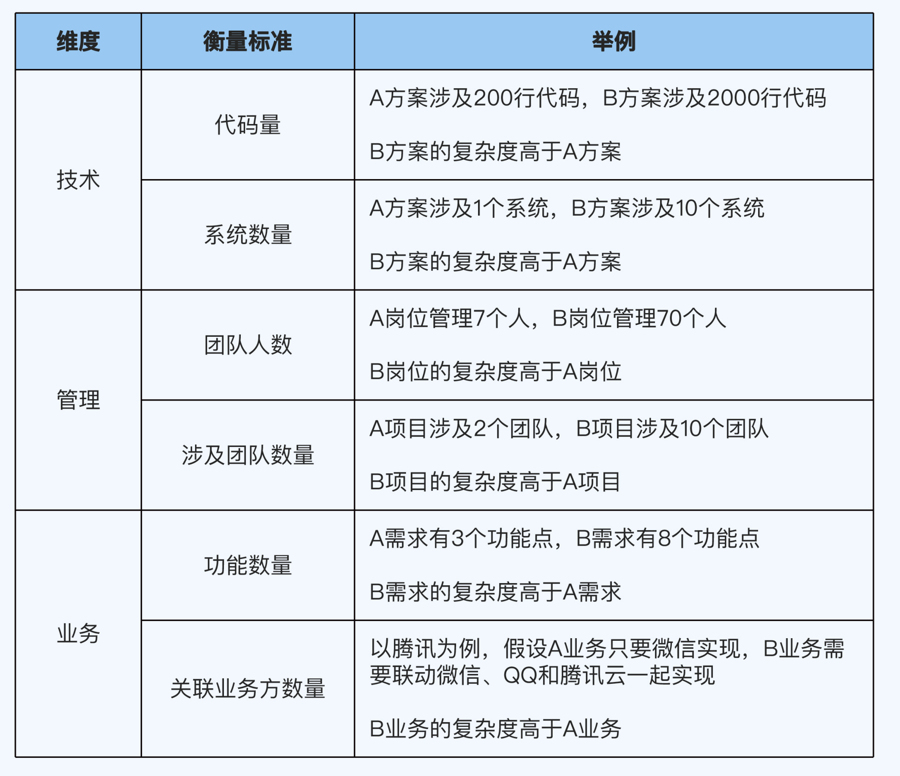
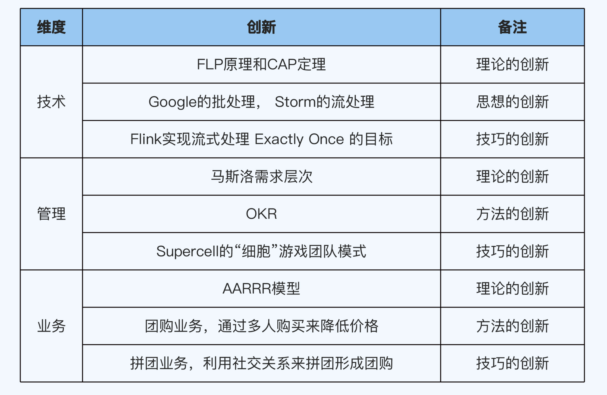
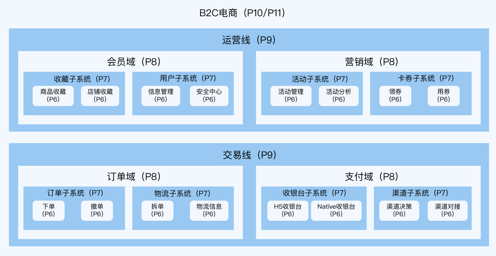
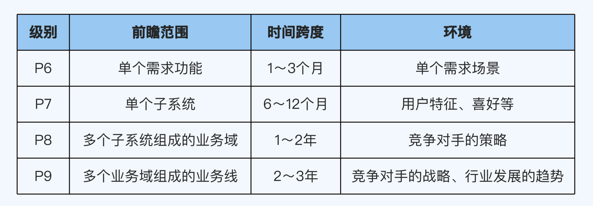
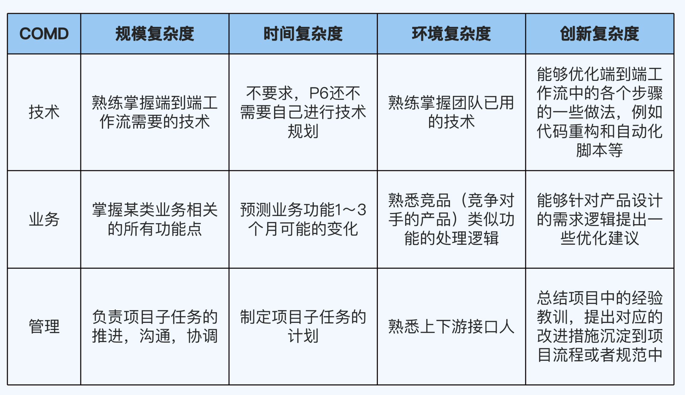

# COMD能力模型：怎么把抽象的能力要求具体化？

上一讲我分享了两条晋升逻辑和一套通用的晋升步骤。现在你已经知道，要先把当前级别要求的能力提升到精通程度，然后尝试做下一级别的事情。 

不过在这个过程中，你还会遇到另一个麻烦，那就是不确定下一级别的能力要求到底是怎样的，所以你也不知道究竟要准备到什么程度。

举个最常见的例子，不同级别有不同的 Title（头衔），比如“工程师”“高级工程师”和“专家工程师”等。但是，这样的 Title 对我们理解不同级别的能力要求，是完全没有什么用处的。“高级工程师”到底“高级”在哪，可能每个人的理解都不一样。

# 公司统一的能力描述：抽象

为了指导员工晋升，公司一般都会对各个级别的能力要求给出描述。但是因为细分的领域实在太多了，所以公司只能进行非常抽象的描述。

比如，P7 的要求是“具备系统思考的能力，能够全面掌握某个技术领域”，而 P8 的要求是“具备前瞻判断的能力，能够规划技术领域的发展方向”。

从实际的效果来看，这样的描述基本没什么效果，绝大部分人看完还是一头雾水。在实际工作中，团队成员经常跟我反馈这样的困惑：

- 什么是系统思考能力？P7 才要求系统思考，可是我 P6 的时候参与项目开发，就需要考虑需求的合理性、索引设计高性能、接口的兼容性和易用性、上线的灰度方案这么多事情，这些难道不是系统思考吗？
  
- 什么是前瞻判断能力？P6 要预测需求变化，P7 要规划团队技术发展，这些也是前瞻判断呀，为什么 P8 要特别强调前瞻判断？

可以说，晋升疑惑千千万，能力要求占一半。这一讲我要介绍的就是把抽象要求具体化的方法。

# 领域定制的能力解读：比较具体

因为公司的抽象描述很难指导实际工作，所以有些领域会独立定制自己的职级能力解读，一般是由 P8 或 P9 级别的员工以工作组的方式讨论得出来的。

比如“Java 业务开发”这个领域，P6 和 P7 级别的能力解读长什么样呢？你可以参考下面的表格。

（注：这张表格仅供参考。它不是完整的解读，不代表所有公司的实际要求。你也不需要看懂里面的所有内容，只要了解这个形式就可以了。）

我们可以看到，这份标准跟公司的描述相比，已经具体很多了。如果按照这个思路，完整地把各个级别要求的能力一一列出来，不但可以作为晋升的标准，也可以作为学习的参考。

其实这种做法对员工是有利的，因为标准越明确，就越容易“照本宣科”地去做。但是从公司的角度来看，这种做法存在成本太高（有几十上百个专业领域要制定详细标准，每年都要更新）、限制创新（大家都只管对照公司标准来做事，其它一概不管）等问题，所以很少有公司会这么做。

# COMD 能力模型：4 种复杂度 +3 个维度

为了彻底解决要求不明确的问题，让你更好地理解不同职级的能力差异，我根据自己的思考和担任晋升评委的经验，提炼出了一套兼容性很强又容易理解的能力模型：**面向复杂度的多维度能力模型**（Complexity-Oriented & Multi-Dimension Capability Model），简称 COMD 能力模型。

COMD 的 CO 是指 Complexity-Oriented，意思是“面向复杂度”（灵感来源于“面向对象”）；MD 是指 Multi-dimension，意思是“多维度”，也就是技术、业务和管理 3 个维度。

COMD 的核心指导思想是，**通过事情的复杂度来判断能力的高低，** 级别越高，所做的事情复杂度也越高。

当然，如果只是单纯地用复杂度来判断能力高低，那么它本质上和其他方法也没什么不同，看不懂的地方还是看不懂，不同的人理解还是不同。

所以，为了清晰地描述不同能力层级的差异，COMD 能力模型还进一步地明确了复杂度，具体包括规模复杂度、时间复杂度、环境复杂度和创新复杂度 4 种类型。

# 1.规模复杂度

规模复杂度是指和规模大小有关的复杂度。

规模越大，复杂度越高。原因在于规模越大，节点越多，节点间的关系越复杂，而且节点间的关系复杂度是指数增长的。就像下面的图片所展示的：当节点数只有 3 个时，节点间的关系也只有 3 个；而节点数达到 6 个时，节点间的关系就变成了 15 个，复杂度提升了 5 倍。

按照这个原理，我们可以对一些常见工作维度的规模复杂度进行比较，具体如下表所示

当然，以上对比的前提是，除了规模之外，其他条件都差不多。（对比其他几个复杂度时也是这样）。就像表格中 200 行代码和 2000 行代码对比，前提是代码复杂度是差不多的。因为 200 行核心代码的复杂度，显然比 2000 行拷贝粘贴的代码要高。

# 2.时间复杂度

时间复杂度是指和时间跨度有关的复杂度。

时间跨度越长，复杂度越高。原因在于万事万物都处于不断发展变化当中，时间跨度越长，变化的因素和可能方向越多，越难判断准确。

三大维度的时间复杂度的对比举例如下表所示。

# 3.环境复杂度

环境复杂度是指和环境不确定性有关的复杂度。

我们很多的判断、决策和行为都依赖于对环境的认知和反应。总的来说，环境不确定性越高，复杂度越高。

环境的不确定性具体分为环境的稳定性、环境的透明性和环境的可预见性 3 个方面：

- 环境的稳定性，指环境变化的速度快慢。
  
- 环境的透明性，指是否能够明确地获取环境相关的信息。
  
- 环境的可预见性，指是否会发生完全无法预料的黑天鹅事件。

环境的稳定性、透明性和可预见性越低，它的不确定性就越高，复杂度也越高。

下面这个表格从宏观的角度分析了技术、管理和业务三个维度所面临的环境不确定性。

**从表格中可以看出，对于互联网行业的业务来说，环境稳定性、透明性和可预见性都比较低，所以它的环境复杂度是最高的。这也是在互联网大厂，大部分 P9/P10 都需要把很多时间和精力投入到业务上的主要原因。**

# 4.创新复杂度

创新复杂度是指和创新程度有关的复杂度。

常见的创新包括理论的创新、思想（或者说方法）的创新和技巧的创新。理论创新的复杂度要高于思想创新，而思想创新的复杂度又高于技巧创新。

以高可用技术领域为例：

- FLP 原理和 CAP 定理属于理论创新。它们奠定了分布式高可用设计的基础和边界，无论是缓存系统、存储系统、批处理系统、流式处理系统还是采用微服务架构的业务系统等，都不能跳出这两个理论的约束和限制。

- 批处理和流处理属于思想创新。对于大数据技术来说，一开始 Google 提出的批处理思路开启了大数据时代，而后来 Storm 开启了流处理这个新的技术领域。

- 实现 Exactly Once 特性属于技巧创新。开源框架 Flink 使用 Chandy-Lamport 算法，实现了流处理 Exactly Once 的特性，能够实现消息精确投递，避免重复消息导致业务出错。

我们可以看到，创新复杂度越高，影响的范围往往也越大。理论创新会奠定整个行业的基础，而思想创新可能开辟一个新的技术领域。

另外，创新并不意味着一定要全球首创，只要相比团队当前现状来说有改进就行了；创新也不局限于技术领域，管理和业务一样可以创新。所以，下面这些事情都可以算是创新：

1.开发 Memcache

2.有了 Memcache 后开发 Redis

3.引入设计模式优化代码

4.使用微服务来拆分系统

5.优化项目流程

6.提出一种新的业务模式

各领域的部分典型创新案例如下表所示，你可以参考对照。

除了刚才说的这 4 种通用的复杂度之外，在每个领域内部，也会有一些工作的复杂度本身就要比另一些工作高。

比方说在软件开发领域，我们一般认为各项工作的复杂度排序是这样的：

从0到1创造系统 > 架构重构 > 项目方案设计 > 编码实现

不过这些认知是领域经验总结形成的共识，并不能通用。所以在使用 COMD 模型的时候，你还是需要结合领域经验综合判断。

# COMD 与抽象描述的对比

我想，你现在应该知道为什么公司写的那些抽象描述让人看不懂了。跟 COMD 能力模型的具体拆解比起来，它们只是脱离实际的文字游戏罢了。我就拿这一讲开头提出的“系统思考”和“前瞻判断”来说好了。

# 系统思考

比如在某些大厂，“系统思考”的确是写在 P7 级别的能力描述里，但它不是 P7 级别才有的能力特征。实际上，P6 以上的级别都要求“系统思考”，区别只是思考的范围不同，也就是规模复杂度不同而已。

以 B2C 电商业务开发为例，在某些大厂，不同级别“系统思考”的范围如下图所示：

对于 P6 来说，系统思考的范围是某个需求，需要考虑需求的合理性、设计的可扩展性和上线后的稳定性等问题。

对于 P7 来说，系统思考的范围是单个系统，需要考虑的是单个系统的架构设计、架构重构和技术选型等问题。

对于 P8 来说，系统思考的范围是某个领域，需要考虑的是领域的发展趋势、架构演进、团队组织结构等问题。

对于 P9 来说，系统思考的范围是多个关联的业务域组成的业务线，需要考虑业务发展趋势、架构演进、团队组织结构等问题。

# 前瞻判断

同样地，在某些大厂，“前瞻判断”虽然写在了 P8 的能力描述里，但其实 P6 以上都有前瞻性的要求，区别只是在于前瞻范围、时间跨度和面临的环境不同而已。这些因素就分别对应了规模复杂度、时间复杂度和环境复杂度。

同样以 B2C 电商业务开发为例，某些大厂 P6～P9 级别的前瞻性要求如下表所示：

所以说，如果你还在绞尽脑汁地钻研“为什么 P7 才提出系统思考”以及“P8 要求的前瞻判断有什么深意”这样的问题，那就掉到文字陷阱的坑里去了，白白浪费脑细胞。至于怎么从坑里走出来呢？这就需要灵活应用 COMD 能力模型了。

# 如何应用 COMD

当你想要了解某个级别的能力要求的时候，不要再对着那些抽象和模糊的词语，不着边际地猜测和想象了。你应该静下心，坐下来填一个“能力矩阵”的表格，把每一项的要求都完整且具体地列出来。比如下面这个“能力矩阵”表格就摘录了 P6 级别的部分要求，可以作为参考。

如果表格里有些内容你填不出来，说明你对这个级别的理解还不到位。不过没有关系，我会在课程的第二部分，也就是职级详解中给出每个级别通用的衡量标准。

在这个基础上，你可以请教你的主管、HR 和同事等人，来完善和细化表格内容。当你详细地填完了这个表格，你也就对这个级别了解得很清楚了。接下来，你就可以对照表格，针对性地提升自己的能力。

# 小结

现在，我们回顾一下这一讲的主要内容。

1.公司会对各个级别的能力要求给出一个抽象的描述，比如“系统思考”和“前瞻判断”等，但实际指导意义不大。

2.有些领域可能会独立定制相关技术方向的能力解读。虽然这种解读比公司的抽象描述稍微具体一些，但因为投入成本太大和限制创新等原因，很难大范围推广。

3.我总结的 COMD 能力模型，把能力分成技术、管理和业务三个维度，并通过规模、时间、环境和创新四个复杂度来判断能力的高低。

4.如果你想了解某个级别的能力要求，为晋升做准备，可以把这个级别的能力模型表格列出来，然后针对表格内容做针对性的提升。

