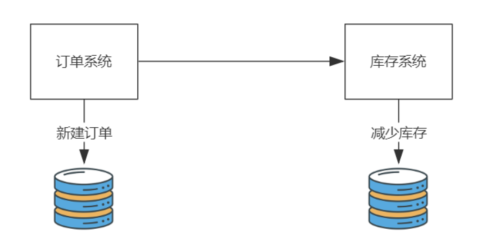

# 什么是 CAP ？什么是最终一致性？什么是幂等操作？

参考：[王雄宁分布式协议课程](http://polygonx.top/wxning-blog/interview/distributed-protocol-and-algorithm/notes/00/01.html)

****

- 一致性C代表更新操作成功后，所有节点在同一时间的数据完全一致。
  
- 可用性A代表用户访问数据时，系统是否能在正常响应时间返回预期的结果。
  
- 分区容错性P代表分布式系统在遇到某节点或网络分区故障的时候，仍然能够对外提供满足一致性或可用性的服务。

AP表现为订单创建后不等待库存减少直接返回处理结果。AP保障可用性，牺牲一致性，可以采用补偿机制保障最终一致性。

CP表现为订单创建后一直等待库存减少后才返回结果。cp用户体验很差，一般在银行，金融，证券这种对数据一致性要求很高的地方使用。AP则在互联网应用。

AC表现为不再拆分数据系统，在一个数据库的一个事务中完成操作，也就是单体应用。

