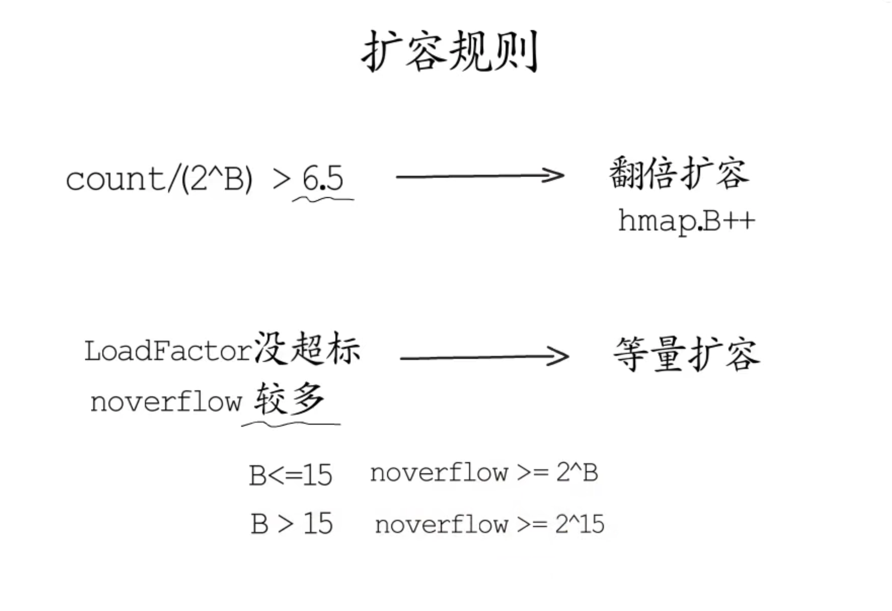

# map相关

<video id="video" width="1000px" height="600px" controls="controls">
    <source id="mp4" src="./assets/videos/Map长啥样儿？.mp4" type="video/mp4">
</video>

# 1.**map+锁和sync.Map怎么选择？**

sync.Map的性能高体现在读操作远多于写操作的时候。 极端情况下，只有读操作时，是普通map的性能的44.3倍。

反过来，如果是全写，没有读，那么sync.Map还不如加普通map+mutex锁呢。只有普通map性能的一半。

建议使用sync.Map时一定要考虑读定比例。当写操作只占总操作的<=1/10的时候，使用sync.Map性能会明显高很多。

# 2.**sync.Map底层原理：**

参考：[知乎专栏文章](https://zhuanlan.zhihu.com/p/344834329)

`sync.map` 适用于读多写少的场景。对于写多的场景，会导致 read map 缓存失效，需要加锁，导致冲突变多；而且由于未命中 read map 次数过多，导致 dirty map 提升为 read map，这是一个 O(N) 的操作，会进一步降低性能。

参考：[csdn文章](https://blog.csdn.net/u011957758/article/details/96633984)

sync.Map的原理很简单，使用了空间换时间策略，通过冗余的两个数据结构(read、dirty),实现加锁对性能的影响。

通过引入两个map将读写分离到不同的map，其中read map提供并发读和已存元素原子写，而dirty map则负责读写。

这样read map就可以在不加锁的情况下进行并发读取,当read map中没有读取到值时,再加锁进行后续读取,并累加未命中数。

当未命中数大于等于dirty map长度,将dirty map上升为read map。

从结构体的定义可以发现，虽然引入了两个map，但是底层数据存储的是指针，指向的是同一份值。

# 3.**map底层实现？**

参考：[B站视频](https://www.bilibili.com/video/BV1Sp4y1U7dJ?from=search&seid=17900809635826536017&spm_id_from=333.337.0.0)

参考：[知乎文章](https://zhuanlan.zhihu.com/p/66676224)

map扩容机制(来源于上面B站视频)：

负载因子超过6.5触发**翻倍扩容**

负载因子未超标，但是使用的溢出桶较多触发**等量扩容**，具体是：

- 常规桶数小于2^15，溢出桶数目超过常规桶

- 常规桶数大于2^15，溢出桶数目大于2^25

等量扩容就是创建和旧桶数量一样多的新桶，然后把键值对迁移至新桶中，那等量扩容有什么用呢？

其实这个规则是桶的负载因子没有超过上限值，但是使用了较多溢出桶，这种情况对应着很多键值对被删除的情况。这样迁移到新桶后能够使得键值对排列更加紧凑，并且减少溢出桶的使用。

