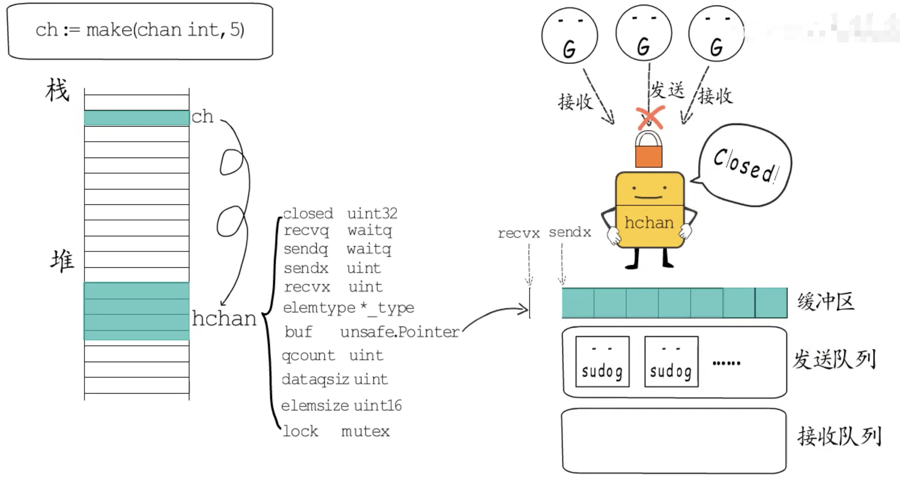
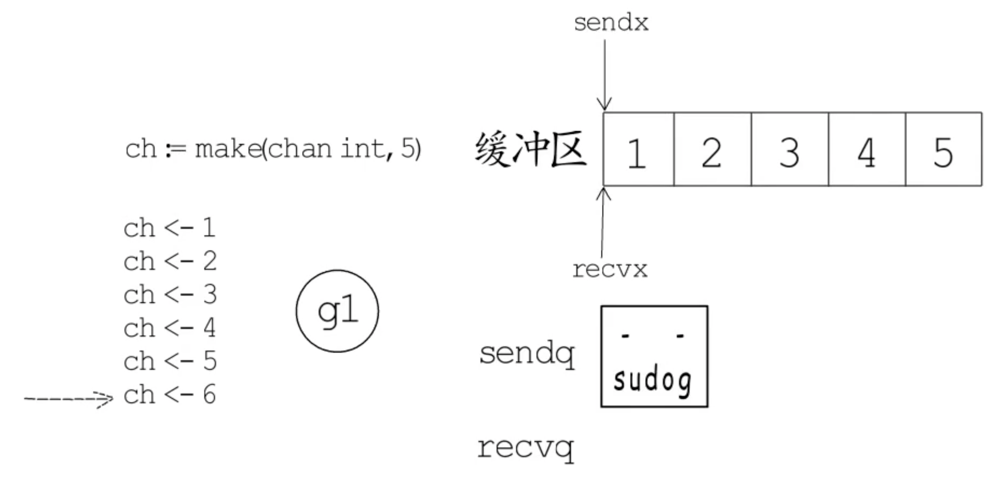
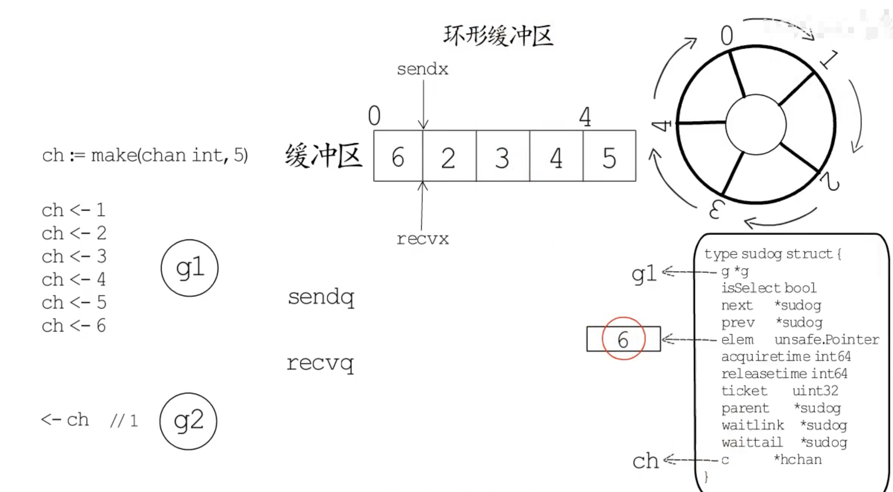
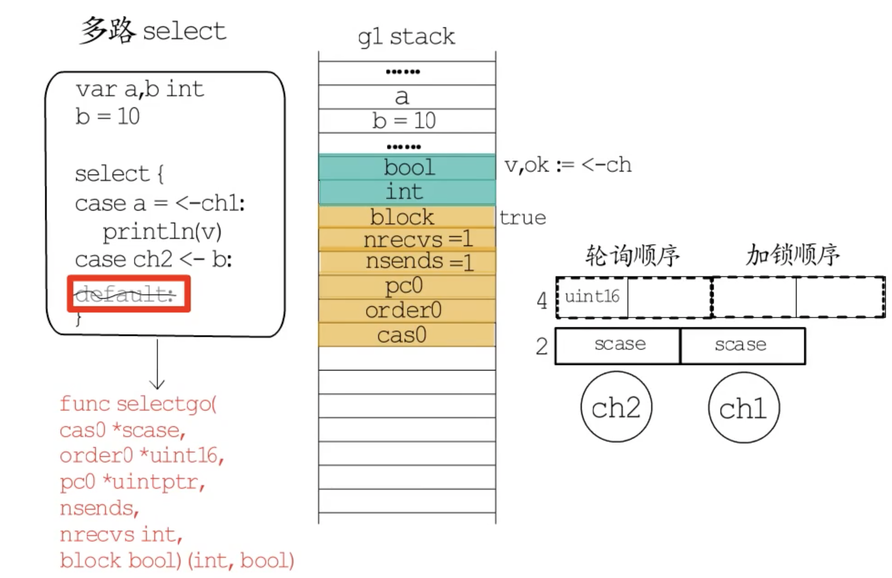

# channel相关

<video id="video" width="1000px" height="600px" controls="controls">
    <source id="mp4" src="./assets/videos/channel 数据结构 阻塞、非阻塞操作 多路select.mp4" type="video/mp4">
</video>

**channel实现原理**

我们用make(chan int, 5)方式创建一个channel，ch是存在于函数栈针上的一个指针，指向堆上的hchan数据结构，因为channel免不了支持协程间的并发访问，所以要有于一把锁来保护整个数据结构。

对于有缓冲channel来讲，需要知道缓冲区在哪，已经存储来多少元素，最多存储多少元素，每个元素占多大空间，所以实际上缓冲区就是一个数组。因为golang运行时中，内存复制、垃圾回收等机制依赖数据的类型信息，所以hchan还要有一个指针，指向元素类型的类型元数据。此外，channel支持交替的读写，需要分别记录读、写下标的位置，当读和写不能立即完成时，需要能够让当前协程在channel上等待，待到条件满足时要能够立即唤醒等待的协程，所以要有两个等待队列，分别针对读和写。此外，channel能够close，所以还要记录它的关闭状态。

初始状态下，ch的缓冲区为空，读写下标都指向下标为0的位置，等待队列也都为空，然后一个协程g1向ch中发送数据，因为没有协程在等待接收数据，所以元素都被存储在缓冲区中，sendx从0开始向后挪，第5个元素会放到下标为4的位置，然后sendx重新回到0，此时缓冲区已经没有空闲位置了，所以接下来发送的第六个元素无处可放，g1就会进到ch的发送等待队列中，

这个等待队列是一个sudog类型的链表，里面会记录哪个协程在等待，等待哪个channel，等待发送的数据在哪等信息。

接下来协程g2从ch接收一个元素recvx指向下一个位置，第0个位置就空出来了，所以会唤醒sendq中的g1，将sudog中的数据6发送给ch，然后缓冲区再次满了，sendq队列为空。

在这一过程中，可以看到sendx和recvx都会从0到4再到0这样循环变化，所以channel的缓冲区被称为环形缓冲区。

所以向channel发送数据时，只有在缓冲区还有空闲位置，或者有协程在等着接收数据的时候才不会发生阻塞。如果channel为nil，或者ch没有缓冲区而且也没有协程等着接收数据，又或者channel有缓冲区，但是缓冲区已经用尽，都会发生阻塞

从channel接收数据时，只有在缓冲区中有数据，或者有协程等着发送数据时才不会发生阻塞。如果channel为nil，或者channel无缓冲而且没有协程等着发送数据，又或者channel有缓冲但缓冲区无数据时都会发生阻塞

**select实现原理**

如果我们不想阻塞协程，就可以使用select，多路select会被编译器转换为对runtime.selectgo函数的调用，第一个参数cas0指向一个数组，数组里装的是select中所有case分支，顺序是send在前recv在后。第二个参数指向一个uint16类型的数组，数组大小等于case分支的两倍，实际上被用作两个数组，第一个数组用来对所有channel的轮询进行乱序，第二个数组用来对所有channel的加锁操作进行排序，轮询需要乱序才能保障公平性，而按照固定算法确定加锁顺序才能避免死锁。第三个参数和race检测相关，我们暂不关心，剩下的nsends和nrecvs分别表示所有case中执行send和recv操作的分支分别有多少个。block表示多路select是否需要阻塞等待，就是有default分支不会阻塞，没有就会阻塞。再来看第一个返回值代表最终哪个case分支被执行了，对应cas0数组的下标，如果进到default分支则对应-1。第二个返回值用于执行recv操作的分支时表明是实际接收到了一个值还是因channel关闭而得到了零值。

多路select需要进行轮询来确定哪个case分支可以操作，但是轮询前需要加锁，所以selectgo函数执行时会先按照有序的加锁顺序对所有channel加锁，然后按照乱序的轮询顺序检查所有channel的等待队列和缓冲区。假如检查ch1时发现有数据可读，那就直接拷贝数据，进入对应分支。假如所有channel都不可操作，就把当前协程添加到所有channel的sendq和recvq中，对应上面的例子，g1会被添加到ch1的recvq以及ch2的sendq中，之后g1会被挂起，并解锁所有的channel。假如接下来ch1有数据可读了，g1就会被唤醒，完成对应分支操作后，会再次按照加锁顺序对所有的channel加锁，然后从所有sendq和recvq中将自己移除，最后全部解锁后返回。

# 1.channel实现原理

channel底层是一个Hchan结构体，他有几个重要的部分：一个核心部分是channel数据的环形队列，包括队列的大小，容量，当前使用量。还有一部分是两个链表，一个是记录读通道而阻塞的goroutine，一个是写通道阻塞的goroutine，就是说如果一个goroutine阻塞于channel了，那么它就被挂在recvq或sendq中

等待队列：

从channel读数据，如果channel缓冲区为空或者没有缓冲区，当前goroutine会被阻塞。 向channel写数据，如果channel缓冲区已满或者没有缓冲区，当前goroutine会被阻塞。

被阻塞的goroutine将会挂在channel的等待队列中：

- 因读阻塞的goroutine会被向channel写入数据的goroutine唤醒；
  
- 因写阻塞的goroutine会被从channel读数据的goroutine唤醒；

创建channel：

创建channel的过程实际上是初始化hchan结构。其中类型信息和缓冲区长度由make语句传入，buf的大小则与元素大小和缓冲区长度共同决定。

向channel写数据：

1.如果等待接收队列recvq不为空，说明缓冲区中没有数据或者没有缓冲区，此时直接从recvq取出G,并把数据写入，最后把该G唤醒，结束发送过程；

2.如果缓冲区中有空余位置，将数据写入缓冲区，结束发送过程；

3.如果缓冲区中没有空余位置，将待发送数据写入G，将当前G加入sendq，进入睡眠，等待被读goroutine唤醒；

从channel读数据：

从一个channel读数据简单过程如下：

1.如果等待发送队列sendq不为空，且没有缓冲区，直接从sendq中取出G，把G中数据读出，最后把G唤醒，结束读取过程；

2.如果等待发送队列sendq不为空，此时说明缓冲区已满，从缓冲区中首部读出数据，把G中数据写入缓冲区尾部，把G唤醒，结束读取过程；

3.如果缓冲区中有数据，则从缓冲区取出数据，结束读取过程；

4.将当前goroutine加入recvq，进入睡眠，等待被写goroutine唤醒；

关闭channel：

关闭channel时会把recvq中的G全部唤醒，本该写入G的数据位置为nil。把sendq中的G全部唤醒，但这些G会panic。

除此之外，panic出现的常见场景还有：

1.关闭值为nil的channel

2.关闭已经被关闭的channel

3.向已经关闭的channel写数据

# 2.如何判断channel已经被关闭？

参考：[知乎文章](https://www.zhihu.com/question/450188866)

# 3.channel使用场景？

- 停止信号
  
- 任务定时
  
- 解藕生产方和消费方
  
- 控制并发数

主要不应该是goroutine之间的通信嘛？？？

参考：[qcrao91博客](https://qcrao91.gitbook.io/go/channel/channel-you-na-xie-ying-yong)