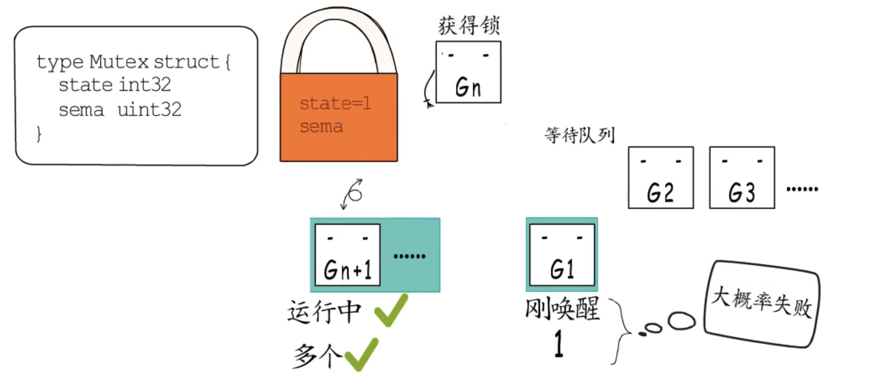
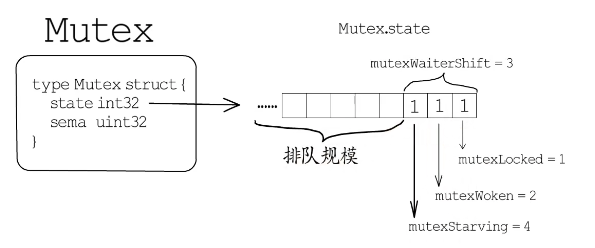
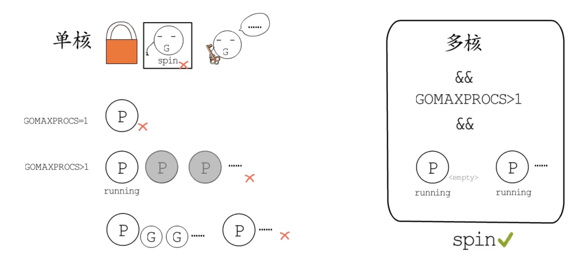
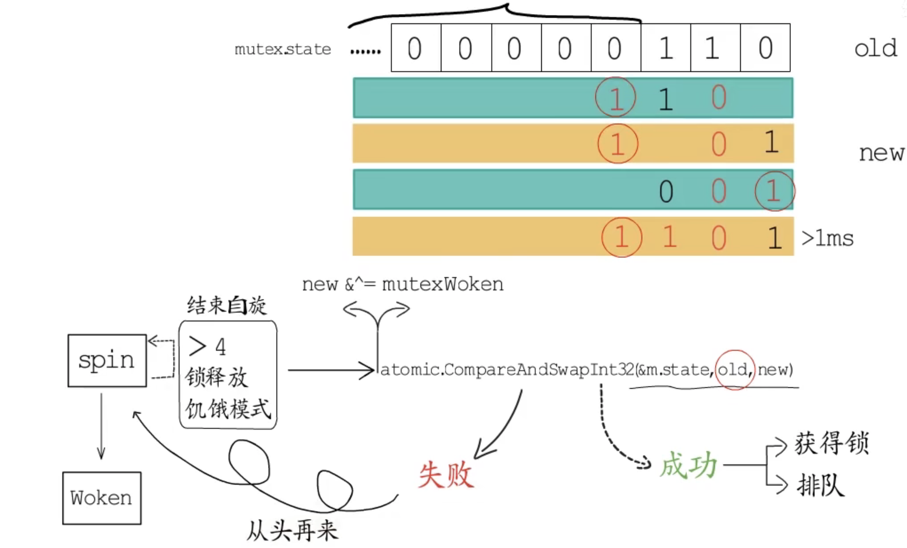

# 锁和读写锁底层实现? 锁有几种模式？

总纲：

<video id="video" width="1000px" height="600px" controls="controls">
    <source id="mp4" src="./assets/videos/Mutex秘籍 - 001 - 总纲.mp4" type="video/mp4">
</video>

理想状态的锁——唯快不破：

<video id="video" width="1000px" height="600px" controls="controls">
    <source id="mp4" src="./assets/videos/Mutex秘籍 - 002 - 理想状态的锁——唯快不破.mp4" type="video/mp4">
</video>

兼顾吞吐量和公平性——收放自如：
 
<video id="video" width="1000px" height="600px" controls="controls">
    <source id="mp4" src="./assets/videos/Mutex秘籍 - 003 - 兼顾吞吐量和公平性——收放自如.mp4" type="video/mp4">
</video>

锁设计理念、runtime提供的等待队列：

<video id="video" width="1000px" height="600px" controls="controls">
    <source id="mp4" src="./assets/videos/信号量 - runtime提供的等待队列.mp4" type="video/mp4">
</video>


<font size=5>**概览**</font>

go语言里mutex结构是这样的：

```go
type Mutex struct {
	state int32
	sema uint32
}
```

此结构的零值就是一个有效的互斥锁，处于unlock状态，state存储的是互斥锁的状态，加锁和解锁都是通过atomic包提供的函数原子性操作该字段。sema用作一个信号量，主要用作等待队列。

Mutex有两种模式，在正常模式下，一个尝试加锁的goroutine会先自旋几次，尝试通过原子操作获得锁，若几次自旋之后仍不能获得锁，则通过信号量排队等待，所有的等待者会按照先入先出（FIFO）的顺序排队，但是，当锁被释放，第一个等待者被唤醒后并不会直接拥有锁，而是需要和后来者竞争，也就是那些处于自旋阶段且尚未排队等待的goroutine，这种情况下后来者更有优势，一方面，他们正在cpu上运行，自然比刚被唤醒的goroutine更有优势，另一方面，处于自旋状态的goroutine可以有很多，而被唤醒的goroutine每次只有一个。所以被唤醒的goroutine有很大概率拿不到锁。这种情况下他会被重新插入到队列的头部，而不是尾部。



而当一个goroutine本次加锁的等待时间超过1ms后，它会把当前Mutex从正常模式切换至饥饿模式，在饥饿模式下，Mutex的所有权从执行unlock的goroutine执行传递给等待队列头部的goroutine，后来者不会自旋，也不会尝试获取锁（即使Mutex处于unlock状态），它们会直接从队列的尾部排队等待。

当一个等待者获得锁之后，他会在以下两种情况时将Mutex从饥饿模式切换回正常模式：

- 它的等待时间小于1ms

- 它是最后一个等待者，等待队列已经空了

综上所述，在正常模式下自旋和排队时同时存在的，执行lock的goroutine会先一边自旋，尝试过几次后如果还没拿到锁，就需要去排队等待了，这种在排队之前先让大家来抢的模式，能够有更高的吞吐量，因为频繁的挂起、唤醒goroutine会带来较多的开销。但是又不能无限制的自旋，要把自旋的开销控制在较小的范围内。

所以，在正常模式下，Mutex有更好的性能，但是可能出现队列尾部的goroutine迟迟抢不到锁（尾端延迟）的情况。

而饥饿模式下，不在自旋尝试，所有goroutine都要排队严格的先来后到，对于防止出现尾端延迟来讲特别重要。

<font size=5>**实现原理**</font>

state的类型是int32，其中第一位用作锁状态标识，置为1表示已加锁，第二位用于记录是否已有goroutine被唤醒了，置为1表示已唤醒，第三位标识Mutex的工作模式，0代表正常模式，1代表饥饿模式。state的其他位用来记录有多少个等待者在排队



然后再来看一下lock和unlock方法，精简掉race检测相关代码，两个方法中主要通过atomic函数实现了 fast path，

```go
func (m *Mutex) Lock() {
	// Fast path: grab unlocked mutex.
	if atomic.CompareAndSwapInt32(&m.state, 0, mutexLocked) {
		return
	}

	m.lockSlow()
}
```

```go
func (m *Mutex) Unlock() {
	new := atomic.AddInt32(&m.state, -mutexLocked)
	if new != 0 {
		m.unlockSlow(new)
	}
}
```

相应的slow path被单独放在了lockSlow和unlockSlow方法中，根据源码和注释的说法，这样是为了便于编译器对 fast path 进行内联优化。

lock方法的fast path期望Mutex处于unlock状态，没有goroutine在排队，更不会饥饿。

理想状况下，一个CAS操作就可以获得锁，但是如果CAS没能获得锁，就需要进入slow path，也就是lockSlow方法。


unlock方法同理，首先通过原子操作从state中减去mutexLocked，也就是释放锁，然后根据state的新值来判断是否需要执行slow path，如果新值为0，也就意味着没有其他goroutine在排队，所以不需要执行额外操作。如果新值不为0，那就需要进入slow path，看看是不是需要唤醒某个goroutine。

<font size=5>**加锁的slow path**</font>

当一个goroutine尝试给Mutex加锁时，如果其他goroutine已经加了锁还没有释放，而且当前Mutex处于正常模式下，是不一定自旋的，因为在单核模式下，自旋的goroutine在等待持有锁的goroutine释放锁，而持有锁的goroutine在等待自旋的goroutine让出cpu，这种情况下自旋就没有意义了。而且如果gomaxprocs=1，或者当前没有其他p正在运行，也和单核场景类似同样不需要自旋。除此之外，如果当前p的本地runq不为空，相较于自旋而言，切换到本地goroutine更有效率，所以，为保障吞吐量也不会自旋。最终，自由在多核场景下，且gomaxprocs>1，且至少有一个其他的p正在running，且当前p的本地runq为空的情况下才可以自旋。



进入自旋的goroutine会先去争抢Mutex的唤醒标识位，设置mutexWoken标识位的目的是：在正常模式下，告知持有锁的goroutine，在unlock的时候不用再唤醒其他goroutine了，已经有goroutine在这里等待，以免唤醒太多等待协程。

Mutex中的自旋，底层是通过procyield循环执行30次PAUSE，自旋次数上限是4，而且每自旋一次都需要重新判断是否可以继续自旋。如果锁被释放了，或者锁进入了饥饿模式，亦或者已经自旋了4次，都会结束自旋。


结束自旋或者根本不用自旋的goroutine就该尝试原子操作修改mutex状态了，把此时Mutex.state保存到old中，把要修改的新state记为new，如果old处于饥饿模式或者加锁状态，goroutine就得去排队，所以这些情况下排队规模要加1，如果是正常模式，就要尝试设置lock位，所以new中mutexLocked要置为1，如果当前goroutine等待时间已经超过1ms而且锁还没被释放，就要讲Mutex的状态切换为饥饿模式。

把排队规模和几个标识位都设置好后，在执行原子操作修改state之前，若是当前goroutine持有唤醒标识的话，还要将唤醒标识位重置，因为，接下来无论是要去抢锁还是单纯的去排队，如果原子操作成功了，要么成功的抢到了锁，要么是成功的进到了等待队列，当前goroutine都不再是被唤醒的goroutine了，所以要释放唤醒标识位。而如果原子操作不成功，也就意味着其他goroutine在我们保存mutex.state到old中以后，又修改了state的值，当前goroutine就要回过头去继续从自旋检查这里开始再次尝试，所以也需要释放自己之前抢到的唤醒标识位，从头再来。



继续展开这个原子操作成功的分支，如果是抢锁成功了，那么加锁的slow path就可以宣告结束了。如果是排队规模设置成功了还要决定是要排在等待队列头部还是尾部，如果当前goroutine已经排过队了，是在unlock时从等待队列唤醒的，那就要排到等待队列头部，如果是第一次排队，就得排到等待队列尾部，并且从第一次排队开始记录当前goroutine的等待时间，接下来就会让出，进到等待队列里。

队列里的goroutine被唤醒时，要从上次让出的地方开始继续执行，接下来会判断如果mutex处于正常模式，那就接着从自旋开始抢锁。如果唤醒后mutex处在饥饿模式，那就没有其他goroutine会和自己抢了，锁已经轮到自己这里，只需要把mutex.state中的lock标识位设置为加锁，把等待队列规模减1，再看看是不是需要切换到正常模式，也就是自己等待时间是不是小于1ms，或者等待队列已经空了，最后设置好mutex.state就一切ok了，这就是加锁操作的slow path。

<font size=5>**解锁的slow path**</font>

```go
func (m *Mutex) unlockSlow(new int32) {
    ...
	if new&mutexStarving == 0 {
		old := new
		for {
			if old>>mutexWaiterShift == 0 || old&(mutexLocked|mutexWoken|mutexStarving) != 0 {
				return
			}
			new = (old - 1<<mutexWaiterShift) | mutexWoken
			if atomic.CompareAndSwapInt32(&m.state, old, new) {
				runtime_Semrelease(&m.sema, false, 1)
				return
			}
			old = m.state
		}
	} else {
		runtime_Semrelease(&m.sema, true, 1)
	}
}
```

进到unlock的slow path，说明除去lock标识位以外，剩下的位不全为0，如果处在正常模式下，若等待队列为空，或者已经有其他goroutine被唤醒或获得了锁，或者锁进入了饥饿模式，那就不需要唤醒某个goroutine，直接返回即可。

否则就要尝试抢占mutexWorken标识位，获取唤醒一个goroutine的权利，抢占成功后就会通过runtime.Semrelease函数唤醒一个goroutine，如果抢占不成功就进入循环尝试，直到等待队列为空，或者已经有一个goroutine被唤醒或获得了锁，或者锁进入了饥饿模式，则退出循环。

而在饥饿模式下，后来的goroutine不会争抢锁，而是直接进行排队，锁的所有权执行从执行unlock的goroutine传递给等待队列中首个等待者，所以不用抢占mutexWoken标识位。

第一个等待者唤醒后，会继承当前goroutine的时间片立刻开始运行，也就是继续lockSlow这里goroutine被唤醒以后的逻辑，这就是unlock的slow path


<font size=5>**通过信号量实现排队**</font>

我们知道可以通过锁来保护临界区的互斥性，如果尝试获得锁失败了，第一种策略是屡败屡战不断重复尝试，直到成功获得锁或者时间片耗完，这被称为自旋锁。

第二种策略是乖乖让出cpu，听从操作系统的安排进入等待队列，我们称之为调度器对象，通俗理解就是操作系统提供的线程间同步原语，一般以一组系统调用的形式存在，比如linux的futex等。基于这些同步原语，可以实现锁以及更复杂的同步工具，这些调度器对象与自旋锁的不同之处主要在于等待队列，这些同步原语是由内核提供的，直接与系统的调度器交互，能够挂起和唤醒线程，这一点是自旋锁做不到的，但也正由于其在内核中实现，所以应用程序需要以系统调用的方式来使用它，这就造成来一定开销，而且获取锁失败时还会发生线程切换，使得开销进一步增大。所以说，调度器对象和自旋锁各有各的应用场景。

如果是多核环境，且持有锁的时间占比较小的情况，往往在几次自旋之后就能获得锁，这比发生一次线程切换的代价小得多。

然而若是单核环境，或者持有锁的时间占比较大的情况，一味自旋空耗cpu反而得不偿失。

而实际的业务逻辑中，持有锁的时间往往不是很确定，如果加锁时先经过自旋锁，但是限制最大自旋次数，若在有限次数内不能加锁成功，再通过调度器对象将当前线程挂起，这样就结合了二者的优点，也是如今主流的锁实现思路，go语言runtime包中的Mutex就是这样的思路，它被runtime自身的代码使用，本质上就是一个结合了自旋锁和调度器对象的优化过的锁，不过它是针对线程设计的，若是协程等待锁时还需要切换线程那就说不过去了，那协程等待一个锁时要如何休眠，等待，唤醒呢？

这要靠runtime.semaphore来实现，这是可供协程使用的信号量。

runtime内部会通过一个大小为251的semaTable来管理所有的semaphore，怎么通过这个大小固定的table来管理数量不定的semaphore呢？大致思路是这样的：

这个semaTable存储的是251棵平衡树的根，平衡树中每个节点都是一个sudog类型的对象，要使用一个信号量时，需要提供一个记录信号量数值的变量，根据它的地址进行计算，映射到semaTable中的一棵平衡树上，找到对应的节点，就找到来该信号量的等待队列。

例如我们常用的sync.Mutex中，有一个sema字段，用于记录信号量的数值，如果有协程想要等待这个Mutex，就会根据sema字段的地址计算映射到semaTable中的某个平衡树上，找到对应的节点，也就找到了这个Mutex的等待队列，所以，sync.Mutex是通过信号量来实现排队的。


而channel需要读等待队列和写等待队列，还要支持缓冲区的功能，所以并没有直接使用信号量来实现排队，而是自己实现了一套排队逻辑，不过无论是信号量还是channel，底层实现都离不开runtime.Mutex，因为它们都需要保障在面临多线程并发时不会出现同步问题


****

在正常模式下，锁的等待者会按照先进先出的顺序获取锁。但是刚被唤起的 Goroutine 与新创建的 Goroutine 竞争时，大概率会获取不到锁，为了减少这种情况的出现，一旦 Goroutine 超过 1ms 没有获取到锁，它就会将当前互斥锁切换饥饿模式，防止部分 Goroutine 被『饿死』。

在饥饿模式中，互斥锁会直接交给等待队列最前面的 Goroutine。新的 Goroutine 在该状态下不能获取锁、也不会进入自旋状态，它们只会在队列的末尾等待。如果一个 Goroutine 获得了互斥锁并且它在队列的末尾或者它等待的时间少于 1ms，那么当前的互斥锁就会切换回正常模式。

与饥饿模式相比，正常模式下的互斥锁能够提供更好地性能，饥饿模式的能避免 Goroutine 由于陷入等待无法获取锁而造成的高尾延时。

******

互斥锁有两种状态：正常状态和饥饿状态。

在正常状态下，所有等待锁的 goroutine 按照FIFO顺序等待。唤醒的 goroutine 不会直接拥有锁，而是会和新请求锁的 goroutine 竞争锁的拥有。新请求锁的 goroutine 具有优势：它正在 CPU 上执行，而且可能有好几个，所以刚刚唤醒的 goroutine 有很大可能在锁竞争中失败。在这种情况下，这个被唤醒的 goroutine 会加入到等待队列的前面。 如果一个等待的 goroutine 超过 1ms 没有获取锁，那么它将会把锁转变为饥饿模式。

在饥饿模式下，锁的所有权将从 unlock 的 goroutine 直接交给交给等待队列中的第一个。新来的 goroutine 将不会尝试去获得锁，即使锁看起来是 unlock 状态, 也不会去尝试自旋操作，而是放在等待队列的尾部。

如果一个等待的 goroutine 获取了锁，并且满足一以下其中的任何一个条件：(1)它是队列中的最后一个；(2)它等待的时候小于1ms。它会将锁的状态转换为正常状态。

正常状态有很好的性能表现，饥饿模式也是非常重要的，因为它能阻止尾部延迟的现象。