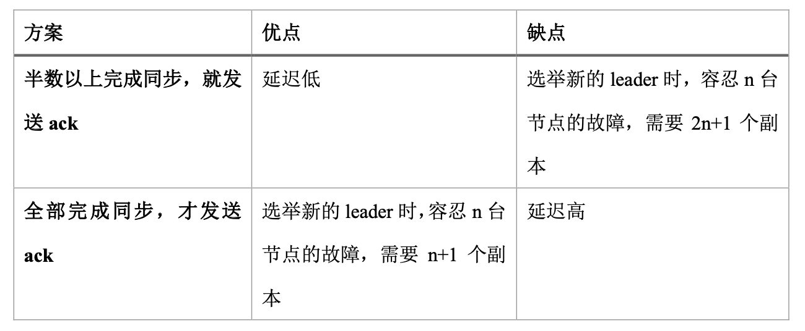
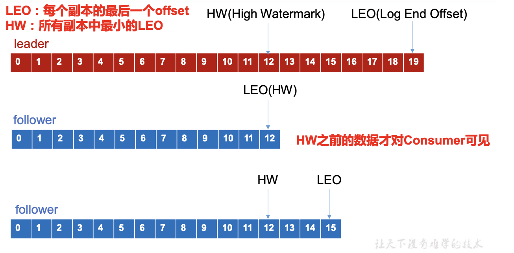

# Kafka数据可靠性保证

为保证 producer 发送的数据，能可靠的发送到指定的 topic，topic 的每个 partition 收到 producer 发送的数据后，都需要向 producer 发送 ack(acknowledgement 确认收到)，如果 producer 收到 ack，就会进行下一轮的发送，否则重新发送数据。

# 1.副本数据同步策略

Kafka选择全部的follower同步完成，才可以发送ack，并没有选择半数以上完成同步，就发送 ack 的策略。原因如下:

1.同样为了容忍 n 台节点的故障，第一种方案需要 2n+1 个副本，而第二种方案只需要 n+1 个副本，而 Kafka 的每个分区都有大量的数据，第一种方案会造成大量数据的冗余。 

2.虽然第二种方案的网络延迟会比较高，但网络延迟对 Kafka 的影响较小。

# 2.ISR

采用第二种方案之后，设想以下情景:leader 收到数据，所有 follower 都开始同步数据， 但有一个 follower，因为某种故障，迟迟不能与 leader 进行同步，那 leader 就要一直等下去， 直到它完成同步，才能发送 ack。这个问题怎么解决呢?

**Leader 维护了一个动态的 in-sync replica set (ISR)，意为和 leader 保持同步的 follower 集 合。当 ISR 中的 follower 完成数据的同步之后，leader 就会给 follower 发送 ack。如果 follower 长时间未向 leader 同步数据，则该 follower 将被踢出 ISR，该时间阈值由 replica.lag.time.max.ms 参数设定。Leader 发生故障之后，就会从 ISR 中选举新的 leader。**

# 3.ack 应答机制

对于某些不太重要的数据，对数据的可靠性要求不是很高，能够容忍数据的少量丢失， 所以没必要等 ISR 中的 follower 全部接收成功。

所以 Kafka 为用户提供了三种可靠性级别，用户根据对可靠性和延迟的要求进行权衡，acks 参数配置:

- 0:producer 不等待 broker 的 ack，这一操作提供了一个最低的延迟，broker 一接收到还 没有写入磁盘就已经返回，当 broker 故障时有可能**丢失数据;**
  
- 1:producer 等待 broker 的 ack，partition 的 leader 落盘成功后返回 ack，如果在 follower 同步成功之前 leader 故障，那么将会**丢失数据;**

- -1(all):producer 等待 broker 的 ack，partition 的 leader 和 follower 全部落盘成功后才 返回 ack。但是如果在 follower 同步完成后，broker 发送 ack 之前，leader 发生故障，那么会 造成**数据重复。**

# 4.故障处理细节

LEO:指的是每个副本最大的 offset; 

HW:指的是消费者能见到的最大的 offset，ISR 队列中最小的 LEO。

**follower 故障**

follower 发生故障后会被临时踢出 ISR，待该 follower 恢复后，follower 会读取本地磁盘 记录的上次的 HW，并将 log 文件高于 HW 的部分截取掉，从 HW 开始向 leader 进行同步。 等该 follower 的 LEO 大于等于该 Partition 的 HW，即 follower 追上 leader 之后，就可以重 新加入 ISR 了。

**leader 故障**

leader 发生故障之后，会从 ISR 中选出一个新的 leader，之后，为保证多个副本之间的数据一致性，其余的 follower 会先将各自的 log 文件高于 HW 的部分截掉，然后从新的 leader 同步数据。注意:这只能保证副本之间的数据一致性，并不能保证数据不丢失或者不重复。

