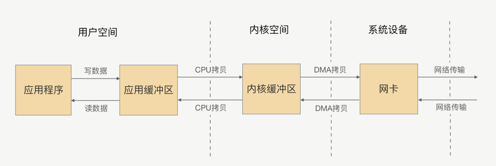

# Kafka如何实现高性能IO？

# 使用批量消息提升服务端处理能力

在 Kafka 内部，消息都是以“批”为单位处理的。

Kafka 的 Producer 只提供了单条发送的 send() 方法，并没有提供任何批量发送的接口。虽然它提供的 API 每次只能发送一条消息，但实际上，Kafka 的客户端 SDK 在实现消息发送逻辑的时候，采用了异步批量发送的机制。

当你调用 send() 方法发送一条消息之后，无论你是同步发送还是异步发送，Kafka 都不会立即就把这条消息发送出去。它会先把这条消息，存放在内存中缓存起来，然后选择合适的时机把缓存中的所有消息组成一批，一次性发给 Broker。


在服务端，Kafka 不会把一批消息再还原成多条消息，再一条一条地处理，这样太慢了。Kafka 这块儿处理的非常聪明，每批消息都会被当做一个“批消息”来处理。也就是说，在 Broker 整个处理流程中，无论是写入磁盘、从磁盘读出来、还是复制到其他副本这些流程中，批消息都不会被解开，一直是作为一条“批消息”来进行处理的。

在消费时，消息同样是以批为单位进行传递的，Consumer 从 Broker 拉到一批消息后，在客户端把批消息解开，再一条一条交给用户代码处理。

比如说，你在客户端发送 30 条消息，在业务程序看来，是发送了 30 条消息，而对于 Kafka 的 Broker 来说，它其实就是处理了 1 条包含 30 条消息的“批消息”而已。显然处理 1 次请求要比处理 30 次请求要快得多。

构建批消息和解开批消息分别在发送端和消费端的客户端完成，不仅减轻了 Broker 的压力，最重要的是减少了 Broker 处理请求的次数，提升了总体的处理能力。

# 使用顺序读写提升磁盘 IO 性能

对于磁盘来说，它有一个特性，就是顺序读写的性能要远远好于随机读写。操作系统每次从磁盘读写数据的时候，需要先寻址，也就是先要找到数据在磁盘上的物理位置，然后再进行数据读写。如果是机械硬盘，这个寻址需要比较长的时间，因为它要移动磁头，这是个机械运动，机械硬盘工作的时候会发出咔咔的声音，就是移动磁头发出的声音。

顺序读写相比随机读写省去了大部分的寻址时间，它只要寻址一次，就可以连续地读写下去，所以说，性能要比随机读写要好很多。

Kafka 就是充分利用了磁盘的这个特性。它的存储设计非常简单，对于每个分区，它把从 Producer 收到的消息，顺序地写入对应的 log 文件中，一个文件写满了，就开启一个新的文件这样顺序写下去。消费的时候，也是从某个全局的位置开始，也就是某一个 log 文件中的某个位置开始，顺序地把消息读出来。

# 利用 PageCache 加速消息读写

在 Kafka 中，它会利用 PageCache 加速消息读写。PageCache 是现代操作系统都具有的一项基本特性。通俗地说，PageCache 就是操作系统在内存中给磁盘上的文件建立的缓存。无论我们使用什么语言编写的程序，在调用系统的 API 读写文件的时候，并不会直接去读写磁盘上的文件，应用程序实际操作的都是 PageCache，也就是文件在内存中缓存的副本。

应用程序在写入文件的时候，操作系统会先把数据写入到内存中的 PageCache，然后再一批一批地写到磁盘上。读取文件的时候，也是从 PageCache 中来读取数据，这时候会出现两种可能情况。

一种是 PageCache 中有数据，那就直接读取，这样就节省了从磁盘上读取数据的时间；另一种情况是，PageCache 中没有数据，这时候操作系统会引发一个缺页中断，应用程序的读取线程会被阻塞，操作系统把数据从文件中复制到 PageCache 中，然后应用程序再从 PageCache 中继续把数据读出来，这时会真正读一次磁盘上的文件，这个读的过程就会比较慢。

Kafka 在读写消息文件的时候，充分利用了 PageCache 的特性。一般来说，消息刚刚写入到服务端就会被消费。大部分情况下，消费读消息都会命中 PageCache，带来的好处有两个：一个是读取的速度会非常快，另外一个是，给写入消息让出磁盘的 IO 资源，间接也提升了写入的性能。

# ZeroCopy：零拷贝技术

在服务端，处理消费的大致逻辑是这样的：

- 首先，从文件中找到消息数据，读到内存中；
  
- 然后，把消息通过网络发给客户端。

这个过程中，数据实际上做了 2 次或者 3 次复制：

1.从文件复制数据到 PageCache 中，如果命中 PageCache，这一步可以省掉；

2.从 PageCache 复制到应用程序的内存空间中，也就是我们可以操作的对象所在的内存；

3.从应用程序的内存空间复制到 Socket 的缓冲区，这个过程就是我们调用网络应用框架的 API 发送数据的过程。

Kafka 使用零拷贝技术可以把这个复制次数减少一次，上面的 2、3 步骤两次复制合并成一次复制。直接从 PageCache 中把数据复制到 Socket 缓冲区中，这样不仅减少一次数据复制，更重要的是，由于不用把数据复制到用户内存空间，DMA 控制器可以直接完成数据复制，不需要 CPU 参与，速度更快。

下面是这个零拷贝对应的系统调用：

```
#include <sys/socket.h>
ssize_t sendfile(int out_fd, int in_fd, off_t *offset, size_t count);
```

它的前两个参数分别是目的端和源端的文件描述符，后面两个参数是源端的偏移量和复制数据的长度，返回值是实际复制数据的长度。

如果你遇到这种从文件读出数据后再通过网络发送出去的场景，并且这个过程中你不需要对这些数据进行处理，那一定要使用这个零拷贝的方法，可以有效地提升性能。

****

下面来自rpc实战与核心原理课程的零拷贝。

系统内核处理 IO 操作分为两个阶段——等待数据和拷贝数 据。等待数据，就是系统内核在等待网卡接收到数据后，把数据写到内核中;而拷贝数据， 就是系统内核在获取到数据后，将数据拷贝到用户进程的空间中。以下是具体流程:



应用进程的每一次写操作，都会把数据写到用户空间的缓冲区中，再由 CPU 将数据拷贝到系统内核的缓冲区中，之后再由 DMA 将这份数据拷贝到网卡中，最后由网卡发送出去。 这里我们可以看到，一次写操作数据要拷贝两次才能通过网卡发送出去，而用户进程的读操作则是将整个流程反过来，数据同样会拷贝两次才能让应用程序读取到数据。

应用进程的一次完整的读写操作，都需要在用户空间与内核空间中来回拷贝，并且每一次拷贝，都需要 CPU 进行一次上下文切换。很浪费cpu资源和性能，解决方案就是零拷贝技术。

所谓的零拷贝，就是取消用户空间与内核空间之间的数据拷贝操作，应用进程每一次的读写操作，可以通过一种方式，直接将数据写入内核或从内核中读取数据，再通过 DMA 将内核中的数据拷贝到网卡，或将网卡中的数据 copy 到内核。

那怎么做到零拷贝?你想一下是不是用户空间与内核空间都将数据写到一个地方，就不需要拷贝了?此时你有没有想到虚拟内存?

零拷贝有两种解决方式，分别是 mmap+write 方式和 sendfile 方式，其核心原理都是通过虚拟内存来解决的。

