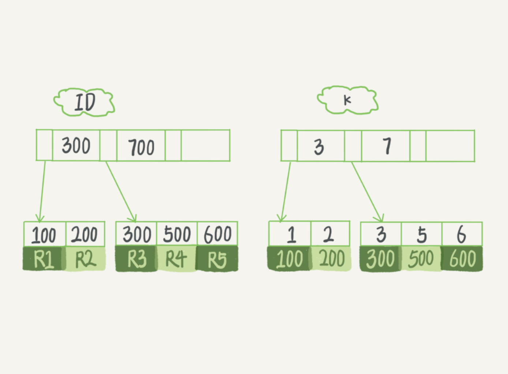

# 普通索引和唯一索引怎么选择？

# 查询过程

假设，执行查询的语句是 select id from T where k=5。

- 对于普通索引来说，查找到满足条件的第一个记录 (5,500) 后，需要查找下一个记录，直到碰到第一个不满足 k=5 条件的记录。
- 对于唯一索引来说，由于索引定义了唯一性，查找到第一个满足条件的记录后，就会停止继续检索。

这个不同带来的性能差距会有多少呢？答案是，微乎其微。InnoDB 的数据是按数据页为单位来读写的。也就是说，当需要读一条记录的时候，并不是将这个记录本身从磁盘读出来，而是以页为单位，将其整体读入内存。在 InnoDB 中，每个数据页的大小默认是 16KB。因为引擎是按页读写的，所以说，当找到 k=5 的记录的时候，它所在的数据页就都在内存里了。那么，对于普通索引来说，要多做的那一次“查找和判断下一条记录”的操作，就只需要一次指针寻找和一次计算。

# 更新过程

对于唯一索引来说，所有的更新操作都要先判断这个操作是否违反唯一性约束。比如，要插入 (4,400) 这个记录，就要先判断现在表中是否已经存在 k=4 的记录，而这必须要将数据页读入内存才能判断。如果都已经读入到内存了，那直接更新内存会更快，就没必要使用 change buffer 了。

**因此，唯一索引的更新就不能使用 change buffer，实际上也只有普通索引可以使用。**

我们再一起来看看如果要在这张表中插入一个新记录 (4,400) 的话，InnoDB 的处理流程是怎样的。

第一种情况是，这个记录要更新的目标页在内存中。这时，InnoDB 的处理流程如下：

- 对于唯一索引来说，找到 3 和 5 之间的位置，判断到没有冲突，插入这个值，语句执行结束；
- 对于普通索引来说，找到 3 和 5 之间的位置，插入这个值，语句执行结束。

这样看来，普通索引和唯一索引对更新语句性能影响的差别，只是一个判断，只会耗费微小的 CPU 时间

第二种情况是，这个记录要更新的目标页不在内存中。这时，InnoDB 的处理流程如下：

- 对于唯一索引来说，需要将数据页读入内存，判断到没有冲突，插入这个值，语句执行结束；
- 对于普通索引来说，则是将更新记录在 change buffer，语句执行就结束了。

将数据从磁盘读入内存涉及随机 IO 的访问，是数据库里面成本最高的操作之一。change buffer 因为减少了随机磁盘访问，所以对更新性能的提升是会很明显的。

# 索引选择和实践

所以，我建议你尽量选择普通索引。

如果所有的更新后面，都马上伴随着对这个记录的查询，那么你应该关闭 change buffer。而在其他情况下，change buffer 都能提升更新性能。

在实际使用中，你会发现，普通索引和 change buffer 的配合使用，对于数据量大的表的更新优化还是很明显的。

