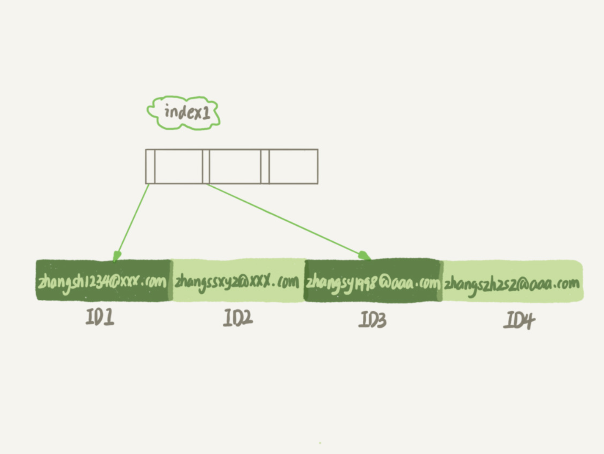
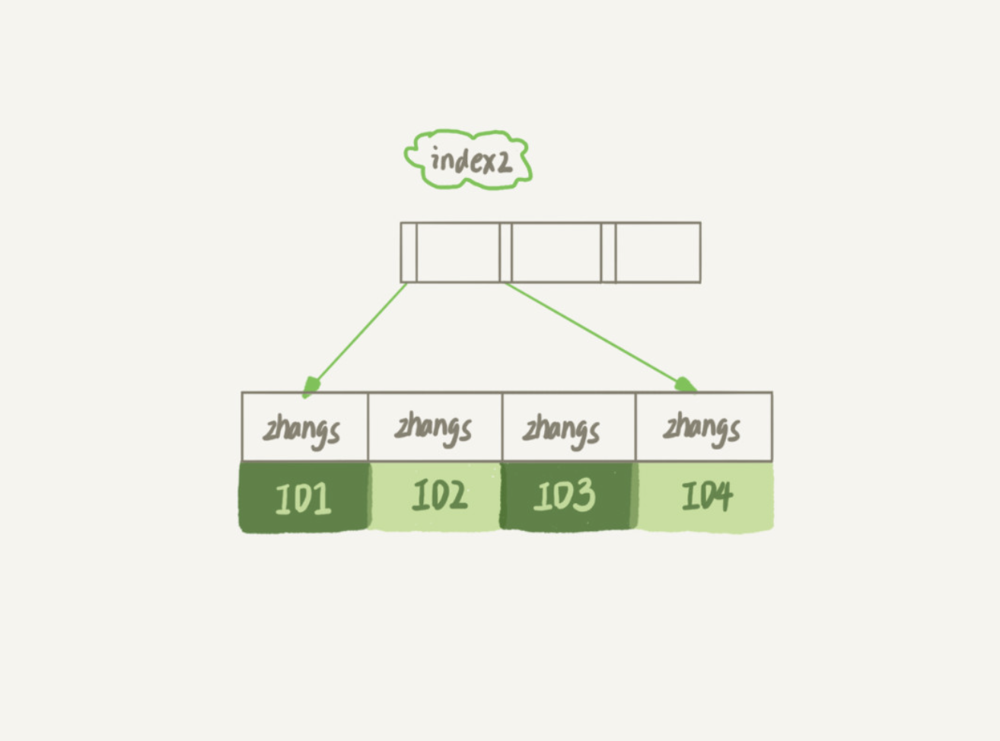

# 如何给字符串字段加索引？

如何在邮箱这样的字段上建立合理的索引？MySQL 是支持前缀索引的，也就是说，你可以定义字符串的一部分作为索引。比如，这两个在 email 字段上创建索引的语句：

```mysql
mysql> alter table SUser add index index1(email);
或
mysql> alter table SUser add index index2(email(6));
```

第一个语句创建的 index1 索引里面，包含了每个记录的整个字符串；而第二个语句创建的 index2 索引里面，对于每个记录都是只取前 6 个字节。

那么，这两种不同的定义在数据结构和存储上有什么区别呢？如图所示，就是这两个索引的示意图。





由于 email(6) 这个索引结构中每个邮箱字段都只取前 6 个字节（即：zhangs），所以占用的空间会更小，这就是使用前缀索引的优势。

我们再看看下面这个语句，在这两个索引定义下分别是怎么执行的。

```mysql
select id,name,email from SUser where email='zhangssxyz@xxx.com';
```

如果使用的是 index1（即 email 整个字符串的索引结构），执行顺序是这样的：

- 从 index1 索引树找到满足索引值是’zhangssxyz@xxx.com’的这条记录，取得 ID2 的值；
- 到主键上查到主键值是 ID2 的行，判断 email 的值是正确的，将这行记录加入结果集；
- 取 index1 索引树上刚刚查到的位置的下一条记录，发现已经不满足 email='zhangssxyz@xxx.com’的条件了，循环结束。

如果使用的是 index2（即 email(6) 索引结构），执行顺序是这样的：

- 从 index2 索引树找到满足索引值是’zhangs’的记录，找到的第一个是 ID1；
- 到主键上查到主键值是 ID1 的行，判断出 email 的值不是’zhangssxyz@xxx.com’，这行记录丢弃；
- 取 index2 上刚刚查到的位置的下一条记录，发现仍然是’zhangs’，取出 ID2，再到 ID 索引上取整行然后判断，这次值对了，将这行记录加入结果集；
- 重复上一步，直到在 idxe2 上取到的值不是’zhangs’时，循环结束。

在这个过程中，要回主键索引取 4 次数据，使用前缀索引后，可能会导致查询语句读数据的次数变多。使用前缀索引，定义好长度，就可以做到既节省空间，又不用额外增加太多的查询成本。


# 其他方式

**索引选取的越长，占用的磁盘空间就越大，相同的数据页能放下的索引值就越少，搜索的效率也就会越低。**

前缀索引随着索引字段长度增加导致占用内存变大，比如身份证号，那还有没有别的处理方法呢？这种方法，既可以占用更小的空间，也能达到相同的查询效率。

**第一种方式是使用倒序存储。** 如果你存储身份证号的时候把它倒过来存，每次查询的时候，你可以这么写：

```mysql
mysql> select field_list from t where id_card = reverse('input_id_card_string');
```

由于身份证号的最后 6 位没有地址码这样的重复逻辑，所以最后这 6 位很可能就提供了足够的区分度。

**第二种方式是使用 hash 字段。** 你可以在表上再创建一个整数字段，来保存身份证的校验码，同时在这个字段上创建索引。

```mysql
mysql> alter table t add id_card_crc int unsigned, add index(id_card_crc);
```

然后每次插入新记录的时候，都同时用 crc32() 这个函数得到校验码填到这个新字段。由于校验码可能存在冲突，也就是说两个不同的身份证号通过 crc32() 函数得到的结果可能是相同的，所以你的查询语句 where 部分要判断 id_card 的值是否精确相同。

```mysql
mysql> select field_list from t where id_card_crc=crc32('input_id_card_string') and id_card='input_id_card_string'
```

我们再一起看看使用倒序存储和使用 hash 字段这两种方法的异同点。

首先，**它们的相同点是，都不支持范围查询。**

它们的不同点：

- 从占用的额外空间来看，倒序存储方式在主键索引上，不会消耗额外的存储空间，而 hash 字段方法需要增加一个字段。

- 在 CPU 消耗方面，倒序方式每次写和读的时候，都需要额外调用一次 reverse 函数，而 hash 字段的方式需要额外调用一次 crc32() 函数。如果只从这两个函数的计算复杂度来看的话，reverse 函数额外消耗的 CPU 资源会更小些。

- 从查询效率上看，使用 hash 字段方式的查询性能相对更稳定一些。因为 crc32 算出来的值虽然有冲突的概率，但是概率非常小，可以认为每次查询的平均扫描行数接近 1。而倒序存储方式毕竟还是用的前缀索引的方式，也就是说还是会增加扫描行数。
