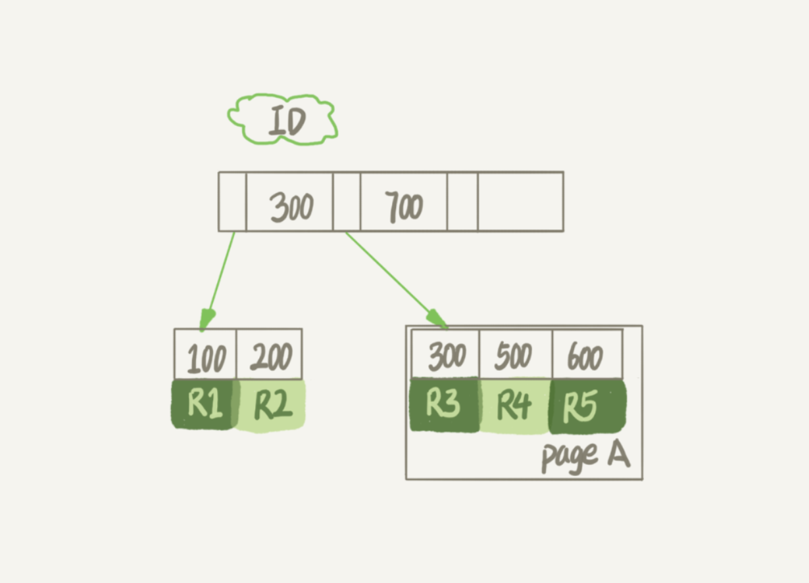

# 为什么表数据删掉一半表文件大小不变？

# 数据删除流程

假设，我们要删掉 R4 这个记录，InnoDB 引擎只会把 R4 这个记录标记为删除。如果之后要再插入一个 ID 在 300 和 600 之间的记录时，可能会复用这个位置。但是，磁盘文件的大小并不会缩小。

如果相邻的两个数据页利用率都很小，系统就会把这两个页上的数据合到其中一个页上，另外一个数据页就被标记为可复用。

进一步地，如果我们用 delete 命令把整个表的数据删除呢？结果就是，所有的数据页都会被标记为可复用。但是磁盘上，文件不会变小。

实际上，不止是删除数据会造成空洞，插入数据也会。当某个页满了再插入数据时需要再申请一个新的页来保存数据，页分裂完成后末尾就留下了空洞。

另外，更新索引上的值，可以理解为删除一个旧的值，再插入一个新值。不难理解，这也是会造成空洞的。

也就是说，经过大量增删改的表，都是可能是存在空洞的。所以，如果能够把这些空洞去掉，就能达到收缩表空间的目的。

而重建表，就可以达到这样的目的。

