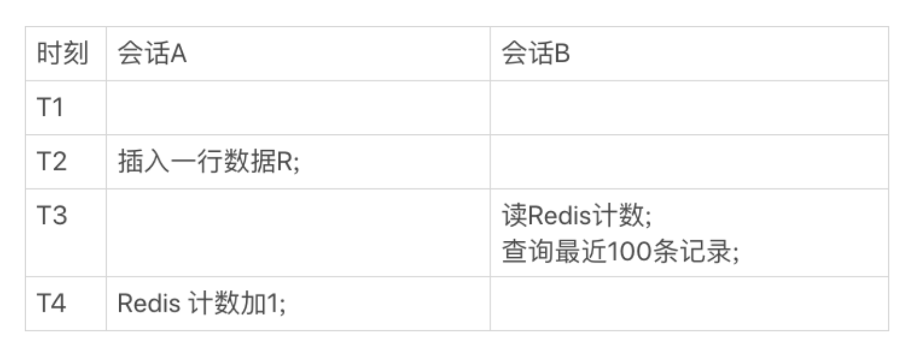
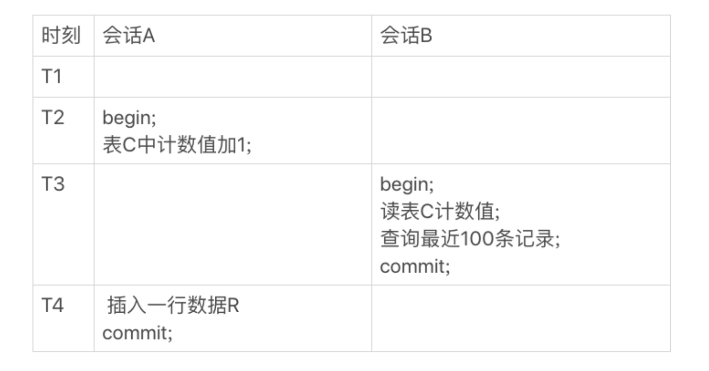

# count(*)很慢该怎么办？

# count(*) 的实现方式

在不同的 MySQL 引擎中，count(*) 有不同的实现方式。

- MyISAM 引擎把一个表的总行数存在了磁盘上，因此执行 count(*) 的时候会直接返回这个数，效率很高；
- 而 InnoDB 引擎就麻烦了，它执行 count(*) 的时候，需要把数据一行一行地从引擎里面读出来，然后累积计数。

为什么 InnoDB 不跟 MyISAM 一样，也把数字存起来呢？这是因为即使是在同一个时刻的多个查询，由于多版本并发控制（MVCC）的原因，InnoDB 表“应该返回多少行”也是不确定的。

你知道的，InnoDB 是索引组织表，主键索引树的叶子节点是数据，而普通索引树的叶子节点是主键值。所以，普通索引树比主键索引树小很多。对于 count(*) 这样的操作，遍历哪个索引树得到的结果逻辑上都是一样的。因此，MySQL 优化器会找到最小的那棵树来遍历。在保证逻辑正确的前提下，尽量减少扫描的数据量，是数据库系统设计的通用法则之一。

**如果你现在有一个页面经常要显示交易系统的操作记录总数，到底应该怎么办呢？答案是，我们只能自己计数。**

# 用缓存系统保存计数

缺点是缓存系统可能会丢失更新，即使 Redis 正常工作，这个值还是逻辑上不精确的。会有缓存和数据库数据一致性问题。

可以设想一下有这么一个页面，要显示操作记录的总数，同时还要显示最近操作的 100 条记录。那么，这个页面的逻辑就需要先到 Redis 里面取出计数，再到数据表里面取数据记录。

我们是这么定义不精确的：

- 一种是，查到的 100 行结果里面有最新插入记录，而 Redis 的计数里还没加 1；

- 另一种是，查到的 100 行结果里没有最新插入的记录，而 Redis 的计数里已经加了 1。

比如第一种情况：

会话 A 是一个插入交易记录的逻辑，往数据表里插入一行 R，然后 Redis 计数加 1；会话 B 就是查询页面显示时需要的数据。在 T3 时刻会话 B 来查询的时候，会显示出新插入的 R 这个记录，但是 Redis 的计数还没加 1。这时候，就会出现我们说的数据不一致。

**其实，把计数放在 Redis 里面，不能够保证计数和 MySQL 表里的数据精确一致的原因，是这两个不同的存储构成的系统，不支持分布式事务，无法拿到精确一致的视图。而把计数值也放在 MySQL 中，就解决了一致性视图的问题。**

# 在数据库保存计数

首先，这解决了崩溃丢失的问题，InnoDB 是支持崩溃恢复不丢数据的。其次，事务可以解决一致性问题，

我们来看下现在的执行结果。虽然会话 B 的读操作仍然是在 T3 执行的，但是因为这时候更新事务还没有提交，所以计数值加 1 这个操作对会话 B 还不可见。

因此，会话 B 看到的结果里， 查计数值和“最近 100 条记录”看到的结果，逻辑上就是一致的。

由于事务可以保证中间结果不被别的事务读到，因此修改计数值和插入新记录的顺序是不影响逻辑结果的。但是，从并发系统性能的角度考虑，你觉得在这个事务序列里，应该先插入操作记录，还是应该先更新计数表呢？

并发系统性能的角度考虑，**应该先插入操作记录，再更新计数表。** 因为更新计数表涉及到行锁的竞争，先插入再更新能最大程度地减少事务之间的锁等待，提升并发度。

# 不同的 count 效率

**对于 count(主键 id) 来说**，InnoDB 引擎会遍历整张表，把每一行的 id 值都取出来，返回给 server 层。server 层拿到 id 后，判断是不可能为空的，就按行累加。

**对于 count(1) 来说**，InnoDB 引擎遍历整张表，但不取值。server 层对于返回的每一行，放一个数字“1”进去，判断是不可能为空的，按行累加。

**所以count(1) 执行得要比 count(主键 id) 快。因为从引擎返回 id 会涉及到解析数据行，以及拷贝字段值的操作。**

对于 count(字段) 来说：

- 如果这个“字段”是定义为 not null 的话，一行行地从记录里面读出这个字段，判断不能为 null，按行累加；

- 如果这个“字段”定义允许为 null，那么执行的时候，判断到有可能是 null，还要把值取出来再判断一下，不是 null 才累加。

**但是 count(\*) 是例外**，并不会把全部字段取出来，而是专门做了优化，不取值。count(*) 肯定不是 null，按行累加。

**所以结论是：按照效率排序的话，count(字段)<count(主键 id)<count(1)≈count(\*)，所以我建议你，尽量使用 count(\*)。**

