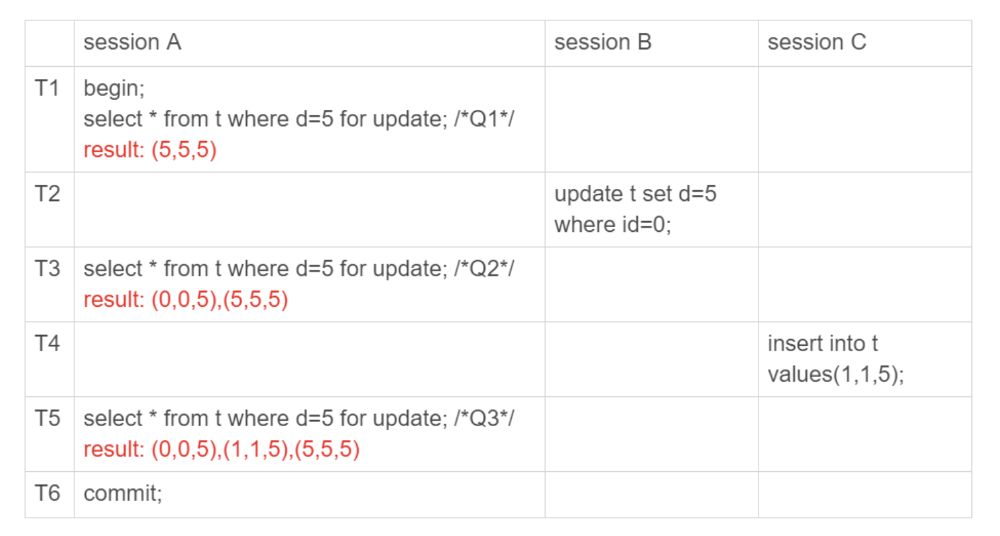
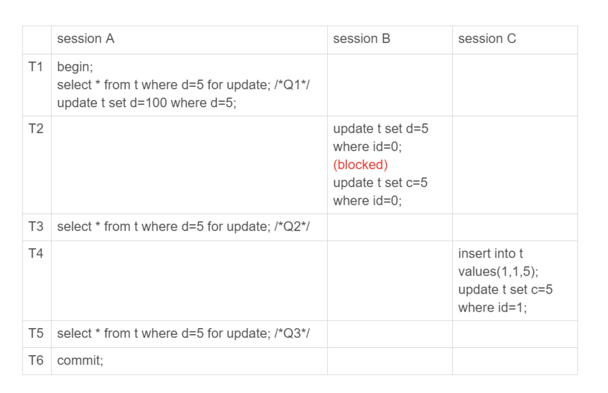
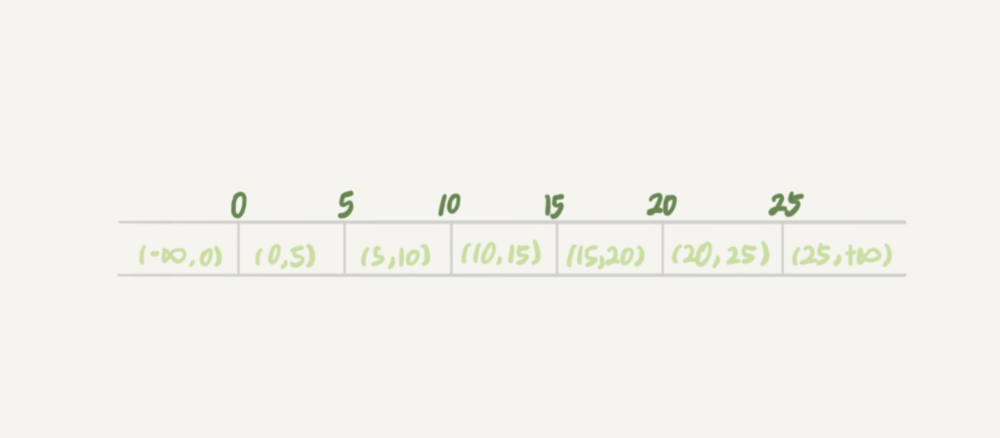

# 什么是幻读？

假设有这样一张表：

```mysql
CREATE TABLE `t` (
  `id` int(11) NOT NULL,
  `c` int(11) DEFAULT NULL,
  `d` int(11) DEFAULT NULL,
  PRIMARY KEY (`id`),
  KEY `c` (`c`)
) ENGINE=InnoDB;
 
insert into t values(0,0,0),(5,5,5),
(10,10,10),(15,15,15),(20,20,20),(25,25,25);
```

来看一下这个场景: 假设只在 id=5 这一行加锁，而其他行的不加锁



可以看到，session A 里执行了三次查询，查询结果都不相同。其中，Q3 读到 id=1 这一行的现象，被称为“幻读”。**幻读指的是一个事务在前后两次查询同一个范围的时候，后一次查询看到了前一次查询没有看到的行。**

::: tip
- 在可重复读隔离级别下，普通的查询是快照读，是不会看到别的事务插入的数据的。因此，幻读在“当前读”下才会出现。
- 上面 session B 的修改结果，被 session A 之后的 select 语句用“当前读”看到，不能称为幻读。幻读仅专指“新插入的行”。
:::
  
# 幻读产生的原因



为什么我们已经这么“凶残”地，把所有的记录都上了锁，还是阻止不了 id=1 这一行的插入和更新呢？

原因很简单。在 T3 时刻，我们给所有行加锁的时候，id=1 这一行还不存在，不存在也就加不上锁。

也就是说，即使把所有的记录都加上锁，还是阻止不了新插入的记录，这也是为什么“幻读”会被单独拿出来解决的原因。


# 如何解决幻读？

产生幻读的原因是，行锁只能锁住行，但是新插入记录这个动作，要更新的是记录之间的“间隙”。因此，为了解决幻读问题，InnoDB 只好引入新的锁，也就是间隙锁 (Gap Lock)。

顾名思义，间隙锁，锁的就是两个值之间的空隙。比如文章开头的表 t，初始化插入了 6 个记录，这就产生了 7 个间隙。



这样，当你执行 select * from t where d=5 for update 的时候，就不止是给数据库中已有的 6 个记录加上了行锁，还同时加了 7 个间隙锁。这样就确保了无法再插入新的记录。

也就是说这时候，在一行行扫描的过程中，不仅将给行加上了行锁，还给行两边的空隙，也加上了间隙锁。

**跟间隙锁存在冲突关系的，是“往这个间隙中插入一个记录”这个操作。** 间隙锁之间都不存在冲突关系。

这句话不太好理解，我给你举个例子：


这里 session B 并不会被堵住。因为表 t 里并没有 c=7 这个记录，因此 session A 加的是间隙锁 (5,10)。而 session B 也是在这个间隙加的间隙锁。它们有共同的目标，即：保护这个间隙，不允许插入值。但，它们之间是不冲突的。

间隙锁和行锁合称 next-key lock，每个 next-key lock 是前开后闭区间。也就是说，我们的表 t 初始化以后，如果用 select * from t for update 要把整个表所有记录锁起来，就形成了 7 个 next-key lock，分别是 (-∞,0]、(0,5]、(5,10]、(10,15]、(15,20]、(20, 25]、(25, +supremum]。

间隙锁的缺点：

**间隙锁的引入，可能会导致同样的语句锁住更大的范围，这其实是影响了并发度的。** 甚至出现由于间隙锁导致的死锁现象。

