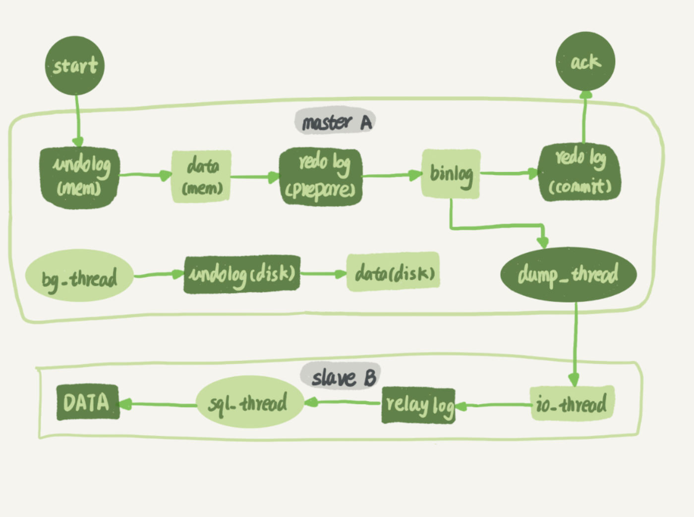

# 主备切换流程是什么样的？

主库接收到客户端的更新请求后，执行内部事务的更新逻辑，同时写 binlog。

备库 B 跟主库 A 之间维持了一个长连接。主库 A 内部有一个线程，专门用于服务备库 B 的这个长连接。一个事务日志同步的完整过程是这样的：

1. 在备库 B 上通过 change master 命令，设置主库 A 的 IP、端口、用户名、密码，以及要从哪个位置开始请求 binlog，这个位置包含文件名和日志偏移量。

2. 在备库 B 上执行 start slave 命令，这时候备库会启动两个线程，就是图中的 io_thread 和 sql_thread。其中 io_thread 负责与主库建立连接。

3. 主库 A 校验完用户名、密码后，开始按照备库 B 传过来的位置，从本地读取 binlog，发给 B。

4. 备库 B 拿到 binlog 后，写到本地文件，称为中转日志（relay log）。

5. sql_thread 读取中转日志，解析出日志里的命令，并执行。

后来由于多线程复制方案的引入，sql_thread 演化成为了多个线程，跟我们今天要介绍的原理没有直接关系，暂且不展开。