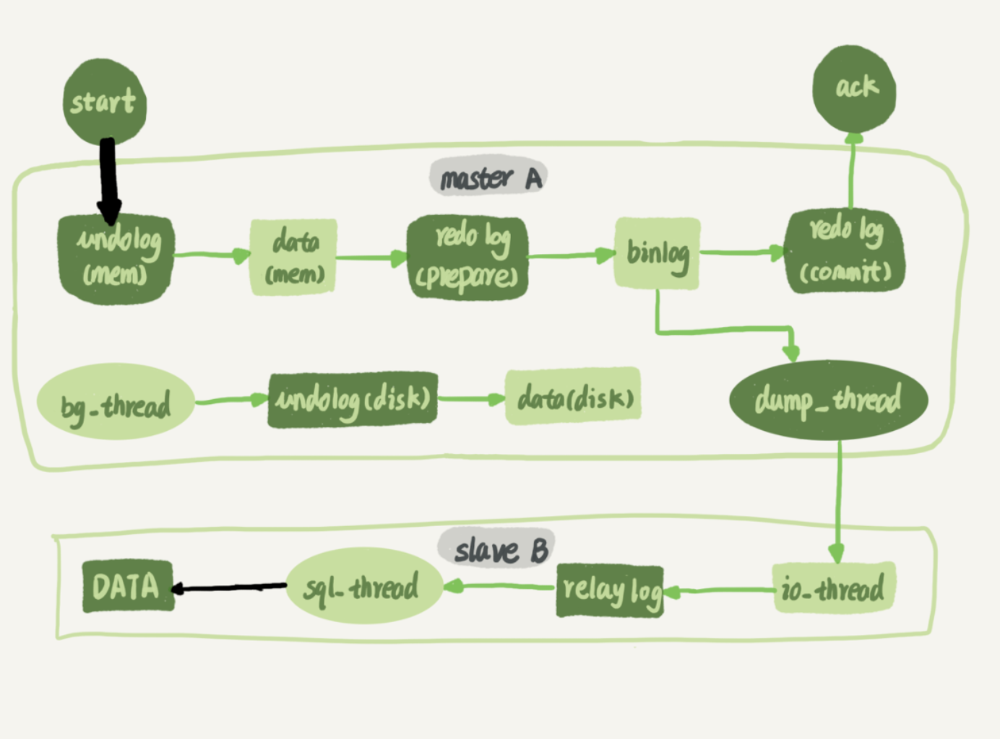
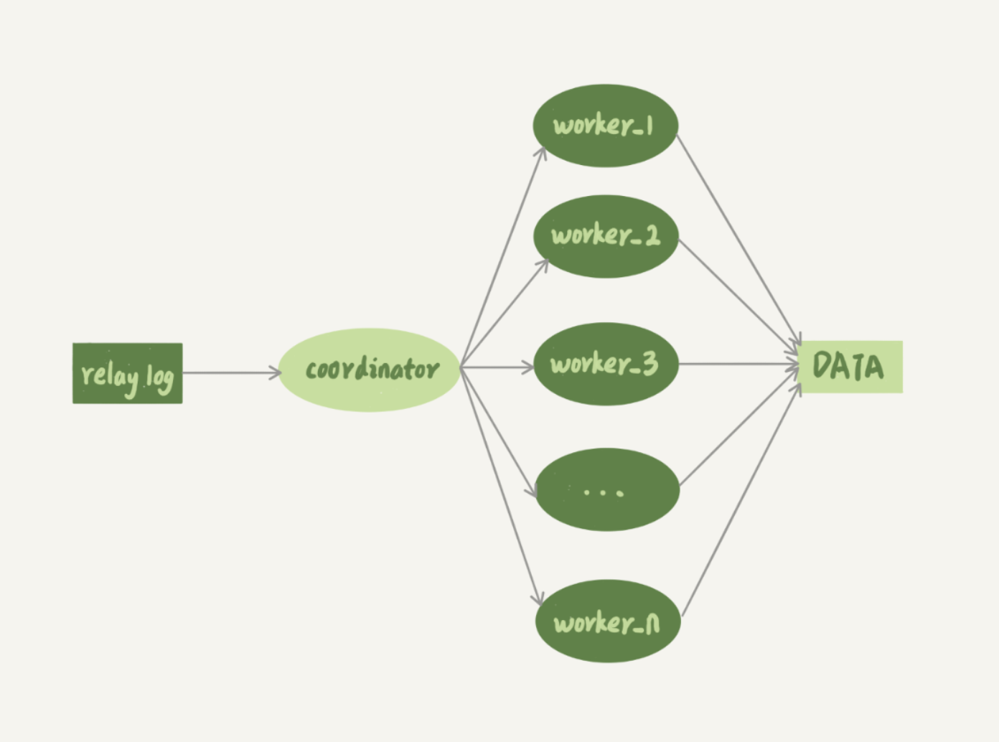

# 怎么解决主备延迟问题？



1.主库 A 执行完成一个事务，写入 binlog，我们把这个时刻记为 T1;

2.之后传给备库 B，我们把备库 B 接收完这个 binlog 的时刻记为 T2;

3.备库 B 执行完成这个事务，我们把这个时刻记为 T3。

所谓主备延迟，就是同一个事务，在备库执行完成的时间和主库执行完成的时间之间的差值，也就是 T3-T1。

需要说明的是，在网络正常的时候，日志从主库传给备库所需的时间是很短的，即 T2-T1 的值是非常小的。也就是说，网络正常情况下，主备延迟的主要来源是备库接收完 binlog 和执行完这个事务之间的时间差。

所以说，主备延迟最直接的表现是，备库消费中转日志（relay log）的速度，比主库生产 binlog 的速度要慢。

# 主备延迟的来源

**首先，有些部署条件下，备库所在机器的性能要比主库所在的机器性能差。** 不常见。

**第二种常见的可能是备库的压力大。**

备库上的查询耗费了大量的 CPU 资源，影响了同步速度，造成主备延迟。

这种情况，我们一般可以做一主多从。除了备库外，可以多接几个从库，让这些从库来分担读的压力。

**第三种可能是大事务。**

大事务这种情况很好理解。因为主库上必须等事务执行完成才会写入 binlog，再传给备库。所以，如果一个主库上的语句执行 10 分钟，那这个事务很可能就会导致从库延迟 10 分钟。

不知道你所在公司的 DBA 有没有跟你这么说过：不要一次性地用 delete 语句删除太多数据。其实，这就是一个典型的大事务场景。最好删除数据的时候，要控制每个事务删除的数据量，分成多次删除。


**另一种典型的大事务场景，就是大表 DDL。** 处理方案就是，计划内的 DDL，建议使用 gh-ost 方案。

**造成主备延迟还有一个大方向的原因，就是备库的并行复制能力。**

图中黑色的两个箭头。一个箭头代表了客户端写入主库，另一箭头代表的是备库上 sql_thread 执行中转日志（relay log）。

在主库上，影响并发度的原因就是各种锁了。由于 InnoDB 引擎支持行锁，除了所有并发事务都在更新同一行（热点行）这种极端场景外，它对业务并发度的支持还是很友好的。

而日志在备库上的执行，就是图中备库上 sql_thread 更新数据 (DATA) 的逻辑。如果是用单线程的话，就会导致备库应用日志不够快，造成主备延迟。

在官方的 5.6 版本之前，MySQL 只支持单线程复制，由此在主库并发高、TPS 高时就会出现严重的主备延迟问题。



coordinator 就是原来的 sql_thread, 不过现在它不再直接更新数据了，只负责读取中转日志和分发事务。真正更新日志的，变成了 worker 线程。而 work 线程的个数，就是由参数 slave_parallel_workers 决定的。


::: tip 注意

- 事务不能按照轮询的方式分发给各个 worker，也就是第一个事务分给 worker_1，第二个事务发给 worker_2。
- 同一个事务的多个更新语句，不能分给不同的 worker 来执行。

所以，coordinator 在分发的时候，需要满足以下这两个基本要求：

- 不能造成更新覆盖。这就要求更新同一行的两个事务，必须被分发到同一个 worker 中。
- 同一个事务不能被拆开，必须放到同一个 worker 中。

:::


# 解决主备延迟方案

# 强制走主库方案

**强制走主库方案**其实就是，将查询请求做分类。通常情况下，我们可以将查询请求分为这么两类：

- 对于必须要拿到最新结果的请求，强制将其发到主库上。比如，在一个交易平台上，卖家发布商品以后，马上要返回主页面，看商品是否发布成功。那么，这个请求需要拿到最新的结果，就必须走主库。

- 对于可以读到旧数据的请求，才将其发到从库上。在这个交易平台上，买家来逛商铺页面，就算晚几秒看到最新发布的商品，也是可以接受的。那么，这类请求就可以走从库。

当然，这个方案最大的问题在于，有时候你会碰到“所有查询都不能是过期读”的需求，比如一些金融类的业务。这样的话，你就要放弃读写分离，所有读写压力都在主库，等同于放弃了扩展性。

# Sleep 方案

**Sleep 方案**，主库更新后，读从库之前先 sleep 一下。具体的方案就是，类似于执行一条 select sleep(1) 命令。

这个思路确实可以在一定程度上解决问题。为了看起来更靠谱儿，我们可以换一种方式。

以卖家发布商品为例，商品发布后，用 Ajax（Asynchronous JavaScript + XML，异步 JavaScript 和 XML）直接把客户端输入的内容作为“新的商品”显示在页面上，而不是真正地去数据库做查询。这样，卖家就可以通过这个显示，来确认产品已经发布成功了。等到卖家再刷新页面，去查看商品的时候，其实已经过了一段时间，也就达到了 sleep 的目的，进而也就解决了过期读的问题。

从严格意义上来说，这个方案存在的问题就是不精确。

# 判断主备无延迟方案

第一种方法，对比位点确保主备无延迟：

- Master_Log_File 和 Read_Master_Log_Pos，表示的是读到的主库的最新位点；
- Relay_Master_Log_File 和 Exec_Master_Log_Pos，表示的是备库执行的最新位点。

如果 Master_Log_File 和 Relay_Master_Log_File、Read_Master_Log_Pos 和 Exec_Master_Log_Pos 这两组值完全相同，就表示接收到的日志已经同步完成。

第二种方法，对比 GTID 集合确保主备无延迟：

- Auto_Position=1 ，表示这对主备关系使用了 GTID 协议。
- Retrieved_Gtid_Set，是备库收到的所有日志的 GTID 集合；
- Executed_Gtid_Set，是备库所有已经执行完成的 GTID 集合。

如果这两个集合相同，也表示备库接收到的日志都已经同步完成。

**在执行查询请求之前，先判断从库是否同步完成的方法，相比于 sleep 方案，准确度确实提升了不少**，但还是没有达到“精确”的程度。为什么这么说呢？

我们上面判断主备无延迟的逻辑，是“备库收到的日志都执行完成了”。但是，从 binlog 在主备之间状态的分析中，不难看出还有一部分日志，处于客户端已经收到提交确认，而备库还没收到日志的状态。

# 等主库位点方案

要理解等主库位点方案，我需要先和你介绍一条命令：

```mysql
select master_pos_wait(file, pos[, timeout]);
```

这条命令的逻辑如下：

它是在从库执行的；

参数 file 和 pos 指的是主库上的文件名和位置；

timeout 可选，设置为正整数 N 表示这个函数最多等待 N 秒。

这个命令正常返回的结果是一个正整数 M，表示从命令开始执行，到应用完 file 和 pos 表示的 binlog 位置，执行了多少事务。

要保证能够查到正确的数据，我们可以使用这个逻辑：

- trx1 事务更新完成后，马上执行 show master status 得到当前主库执行到的 File 和 Position；

- 选定一个从库执行查询语句；

- 在从库上执行 select master_pos_wait(File, Position, 1)；

- 如果返回值是 >=0 的正整数，则在这个从库执行查询语句；

- 否则，到主库执行查询语句。


# GTID 方案

如果你的数据库开启了 GTID 模式，对应的也有等待 GTID 的方案。

MySQL 中同样提供了一个类似的命令：

```mysql
select wait_for_executed_gtid_set(gtid_set, 1);

```

这条命令的逻辑是：

- 等待，直到这个库执行的事务中包含传入的 gtid_set，返回 0；

- 超时返回 1。

在前面等位点的方案中，我们执行完事务后，还要主动去主库执行 show master status。而 MySQL 5.7.6 版本开始，允许在执行完更新类事务后，把这个事务的 GTID 返回给客户端，这样等 GTID 的方案就可以减少一次查询。

这时，等 GTID 的执行流程就变成了：

- trx1 事务更新完成后，从返回包直接获取这个事务的 GTID，记为 gtid1；

- 选定一个从库执行查询语句；

- 在从库上执行 select wait_for_executed_gtid_set(gtid1, 1)；

- 如果返回值是 0，则在这个从库执行查询语句；

- 否则，到主库执行查询语句。


# 总结

即使是等待位点和等待 GTID 这两个方案，虽然看上去比较靠谱儿，但仍然存在需要权衡的情况。如果所有的从库都延迟，那么请求就会全部落到主库上，这时候会不会由于压力突然增大，把主库打挂了呢？

其实，在实际应用中，这几个方案是可以混合使用的。

比如，先在客户端对请求做分类，区分哪些请求可以接受过期读，而哪些请求完全不能接受过期读；然后，对于不能接受过期读的语句，再使用等 GTID 或等位点的方案。

****

参考: [王雄宁系统设计课程](http://polygonx.top/wxning-blog/interview/system-design/notes/02/02.html)

