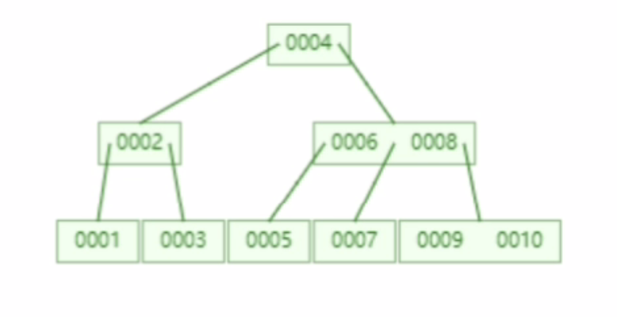
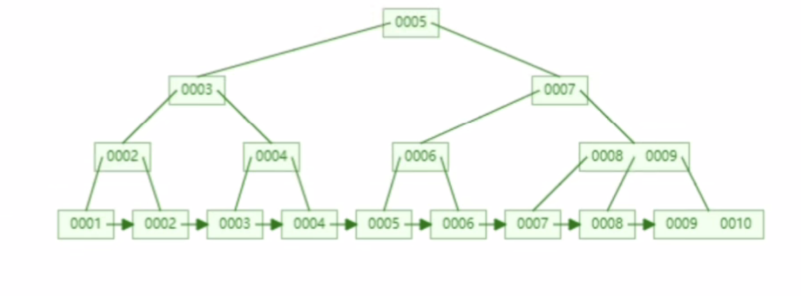

# 索引为什么不使用其他数据结构？

**哈希表这种结构适用于只有等值查询的场景**，比如 Memcached 及其他一些 NoSQL 引擎。哈希表不适用于区间查询。

虽然**有序数组在等值查询和范围查询场景中的性能就都非常优秀**，但是在需要更新数据的时候就麻烦了，你往中间插入一个记录就必须得挪动后面所有的记录，成本太高。所以，**有序数组索引只适用于静态存储引擎**，比如你要保存的是 2017 年某个城市的所有人口信息，这类不会再修改的数据。

二叉树会随着数据的增加树高越来越高，查询效率也越来越低。而且范围查询效率也很低，需要回旋查找。

同样b树虽然解决了二叉树树高越来越高的问题，但是在返回查找时还是需要回旋查找。

以 InnoDB 的一个整数字段索引为例，这个 N 叉树的 N 差不多是 1200。这棵树高是 4 的时候，就可以存 1200 的 3 次方个值，这已经 17 亿了。考虑到树根的数据块总是在内存中的，一个 10 亿行的表上一个整数字段的索引，查找一个值最多只需要访问 3 次磁盘。

b+树叶子结点有指针相连接，范围查找直接通过指针找到下一个元素，叶子结点已经排好序了。

B+树与B树的不同：

- B+树非叶子节点不存在数据只存索引，B树非叶子节点存储数据
  
- B+树查询效率更高。B+树使用双向链表串连所有叶子节点，区间查询效率更高（因为所有数据都在B+树的叶子节点，扫描数据库 只需扫一遍叶子结点就行了），但是B树则需要通过中序遍历才能完成查询范围的查找。
  
- B+树查询效率更稳定。B+树每次都必须查询到叶子节点才能找到数据，而B树查询的数据可能不在叶子节点，也可能在，这样就会造成查询的效率的不稳定
  
- B+树的磁盘读写代价更小。B+树的内部节点并没有指向关键字具体信息的指针，因此其内部节点相对B树更小，通常B+树矮更胖，高度小查询产生的I/O更少。

**参考：** https://www.bilibili.com/video/BV1t5411u7Fg?p=2	
