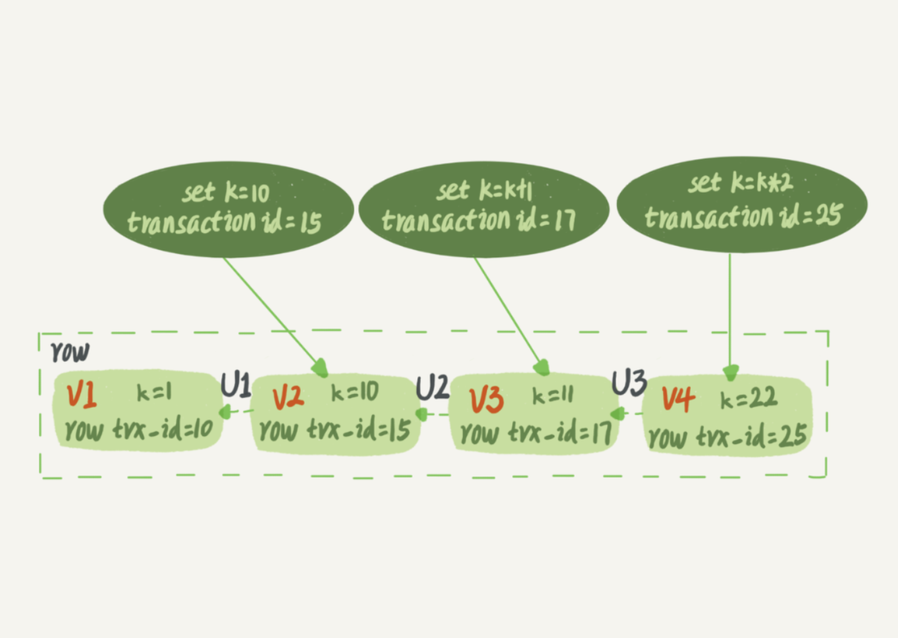
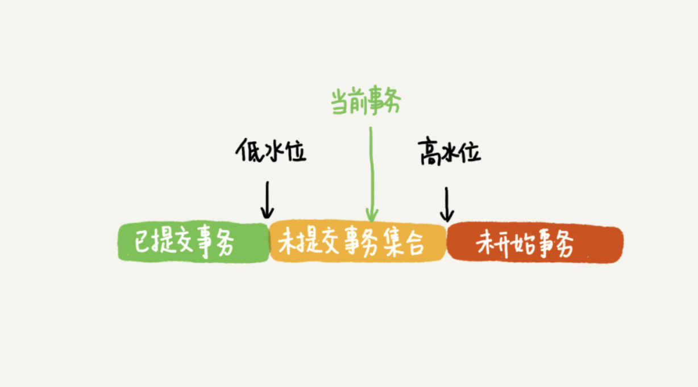

# MVCC 底层实现

InnoDB 在实现 MVCC 时用到的一致性读视图，即 consistent read view，用于支持 RC（Read Committed，读提交）和 RR（Repeatable Read，可重复读）隔离级别的实现。

在可重复读隔离级别下，事务在启动的时候就“拍了个快照”。注意，这个快照是基于整库的。

这时，你会说这看上去不太现实啊。如果一个库有 100G，那么我启动一个事务，MySQL 就要拷贝 100G 的数据出来，这个过程得多慢啊。可是，我平时的事务执行起来很快啊。

实际上，我们并不需要拷贝出这 100G 的数据。我们先来看看这个快照是怎么实现的。

InnoDB 里面每个事务有一个唯一的事务 ID，叫作 transaction id。它是在事务开始的时候向 InnoDB 的事务系统申请的，是按申请顺序严格递增的。

而每行数据也都是有多个版本的。每次事务更新数据的时候，都会生成一个新的数据版本，并且把 transaction id 赋值给这个数据版本的事务 ID，记为 row trx_id。同时，旧的数据版本要保留，并且在新的数据版本中，能够有信息可以直接拿到它。

也就是说，数据表中的一行记录，其实可能有多个版本 (row)，每个版本有自己的 row trx_id。

图中虚线框里是同一行数据的 4 个版本，当前最新版本是 V4，k 的值是 22，它是被 transaction id 为 25 的事务更新的，因此它的 row trx_id 也是 25。

你可能会问，前面的文章不是说，语句更新会生成 undo log（回滚日志）吗？那么，undo log 在哪呢？

实际上，图 2 中的三个虚线箭头，就是 undo log；而 V1、V2、V3 并不是物理上真实存在的，而是每次需要的时候根据当前版本和 undo log 计算出来的。比如，需要 V2 的时候，就是通过 V4 依次执行 U3、U2 算出来。

明白了多版本和 row trx_id 的概念后，我们再来想一下，InnoDB 是怎么定义那个“100G”的快照的。

按照可重复读的定义，一个事务启动的时候，能够看到所有已经提交的事务结果。但是之后，这个事务执行期间，其他事务的更新对它不可见。

因此，一个事务只需要在启动的时候声明说，“以我启动的时刻为准，如果一个数据版本是在我启动之前生成的，就认；如果是我启动以后才生成的，我就不认，我必须要找到它的上一个版本”。

当然，如果“上一个版本”也不可见，那就得继续往前找。还有，如果是这个事务自己更新的数据，它自己还是要认的。

在实现上， InnoDB 为每个事务构造了一个数组，用来保存这个事务启动瞬间，当前正在“活跃”的所有事务 ID。“活跃”指的就是，启动了但还没提交。

数组里面事务 ID 的最小值记为低水位，当前系统里面已经创建过的事务 ID 的最大值加 1 记为高水位。

这个视图数组和高水位，就组成了当前事务的一致性视图（read-view）。

而数据版本的可见性规则，就是基于数据的 row trx_id 和这个一致性视图的对比结果得到的。

这个视图数组把所有的 row trx_id 分成了几种不同的情况。

这样，对于当前事务的启动瞬间来说，一个数据版本的 row trx_id，有以下几种可能：

- 如果落在绿色部分，表示这个版本是已提交的事务或者是当前事务自己生成的，这个数据是可见的；

- 如果落在红色部分，表示这个版本是由将来启动的事务生成的，是肯定不可见的；

- 如果落在黄色部分，那就包括两种情况
  
    1.若 row trx_id 在数组中，表示这个版本是由还没提交的事务生成的，不可见；
  
    2.若 row trx_id 不在数组中，表示这个版本是已经提交了的事务生成的，可见。

比如，对于图 2 中的数据来说，如果有一个事务，它的低水位是 18，那么当它访问这一行数据时，就会从 V4 通过 U3 计算出 V3，所以在它看来，这一行的值是 11。

有了这个声明后，系统里面随后发生的更新，是不是就跟这个事务看到的内容无关了呢？因为之后的更新，生成的版本一定属于上面的 2 或者 3(a) 的情况，而对它来说，这些新的数据版本是不存在的，所以这个事务的快照，就是“静态”的了

  
**参考：** https://www.bilibili.com/video/BV1t5411u7Fg?spm_id_from=333.999.0.0

