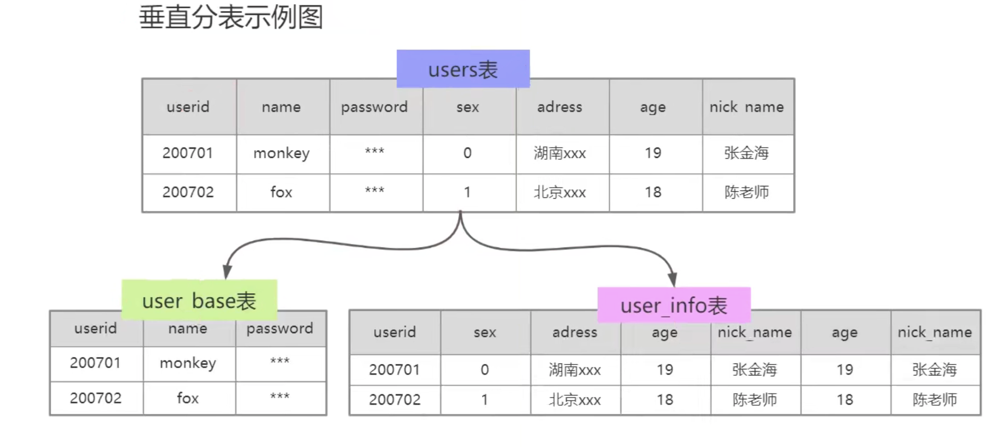
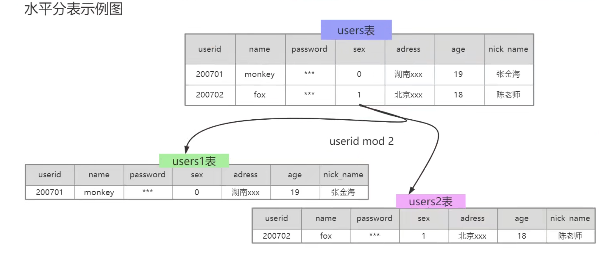

# 数据库中什么情况下进行分库，什么情况下进行分表？

# 如何进行分库？

分库：由单个数据库实例拆分成多个数据库实例，将数据分布到多个数据库实例中。分库分表采取的是分而治之的策略，分库目的是减轻单台MySQL实例存储压力及可扩展性。

  
**垂直分库**

纵向切库，太经典的切分方式，基于表进行切分，通俗来讲就是大表拆小表，通常是把新的业务模块或集成公共模块拆分出去，比如订单库，商品库，会员库。

**特点：**

- 每个库的表都不一样；

- 表不一样，数据就更不一样了，没有任何交集；

- 每个库相对独立，模块化；

**场景：**

可以抽象出单独的业务模块时，可以抽象出公共区时，如字典、公共时间、公共配置等。

  
**水平分库**

以行数据为依据，将一个库中的数据拆分到多个库中。这种策略并不实用，因为会对后台开发很不友好，有很多坑，不建议采用，理解即可。比如下面对 userid 对2取模，如果是1就分到会员1表，如果是2就分到会员2表。

**特点：**

- 每个库的结构都一样；

- 每个库的数据都不一样，没有交集；

- 所有库的并集是全量数据；

**场景：**

系统绝对并发量上来了，CPU内存压力大。分表难以根本上解决量的问题，并且还没有明显的业务归属来垂直分库，主库磁盘接近饱和。

  
# 如何进行分表？

分表：由单张表拆分成多张表，将数据划分到多张表内。分表是解决单张表数据过大以后查询的瓶颈问题。

  
**垂直分表**

垂直分表，或者叫竖着切表，该策略是以字段为依据的，主要按照字段的活跃性、字段长度，将表中字段拆分到不同的表（主表和扩展表）中。

**特点：**

- 每个表的结构都不一样；

- 每个表的数据也不一样，有一个关联字段，一般是主键或外键，用于关联兄弟表数据；

- 所有兄弟表的并集是该表的全量数据；

**场景：**

- **有几个字段属于热点字段（比如上图的用户表中热点就是用于登陆的user_base表），更新频率很高，要把这些字段单独切到一张表里，不然innodb行锁影响并发性能。**（通过将重要字段单独剥离出一张小表，让每一页能够容纳更多的行，进而缩小数据扫描的范围，达到提高执行效率的目的。）

- 有大字段，如text，存储压力很大，毕竟innodb数据和索引是同一个文件。

- 有明显的业务区分，或表结构设计时字段冗余。

**什么情况下垂直分表：** 

- 单表数据量未来可能千万

- 字段超过20个，且包含了超长的 Varchar、CLOB、BLOB等字段

**哪些字段放到小表？**

- 数据查询、排序时需要的字段，如分类编号、商户id、品牌编号、逻辑删除标志位等

- 高频访问的小字段，如商品名称、子标题、价格、厂商基本等

**哪些字段放到大表？**

- 低频访问字段：配送信息、售后声明、最后更新时间等

- 大字段：商品图文详情、图片BLOB、JSON元数据等（因为大字段存储压力和检索压力太大了，甚至要把大字段数据单独存储在一张表中）

  
**水平分表**

水平分表，也叫“横着切”。以行数据为依据进行切分，一般按照某列的自容进行切分。

方法：

**1.RANGE**

第一种方法们可以指定一个数据范围来进行分表，例如从1~1000000，1000001-2000000。当然这种方法需要维护表的ID，特别是分布式环境下，这种分布式ID,在不使用第三方分表工具的情况下，建议使用Redis，Redis的incr操作可以轻松的维护分布式的表ID。

优点： 扩容简单，提前建好库、表就好

缺点： 大部分读和写都访会问新的数据，有IO瓶颈，这样子造成新库压力过大，不建议采用。（**尾部热点** 面试可以说出来）

**2.HASH取模**

针对上述RANGE方式分表有IO瓶颈的问题，咱们可以采用根据用户ID HASG取模的方式进行分库分表。这样就可以将数据分散在不同的库、表中，避免了IO瓶颈的问题。

优点： 能保证数据较均匀的分散落在不同的库、表中，减轻了数据库压力。

缺点： 扩容麻烦、迁移数据时每次都需要重新计算hash值分配到不同的库和表。

**3.一致性HASH**

优点： 通过虚拟节点方式能保证数据较均匀的分散落在不同的库、表中，并且新增、删除节点不影响其他节点的数据，高可用、容灾性强。

**特点：**

- 每个表的结构都一样；

- 每个表的数据都不一样，没有交集；

- 所有表的并集是该表的全量数据；

**场景：**

单表的数据量过大或增长速度很快，已经影响或即将会影响SQL查询效率，加重了CPU负担，提前到达瓶颈。记得水平分表越早越好。

# 总结

**垂直划分：**

特点：

- 每个库（表）结构不一样

- 每个库（表）的数据都至少有一列一样（关联起来）

- 每个库（表）的并集是全量数据

优点：

- 拆分后业务清晰

- 数据维护比较简单，不同业务放到不同机器上

缺点：

- 如果单表的数据量比较大，写读压力大，比如垂直分表后每个表的数据条数是一样的，只是字段不同而已。

- 收到某种业务来决定、或者被限制。也就是说一个业务往往会影响到数据库的瓶颈。比如双十一时下订单的量远远比注册账户的量大，所以只有订单库压力比较大，会员和商品库压力相对较小。

**水平拆分：**

特点：

- 每个库（表）结构一样

- 每个库（表）数据不一样

- 每个库（表）数据的并集是全量数据

优点：

- 单个库（表）的数据量保持一定量的减少，有助于性能提升

- 提高量系统的稳定性和负载能力

- 切分的表的结构相同，程序改造较少

缺点：

- 数据的扩容很有难度维护量大

- 拆分规则很难抽象出来

  
一般先分库再分表，因为分库比较容易一些，等到数据量大时再分表。

一般在项目早期进行垂直拆分（因为如果后期再垂直拆分工作量太大，而且代码改动也大，因为增加了新库），后期再水平拆分。

  
**分库分表需要解决的问题**

**1.事务问题**

当更新内容同时分布在不同库中，不可避免会带来跨库事务问题。跨分片事务也是分布式事务，没有简单的方案，一般可使用"XA协议"和"两阶段提交"处理。

分布式事务能最大限度保证了数据库操作的原子性。但在提交事务时需要协调多个节点，推后了提交事务的时间点，延长了事务的执行时间。导致事务在访问共享资源时发生冲突或死锁的概率增高。随着数据库节点的增多，这种趋势会越来越严重，从而成为系统在数据库层面上水平扩展的枷锁。

除了分布式事务以外还有一种方案是由应用程序和数据库共同控制。原理是将一个跨多个数据库的分布式事务分拆成多个仅处于单个数据库上面的小事务，并通过应用程序来总控各个小事务。

对于那些性能要求很高，但对一致性要求不高的系统，往往不苛求系统的实时一致性，只要在允许的时间段内达到最终一致性即可，可采用事务补偿的方式。与事务在执行中发生错误后立即回滚的方式不同，事务补偿是一种事后检查补救的措施，一些常见的实现方法有：对数据进行对账检查，基于日志进行对比，定期同标准数据来源进行同步等等。事务补偿还要结合业务系统来考虑。

  
**2.跨节点关联查询 join 问题**

切分之前，系统中很多列表和详情页所需的数据可以通过sql join来完成。而切分之后，数据可能分布在不同的节点上，此时join带来的问题就比较麻烦了，考虑到性能，尽量避免使用join查询。

解决这个问题的一些方法：

1.全局表

全局表，也可看做是"数据字典表"，就是系统中所有模块都可能依赖的一些表，为了避免跨库join查询，可以将这类表在每个数据库中都保存一份。这些数据通常很少会进行修改，所以也不担心一致性的问题。

2.字段冗余

一种典型的反范式设计，利用空间换时间，为了性能而避免join查询。例如：订单表保存userId时候，也将userName冗余保存一份，这样查询订单详情时就不需要再去查询"买家user表"了。

但这种方法适用场景也有限，比较适用于依赖字段比较少的情况。而冗余字段的数据一致性也较难保证，就像上面订单表的例子，买家修改了userName后，是否需要在历史订单中同步更新呢?这也要结合实际业务场景进行考虑。

3.数据组装

在系统层面，分两次查询，第一次查询的结果集中找出关联数据id，然后根据id发起第二次请求得到关联数据。最后将获得到的数据进行字段拼装。

4.ER分片

关系型数据库中，如果可以先确定表之间的关联关系，并将那些存在关联关系的表记录存放在同一个分片上，那么就能较好的避免跨分片join问题。在1:1或1:n的情况下，通常按照主表的ID主键切分。

  
**3.跨节点分页、排序、函数问题**

跨节点多库进行查询时，会出现limit分页、order by排序等问题。分页需要按照指定字段进行排序，当排序字段就是分片字段时，通过分片规则就比较容易定位到指定的分片;当排序字段非分片字段时，就变得比较复杂了。需要先在不同的分片节点中将数据进行排序并返回，然后将不同分片返回的结果集进行汇总和再次排序，最终返回给用户。

在使用Max、Min、Sum、Count之类的函数进行计算的时候，也需要先在每个分片上执行相应的函数，然后将各个分片的结果集进行汇总和再次计算，最终将结果返回。或者存储到Redis中

  
**4.全局主键避重问题**

1.UUID

UUID标准形式包含32个16进制数字，分为5段，形式为8-4-4-4-12的36个字符，例如：550e8400-e29b-41d4-a716-446655440000

UUID是主键是最简单的方案，本地生成，性能高，没有网络耗时。但缺点也很明显，由于UUID非常长，会占用大量的存储空间;另外，作为主键建立索引和基于索引进行查询时都会存在性能问题，在InnoDB下，UUID的无序性会引起数据位置频繁变动，导致分页。

2.Snowflake分布式自增ID算法

  
**5.查询字段不是分区键**

比如，在用户库中我们使用 ID 作为分区键，这时如果需要按照昵称来查询用户时，你可以按照昵称作为分区键再做一次拆分，但是这样会极大的增加存储成本，如果以后我们还需要按照注册时间来查询时要怎么办呢，再做一次拆分吗？

所以最合适的思路是你要建立一个昵称和 ID 的映射表，在查询的时候要先通过昵称查询到 ID，再通过 ID 查询完整的数据，这个表也可以是分库分表的，也需要占用一定的存储空间，但是因为表中只有两个字段，所以相比重新做一次拆分还是会节省不少的空间的。

参考[王雄宁系统设计课程](http://polygonx.top/wxning-blog/interview/system-design/notes/02/03.html)

**基因法：**

按uid分库，如果按username查询数据时就需要扫描全表，如何优化呢？

基因法的快速定位：

使用场景：在关键字段上使用

优点：性能极高，不用额外查询便可快速分表查询

缺点：

- 建议以2^n数量分库，提前规划不具备迁移条件

- 主键生成器算法要求高，需要保证全局唯一

- 只能由一个非主键字段与主键关联

**倒排索引法：（我理解其实就是上面的映射表）**

优点：最通用的数据库分表检索方案，几乎适用于所有系统

缺点：

- 多一次查询，性能有所降低

- 控制不好数据量爆炸，对redis内存需求大（如果是ssd性能好，可以使用innodb表代替）

- 需要手动维护数据库与缓冲的一致性

# 开源框架

proxy代理层：mycat，atlas，mysql-proxy

JDBC直连层：shardingphere，tddl，cobar

JDBC 的性能比 proxy（跨网络） 更好，但是 proxy 应用更广，因为 proxy 方式支持跨平台，跨语言。

  
**参考：**

- 如何分库分表：https://zhuanlan.zhihu.com/p/348659067

- 分库分表带来的问题：https://mp.weixin.qq.com/s/YJAloopqimywC7-Z45dKNA

- https://www.bilibili.com/video/BV1BU4y137Me?p=1

- [分库分表，实例讲解](https://www.pianshen.com/article/29141611456/)

- [基因算法-分库分表的超级解决方案](https://blog.csdn.net/weixin_52346300/article/details/113104964?utm_medium=distribute.pc_aggpage_search_result.none-task-blog-2~aggregatepage~first_rank_ecpm_v1~rank_v31_ecpm-2-113104964.pc_agg_new_rank&utm_term=%E5%9F%BA%E5%9B%A0%E6%B3%A8%E5%85%A5%E6%B3%95+%E9%9B%AA%E8%8A%B1%E7%AE%97%E6%B3%95&spm=1000.2123.3001.4430)

- [基因法与倒排索引在MySQL分库分表的应用-视频](https://www.bilibili.com/video/BV1QL4y1771n?spm_id_from=333.337.search-card.all.click)

- [为什么大厂要做数据垂直分表?-视频](https://www.bilibili.com/video/BV1v44y117K9/?spm_id_from=333.788)