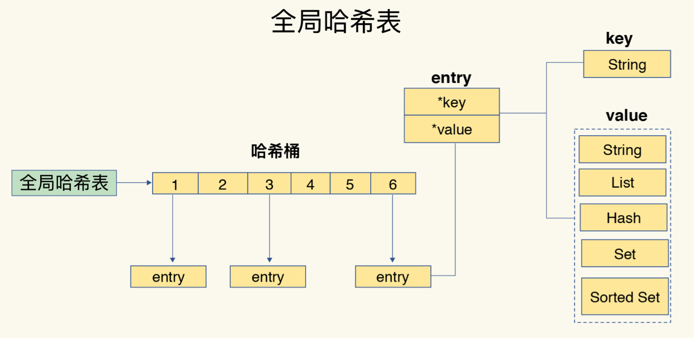
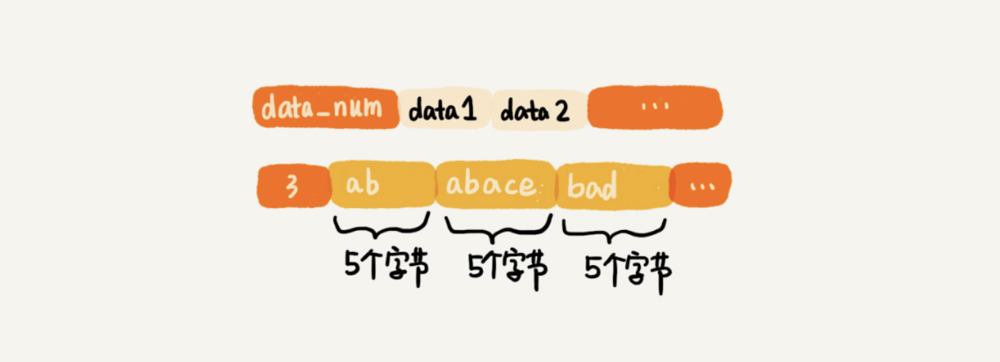

# Redis数据结构底层实现？


# 键和值用什么结构组织?

为了实现从键到值的快速访问，Redis 使用了一个哈希表来保存所有键值对。



哈希桶中的 entry 元素中保存了*key和*value指针，分别指向了 实际的键和值，这样一来，即使值是一个集合，也可以通过*value指针被查找到。

Redis 解决哈希冲突的方式是链表法。Redis 会对哈希表做 rehash 操作。rehash 也就是增加现有的哈希桶数量，让逐渐 增多的 entry 元素能在更多的桶之间分散保存，减少单个桶中的元素数量，从而减少单个 桶中的冲突。

其实，为了使 rehash 操作更高效，Redis 默认使用了两个全局哈希表:哈希表 1 和哈希 表 2。一开始，当你刚插入数据时，默认使用哈希表 1，此时的哈希表 2 并没有被分配空 间。随着数据逐步增多，Redis 开始执行 rehash，这个过程分为三步:

1.给哈希表 2 分配更大的空间，例如是当前哈希表 1 大小的两倍;
2.把哈希表 1 中的数据重新映射并拷贝到哈希表 2 中;
3.释放哈希表 1 的空间。

第二步涉及大量的数据拷贝，如果一次性把哈希表 1 中的数据都 迁移完，会造成 Redis 线程阻塞，无法服务其他请求。为了避免这个问题，Redis 采用了渐进式 rehash。

简单来说就是在第二步拷贝数据时，Redis 仍然正常处理客户端请求，每处理一个请求 时，从哈希表 1 中的第一个索引位置开始，顺带着将这个索引位置上的所有 entries 拷贝 到哈希表 2 中;等处理下一个请求时，再顺带拷贝哈希表 1 中的下一个索引位置的 entries。这样就巧妙地把一次性大量拷贝的开销，分摊到了多次处理请求的过程中，避免了耗时操
作，保证了数据的快速访问。

对于 String 类型来说，找到哈希桶就能直接增删改查了，所以，哈希表的 O(1) 操作复杂度也就是它的复杂度了。但是，对于集合类型来说，即使找到哈希桶了，还要在集合中再进一步操作。

# 集合数据操作效率

压缩列表实际上类似于一个数组，数组中的每一个元素都对应保存一个数据。和数组不同 的是，压缩列表在表头有三个字段 zlbytes、zltail 和 zllen，分别表示列表长度、列表尾的 偏移量和列表中的 entry 个数;压缩列表在表尾还有一个 zlend，表示列表结束。


在压缩列表中，如果我们要查找定位第一个元素和最后一个元素，可以通过表头三个字段 的长度直接定位，复杂度是 O(1)。而查找其他元素时，就没有这么高效了，只能逐个查找，此时的复杂度就是 O(N) 了。

跳表在链表的基础上，增加了多级索引，通过索引位置的几个跳转，实现数据的快速定位。跳表的查找复杂度就是 O(logN)。

****


# 列表（list）

列表对应两种实现方法，一种是压缩列表（ziplist），另一种是双向循环链表。

**当列表中存储的数据量比较小的时候，列表就可以采用压缩列表的方式实现。** 具体需要同时满足下面两个条件：

- 列表中保存的单个数据（有可能是字符串类型的）小于 64 字节；
- 列表中数据个数少于 512 个。

关于压缩列表，它有点儿类似数组，通过一片连续的内存空间，来存储数据。不过，它跟数组不同的一点是，**它允许存储的数据大小不同。**


听到“压缩”两个字，直观的反应就是节省内存。之所以说这种存储结构节省内存，是相较于数组的存储思路而言的。我们知道，数组要求每个元素的大小相同，如果我们要存储不同长度的字符串，那我们就需要用最大长度的字符串大小作为元素的大小（假设是 20 个字节）。那当我们存储小于 20 个字节长度的字符串的时候，便会浪费部分存储空间。



压缩列表这种存储结构，一方面比较节省内存，另一方面可以支持不同类型数据的存储。而且，因为数据存储在一片连续的内存空间，通过键来获取值为列表类型的数据，读取的效率也非常高。

当列表中存储的数据量比较大的时候，也就是不能同时满足刚刚讲的两个条件的时候，列表就要通过双向循环链表来实现了。

Redis 的这种双向链表的实现方式，非常值得借鉴。它额外定义一个 list 结构体，来组织链表的首、尾指针，还有长度等信息。这样，在使用的时候就会非常方便。

```c
// 以下是 C 语言代码，因为 Redis 是用 C 语言实现的。
typedef struct listnode {
  struct listNode *prev;
  struct listNode *next;
  void *value;
} listNode;
 
 
typedef struct list {
  listNode *head;
  listNode *tail;
  unsigned long len;
  // .... 省略其他定义
} list;
```

# 字典（hash）

字典类型用来存储一组数据对。每个数据对又包含键值两部分。字典类型也有两种实现方式。一种是我们刚刚讲到的**压缩列表**，另一种是**散列表**。

同样，只有当存储的数据量比较小的情况下，Redis 才使用压缩列表来实现字典类型。具体需要满足两个条件：

- 字典中保存的键和值的大小都要小于 64 字节；
- 字典中键值对的个数要小于 512 个。

当不能同时满足上面两个条件的时候，Redis 就使用散列表来实现字典类型。Redis 使用[MurmurHash2](https://zh.wikipedia.org/wiki/Murmur哈希)这种运行速度快、随机性好的哈希算法作为哈希函数。对于哈希冲突问题，Redis 使用链表法来解决。除此之外，Redis 还支持散列表的动态扩容、缩容。

当数据动态增加之后，散列表的装载因子会不停地变大。为了避免散列表性能的下降，当装载因子大于 1 的时候，Redis 会触发扩容，将散列表扩大为原来大小的 2 倍左右（具体值需要计算才能得到，如果感兴趣，你可以去阅读[源码](https://github.com/antirez/redis/blob/unstable/src/dict.c)）。

当数据动态减少之后，为了节省内存，当装载因子小于 0.1 的时候，Redis 就会触发缩容，缩小为字典中数据个数的大约 2 倍大小（这个值也是计算得到的，如果感兴趣，你也可以去阅读[源码](https://github.com/antirez/redis/blob/unstable/src/dict.c)）。

我们前面讲过，扩容缩容要做大量的数据搬移和哈希值的重新计算，所以比较耗时。针对这个问题，Redis 使用我们在散列表那章中讲的渐进式扩容缩容策略，将数据的搬移分批进行，避免了大量数据一次性搬移导致的服务停顿。

# 集合（set）

集合这种数据类型用来存储一组不重复的数据。这种数据类型也有两种实现方法，一种是基于有序数组，另一种是基于散列表。

当要存储的数据，同时满足下面这样两个条件的时候，Redis 就采用有序数组，来实现集合这种数据类型。

- 存储的数据都是整数；
- 存储的数据元素个数不超过 512 个。

当不能同时满足这两个条件的时候，Redis 就使用散列表来存储集合中的数据。

# 有序集合（sortedset）

有序集合这种数据类型，它用来存储一组数据，并且每个数据会附带一个得分。通过得分的大小，我们将数据组织成跳表这样的数据结构，以支持快速地按照得分值、得分区间获取数据。

实际上，跟 Redis 的其他数据类型一样，有序集合也并不仅仅只有跳表这一种实现方式。当数据量比较小的时候，Redis 会用压缩列表来实现有序集合。具体点说就是，使用压缩列表来实现有序集合的前提，有这样两个：

- 所有数据的大小都要小于 64 字节；
- 元素个数要小于 128 个。


