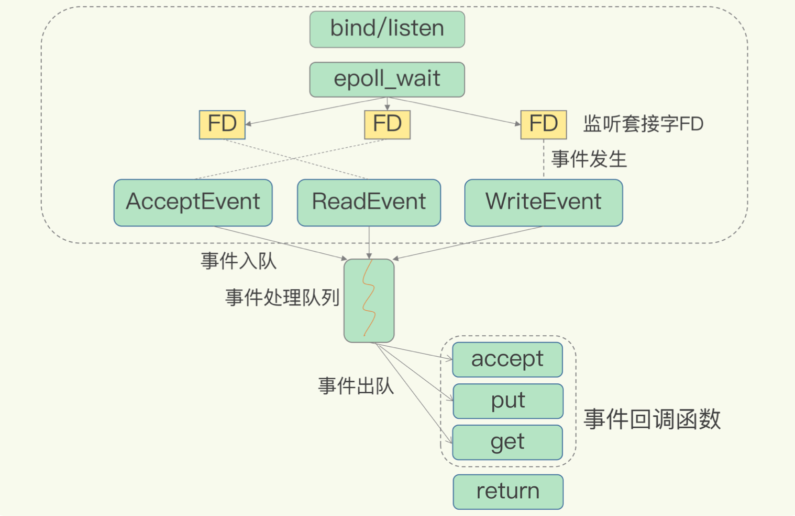

# 为什么单线程的Redis能那么快?

我们通常说，Redis 是单线程，主要是指 Redis 的网络 IO 和键值对读写是由一个线程来完成的，这也是 Redis 对外提供键值存储服务的主要流程。 但 Redis 的其他功能，比如持久化、异步删除、集群数据同步等，其实是由额外的线程执 行的。

# 多线程的开销

使用多线程，可以增加系统吞吐率，但是，再进一步增加线程时，系统吞吐率就增长迟缓了，有时甚至还会出现下降的情况。

一个关键的瓶颈在于，系统中通常会存在被多线程同时访问的共享资源，比如一个共享的数据结构。当有多个线程要修改这个共享资源时，为了保证共享资源的正确性，就需要有额外的机制进行保证，而这个额外的机制，就会带来额外的开销。

假设 Redis 采用多线程设计，现在有两个线程 A 和 B，线程 A 对一个 List 做 LPUSH 操作，并对队列长度加 1。同时，线程 B 对该 List 执行 LPOP 操作，并对队列长度减 1。为了保证队列长度的正确性，Redis 需要让线程 A 和 B 的 LPUSH 和 LPOP 串行执行。这就是多线程编程模式面临的共享资源的并发访问控制问题。

所以，即使增加了线程，大部分线程也在等待获取访问共享资源的互斥锁，并行变串行，系统吞吐率并没有随着线程的增加而增加。

而且，采用多线程开发一般会引入同步原语来保护共享资源的并发访问，这也会降低系统 代码的易调试性和可维护性。为了避免这些问题，Redis 直接采用了单线程模式。

# 单线程 Redis 为什么那么快?

**一方面，Redis 的大部分操作在内存上完成，再加上它采用了高效的数据结构，例如哈希表和跳表，这是它实现高性能的一个重要原因。另一方面，就是 Redis 采用了多路复用机 制，使其在网络 IO 操作中能并发处理大量的客户端请求，实现高吞吐率。**

**基于多路复用的高性能 I/O 模型**

简单来说，在 Redis 只运行单线程的情况下，该机制允许内核中，同 时存在多个监听套接字和已连接套接字。内核会一直监听这些套接字上的连接请求或数据 请求。一旦有请求到达，就会交给 Redis 线程处理，这就实现了一个 Redis 线程处理多个 IO 流的效果。

下图就是基于多路复用的 Redis IO 模型。图中的多个 FD 就是刚才所说的多个套接字。 Redis 网络框架调用 epoll 机制，让内核监听这些套接字。此时，Redis 线程不会阻塞在某一个特定的监听或已连接套接字上，也就是说，不会阻塞在某一个特定的客户端请求处理 上。正因为此，Redis 可以同时和多个客户端连接并处理请求，从而提升并发性。

为了在请求到达时能通知到 Redis 线程，select/epoll 提供了基于事件的回调机制，即针 对不同事件的发生，调用相应的处理函数。

那么，回调机制是怎么工作的呢?其实，epoll 一旦监测到 FD 上有请求到达时，就会触发相应的事件。

这些事件会被放进一个事件队列，Redis 单线程对该事件队列不断进行处理。这样一来， Redis 无需一直轮询是否有请求实际发生，这就可以避免造成 CPU 资源浪费。同时， Redis 在对事件队列中的事件进行处理时，会调用相应的处理函数，这就实现了基于事件 的回调。因为 Redis 一直在对事件队列进行处理，所以能及时响应客户端请求，提升 Redis 的响应性能。

