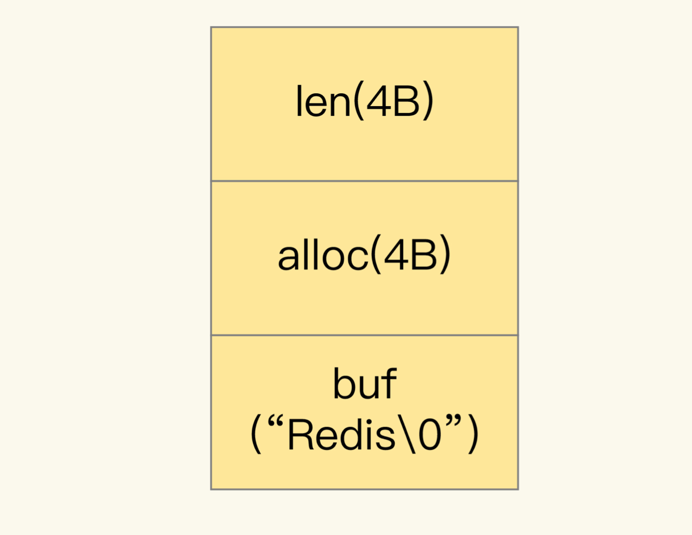
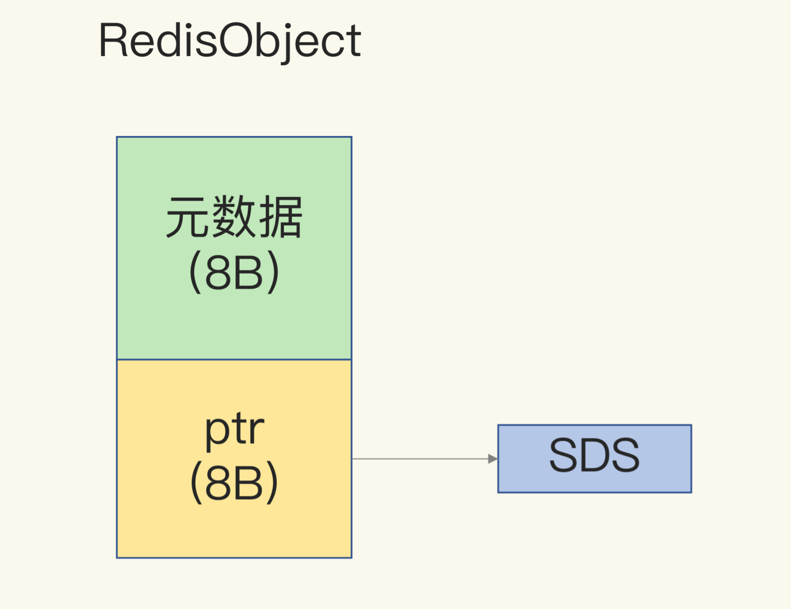
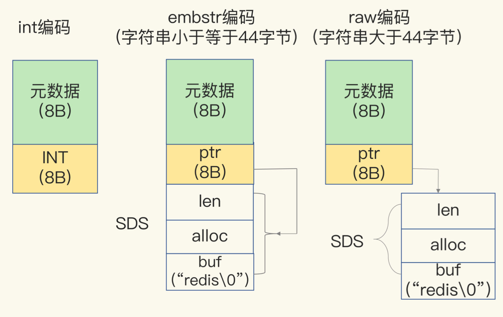

# 为什么String类型内存开销大?

除了记录实际数据，String 类型还需要额外的内存空间记录数据长度、空间使用等 信息，这些信息也叫作元数据。当实际保存的数据较小时，元数据的空间开销就显得比较大了。

当保存 64 位有符号整数时，String 类型会把它保存为一个 8 字节的 Long 类型整数， 这种保存方式通常也叫作 **int 编码方式**。

当你保存的数据中包含字符时，String 类型就会用简单动态字符串(Simple Dynamic String，SDS)结构体来保存。

- buf:字节数组，保存实际数据。为了表示字节数组的结束，Redis 会自动在数组最后加 一个“\0”，这就会额外占用 1 个字节的开销。
- len:占 4 个字节，表示 buf 的已用长度。
- alloc:也占个 4 字节，表示 buf 的实际分配长度，一般大于 len。

在 SDS 中，buf 保存实际数据，而 len 和 alloc 本身其实是 SDS 结构体的额外开销。

另外，对于 String 类型来说，除了 SDS 的额外开销，还有一个来自于 RedisObject 结构体的开销。

因为 Redis 的数据类型有很多，而且，不同数据类型都有些相同的元数据要记录(比如最 后一次访问的时间、被引用的次数等)，所以，Redis 会用一个 RedisObject 结构体来统 一记录这些元数据，同时指向实际数据。

一个 RedisObject 包含了 8 字节的元数据和一个 8 字节指针，这个指针再进一步指向具体 数据类型的实际数据所在，例如指向 String 类型的 SDS 结构所在的内存地址，可以看一下下面的示意图。

为了节省内存空间，Redis 还对 Long 类型整数和 SDS 的内存布局做了专门的设计。

一方面，当保存的是 Long 类型整数时，RedisObject 中的指针就直接赋值为整数数据 了，这样就不用额外的指针再指向整数了，节省了指针的空间开销。

另一方面，当保存的是字符串数据，并且字符串小于等于 44 字节时，RedisObject 中的元 数据、指针和 SDS 是一块连续的内存区域，这样就可以避免内存碎片。这种布局方式也被 称为 embstr 编码方式。

当然，当字符串大于 44 字节时，SDS 的数据量就开始变多了，Redis 就不再把 SDS 和 RedisObject 布局在一起了，而是会给 SDS 分配独立的空间，并用指针指向 SDS 结构。 这种布局方式被称为 raw 编码模式。

# 用什么数据结构可以节省内存?

Redis 有一种底层数据结构，叫压缩列表(ziplist)，这是一种非常节省内存的结构。

Redis 基于压缩列表实现了 List、Hash 和 Sorted Set 这样的集合类型，这样做的最大好 处就是节省了 dictEntry 的开销。当你用 String 类型时，一个键值对就有一个 dictEntry， 要用 32 字节空间。但采用集合类型时，一个 key 就对应一个集合的数据，能保存的数据 多了很多，但也只用了一个 dictEntry，这样就节省了内存。

**如何用集合类型保存单值的键值对?**

在保存单值的键值对时，可以采用基于 Hash 类型的二级编码方法。这里说的二级编码， 就是把一个单值的数据拆分成两部分，前一部分作为 Hash 集合的 key，后一部分作为 Hash 集合的 value，这样一来，我们就可以把单值数据保存到 Hash 集合中了。

以图片 ID 1101000060 和图片存储对象 ID 3302000080 为例，我们可以把图片 ID 的前 7 位(1101000)作为 Hash 类型的键，把图片 ID 的最后 3 位(060)和图片存储对象 ID 分别作为 Hash 类型值中的 key 和 value。

注意，**二级编码方法中采用的 ID 长度是有讲究的。**

Hash 类型设置了用压缩列表保存数据时的两个阈值，一旦超过了阈值，Hash 类型就会用哈希表 来保存数据了。这两个阈值分别对应以下两个配置项:

- hash-max-ziplist-entries:表示用压缩列表保存时哈希集合中的最大元素个数。
- hash-max-ziplist-value:表示用压缩列表保存时哈希集合中单个元素的最大长度。

如果我们往 Hash 集合中写入的元素个数超过了 hash-max-ziplist-entries，或者写入的 单个元素大小超过了 hash-max-ziplist-value，Redis 就会自动把 Hash 类型的实现结构 由压缩列表转为哈希表。

一旦从压缩列表转为了哈希表，Hash 类型就会一直用哈希表进行保存，而不会再转回压缩 列表了。在节省内存空间方面，哈希表就没有压缩列表那么高效了。

**为了能充分使用压缩列表的精简内存布局，我们一般要控制保存在 Hash 集合中的元素个数。** 所以，在刚才的二级编码中，我们只用图片 ID 最后 3 位作为 Hash 集合的 key，也就 保证了 Hash 集合的元素个数不超过 1000，同时，我们把 hash-max-ziplist-entries 设置 为 1000，这样一来，Hash 集合就可以一直使用压缩列表来节省内存空间了。

