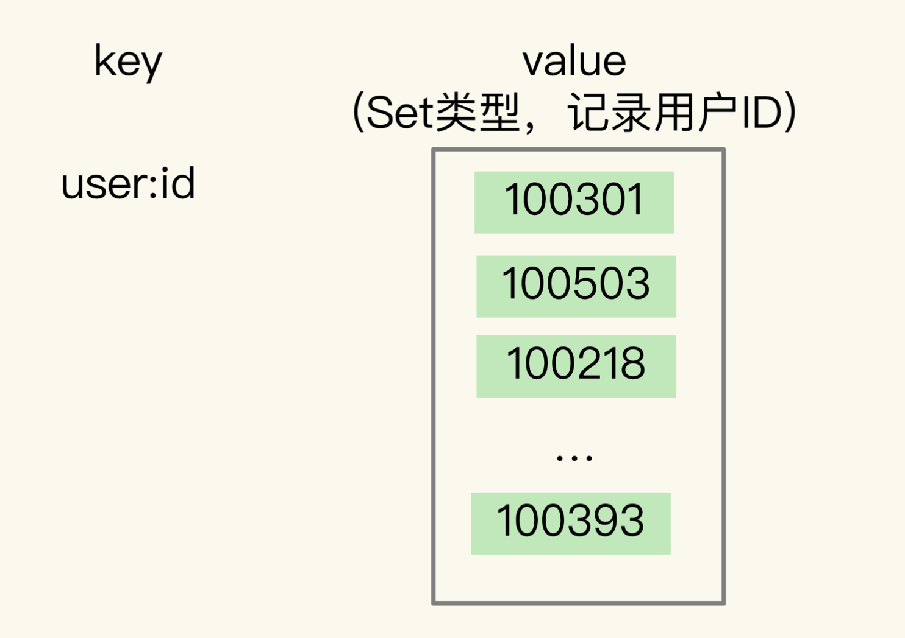
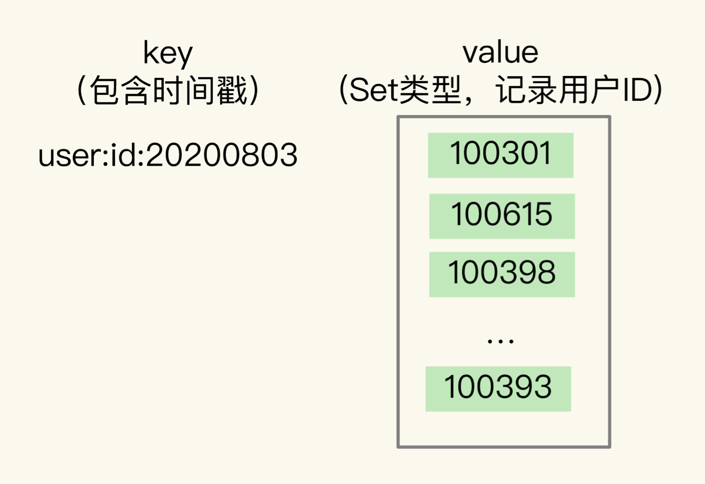

# 聚合统计

所谓的聚合统计，就是指统计多个集合元素的聚合结果，包括:统计多个集合的共有元素(交集统计);把两个集合相比，统计其中一个集合独有的元素(差集统计);统计多个集合的所有元素(并集统计)。

比如，统计手机 App 每天的新增用户数和第二天的留存用户数，正好对应了聚合统计。

要完成这个统计任务，我们可以用一个集合记录所有登录过 App 的用户 ID，同时，用另 一个集合记录每一天登录过 App 的用户 ID。然后，再对这两个集合做聚合统计。

记录所有登录过 App 的用户 ID 还是比较简单的，我们可以直接使用 Set 类型，把 key 设 置为 user:id，表示记录的是用户 ID，value 就是一个 Set 集合，里面是所有登录过 App 的用户 ID，我们可以把这个 Set 叫作累计用户 Set，如下图所示:

需要注意的是，累计用户 Set 中没有日期信息，我们是不能直接统计每天的新增用户的。 所以，我们还需要把每一天登录的用户 ID，记录到一个新集合中，我们把这个集合叫作每 日用户 Set，它有两个特点:

1.key 是 user:id 以及当天日期，例如 user: id:20200803; 
2.value 是 Set 集合，记录当天登录的用户 ID。

在统计每天的新增用户时，我们只用计算每日用户 Set 和累计用户 Set 的差集就行。

::: tip 注意
Set 的差集、并集和交集的计算复杂度较高，在数据量较大的情况下，如果直接执行这些计 算，会导致 Redis 实例阻塞。所以，我给你分享一个小建议:**你可以从主从集群中选择一 个从库，让它专门负责聚合计算，或者是把数据读取到客户端，在客户端来完成聚合统计**，这样就可以规避阻塞主库实例和其他从库实例的风险了。

:::

