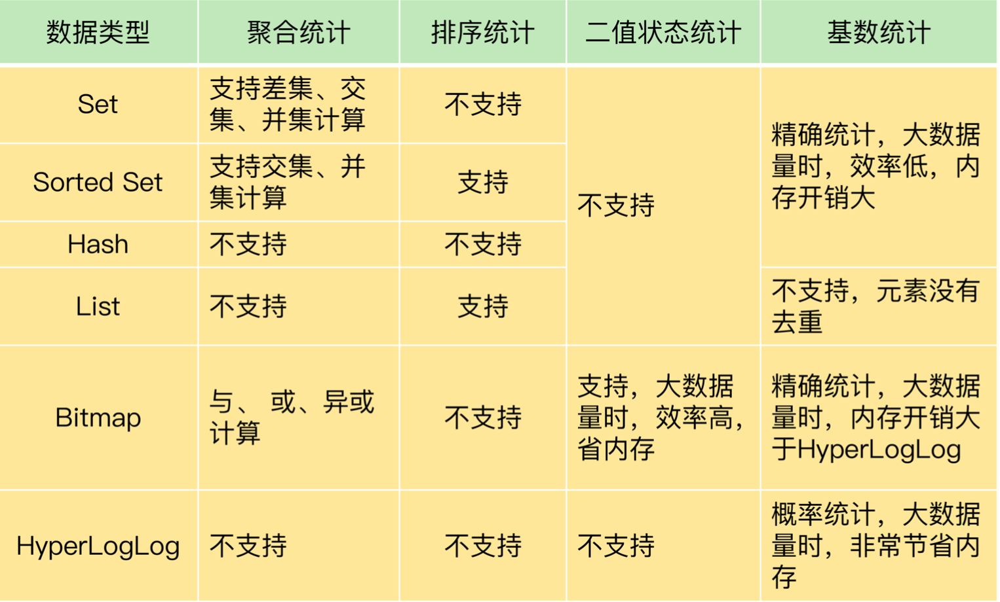

# 基数统计

基数统计就是指统计一个集合中不重复的元素个数。比如统计网页的 UV。

网页 UV 的统计有个独特的地方，就是需要去重，一个用户一天内的多次访问只能算作一 次。在 Redis 的集合类型中，Set 类型默认支持去重，所以看到有去重需求时，我们可能 第一时间就会想到用 Set 类型。

有一个用户 user1 访问 page1 时，你把这个信息加到 Set 中:

```shell
SADD page1:uv user1
```

用户 1 再来访问时，Set 的去重功能就保证了不会重复记录用户 1 的访问次数，这样，用 户 1 就算是一个独立访客。当你需要统计 UV 时，可以直接用 SCARD 命令，这个命令会 返回一个集合中的元素个数。

但是，如果 page1 非常火爆，UV 达到了千万，这个时候，一个 Set 就要记录千万个用户 ID。对于一个搞大促的电商网站而言，这样的页面可能有成千上万个，如果每个页面都用 这样的一个 Set，就会消耗很大的内存空间。

当然，你也可以用 Hash 类型记录 UV。

例如，你可以把用户 ID 作为 Hash 集合的 key，当用户访问页面时，就用 HSET 命令(用 于设置 Hash 集合元素的值)，对这个用户 ID 记录一个值“1”，表示一个独立访客，用 户 1 访问 page1 后，我们就记录为 1 个独立访客，如下所示:

```shell
HSET page1:uv user1 1
```

即使用户 1 多次访问页面，重复执行这个 HSET 命令，也只会把 user1 的值设置为 1，仍 然只记为 1 个独立访客。当要统计 UV 时，我们可以用 HLEN 命令统计 Hash 集合中的所 有元素个数。

但是，和 Set 类型相似，当页面很多时，Hash 类型也会消耗很大的内存空间。

这时候，就要用到 Redis 提供的 HyperLogLog 了。

HyperLogLog 是一种用于统计基数的数据集合类型，它的最大优势就在于，当集合元素数 量非常多时，它计算基数所需的空间总是固定的，而且还很小。在 Redis 中，每个 HyperLogLog 只需要花费 12 KB 内存，就可以计算接近 2^64 个元素 的基数。

在统计 UV 时，你可以用 PFADD 命令(用于向 HyperLogLog 中添加新元素)把访问页 面的每个用户都添加到 HyperLogLog 中。

```shell
PFADD page1:uv user1 user2 user3 user4 user5
```

接下来，就可以用 PFCOUNT 命令直接获得 page1 的 UV 值了。

```shell
PFCOUNT page1:uv
```

有一点需要你注意一下，HyperLogLog 的统计规则是基于概率完成的，所以它给出 的统计结果是有一定误差的，标准误算率是 0.81%。这也就意味着，你使用HyperLogLog 统计的 UV 是 100 万，但实际的 UV 可能是 101 万。虽然误差率不算大， 但是，如果你需要精确统计结果的话，最好还是继续用 Set 或 Hash 类型。

# 总结




