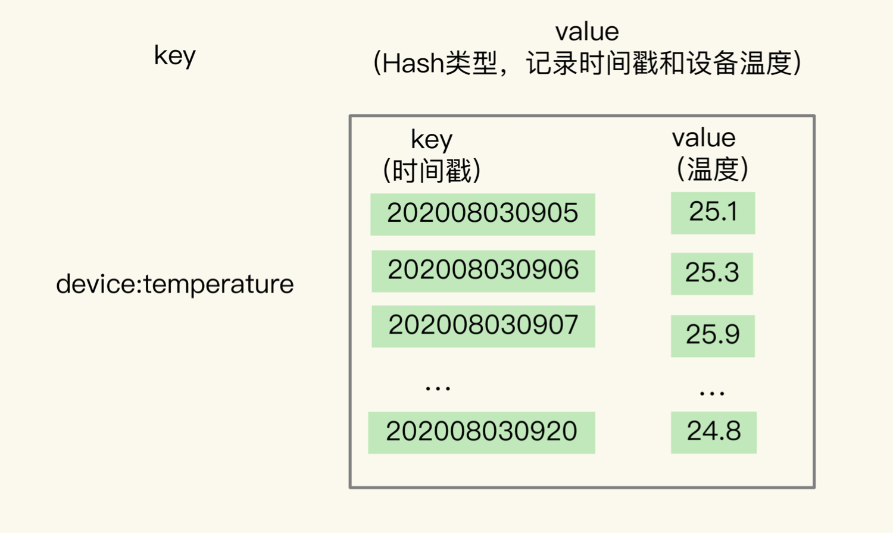
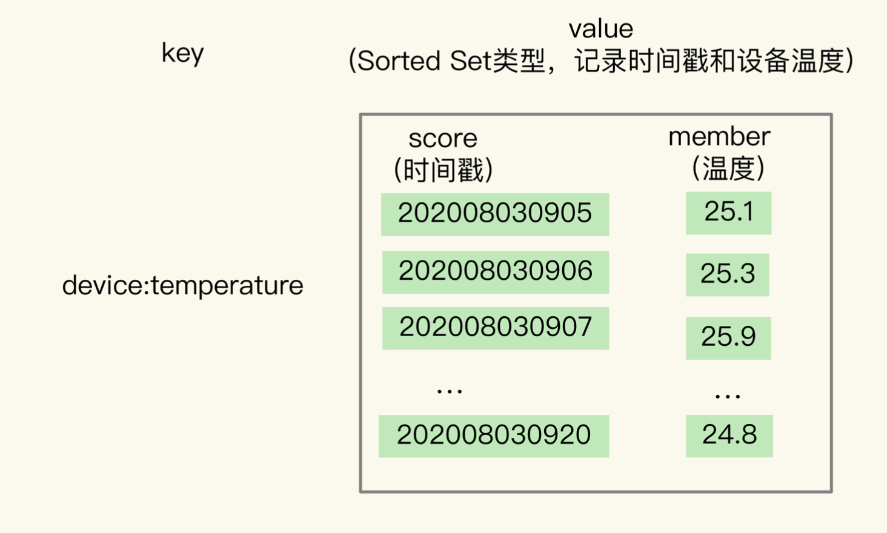

# 如何在Redis中保存时间序列数据?

例如：我们需要周期性地统计近 万台设备的实时状态，包括设备 ID、压力、温度、湿度，以及对应的时间戳。

这些与发生时间相关的一组数据，就是时间序列数据。这些数据的特点是没有严格的关系模型，记录的信息可以表示成键和值的关系，所以，并不需要专门用关系型数据库(例如 MySQL)来保存。而 Redis 的键值数据模型，正好可以满足这里的数据存取需求。


# 时间序列数据的读写特点

在实际应用中，时间序列数据通常是持续高并发写入的。

同时，时间序列数据的写入主要就是插入新数据，而不是更新一个已存在的数据。

**所以，这种数据的写入特点很简单，就是插入数据快，这就要求我们选择的数据类型，在 进行数据插入时，复杂度要低，尽量不要阻塞。**

看到这儿，第一时间会想到用 Redis 的 String、Hash 类型来保存，因为它们的插入复杂度都是 O(1)，是个不错的选 择。但是，**String 类型在记录小数据时，元数据的内存开销比较大，不太适合保存大量数据。**

那我们再看看，时间序列数据的“读”操作有什么特点。

我们在查询时间序列数据时，既有对单条记录的查询，也有对某个时间范围内的数据的查询。除此之外，还有一些更复杂的查询，比如对某个时间范围内的数据做聚合计算。这里的聚 合计算，就是对符合查询条件的所有数据做计算，包括计算均值、最大 / 最小值、求和 等。

# 基于 Hash 和 Sorted Set 保存时间序列数据

关于 Hash 类型，我们都知道，它有一个特点是，可以实现对单键的快速查询。这就满足 了时间序列数据的单键查询需求。我们可以把时间戳作为 Hash 集合的 key，把记录的设备状态值作为 Hash 集合的 value。



我们用 HGET 命令查询 202008030905 这个时刻的温度值：

```shell
1 HGET device:temperature 202008030905
2 "25.1"
```

用 Hash 类型来实现单键的查询很简单。但是，**Hash 类型有个短板:它并不支持 对数据进行范围查询。**

如果要对 Hash 类型进行范围查询的话，就需要扫描 Hash 集合中的所有数据，再把这些数据取回到客户端进行排序，然后，才能在客 户端得到所查询范围内的数据。显然，查询效率很低。

为了能同时支持按时间戳范围的查询，可以用 Sorted Set 来保存时间序列数据，因为它能 够根据元素的权重分数来排序。我们可以把时间戳作为 Sorted Set 集合的元素分数，把时 间点上记录的数据作为元素本身。



使用 Sorted Set 保存数据后，我们就可以使用 ZRANGEBYSCORE 命令，按照输入的最大 时间戳和最小时间戳来查询这个时间范围内的温度值了。我们来查询一下在 2020 年 8 月 3 日 9 点 7 分到 9 点 10 分间的所有温度值:

```shell
1 ZRANGEBYSCORE device:temperature 202008030907 202008030910 2 1) "25.9"
3 2) "24.9"
4 3) "25.3"
5 4) "25.2"
```

现在我们知道了，同时使用 Hash 和 Sorted Set，可以满足单个时间点和一个时间范围内 的数据查询需求了，但是我们又会面临一个新的问题: 如何保证写入 Hash 和 Sorted Set 是一个原子性的操作呢?

这就用到 Redis 的事务了，当多个命令及其参数本身无误时，MULTI 和 EXEC 命令可以保证执 行这些命令时的原子性。

还有一个问题：如何对时间序列数据进行聚合计算

因为 Sorted Set 只支持范围查询，无法直接进行聚合计算，所以，我们只能先把时间范围 内的数据取回到客户端，然后在客户端自行完成聚合计算。这个方法虽然能完成聚合计 算，但是会带来一定的潜在风险，也就是大量数据在 Redis 实例和客户端间频繁传输，这 会和其他操作命令竞争网络资源，导致其他操作变慢。

::: tip 总结
两个不足:
- 一个是，在执行聚合计算时，我们需要把数据读取到客户端再进行聚合，当有大量数据要聚合时，数据传输开销大;
- 另一个是，所有的数据会在两个数据类型中各保存一份，内存开销不小。不过，我们可以通过设置适当的数据过期时间，释放内存，减小内存压力。
:::

为了避免客户端和 Redis 实例间频繁的大量数据传输，我们可以使用 RedisTimeSeries 来 保存时间序列数据。

# 基于 RedisTimeSeries 模块保存时间序列数据

RedisTimeSeries 是 Redis 的一个扩展模块。它专门面向时间序列数据提供了数据类型和访问接口，并且支持在 Redis 实例上直接对数据进行按时间范围的聚合计算。

RedisTimeSeries 模块是专门为存取时间序列数据 而设计的扩展模块。和第一种方案相比，RedisTimeSeries 能支持直接在 Redis 实例上进 行多种数据聚合计算，避免了大量数据在实例和客户端间传输。不过，RedisTimeSeries 的底层数据结构使用了链表，它的范围查询的复杂度是 O(N) 级别的，同时，它的 TS.GET 查询只能返回最新的数据，没有办法像第一种方案的 Hash 类型一样，可以返回任一时间 点的数据。

::: tip 建议
- 如果你的部署环境中网络带宽高、Redis 实例内存大，可以优先考虑第一种方案;
- 如果你的部署环境中网络、内存资源有限，而且数据量大，聚合计算频繁，需要按数据
  集合属性查询，可以优先考虑第二种方案。
  
:::


关于 RedisTimeSeries 使用具体可查看相关资料。


