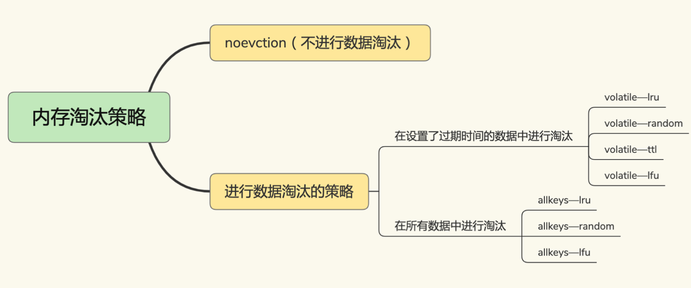
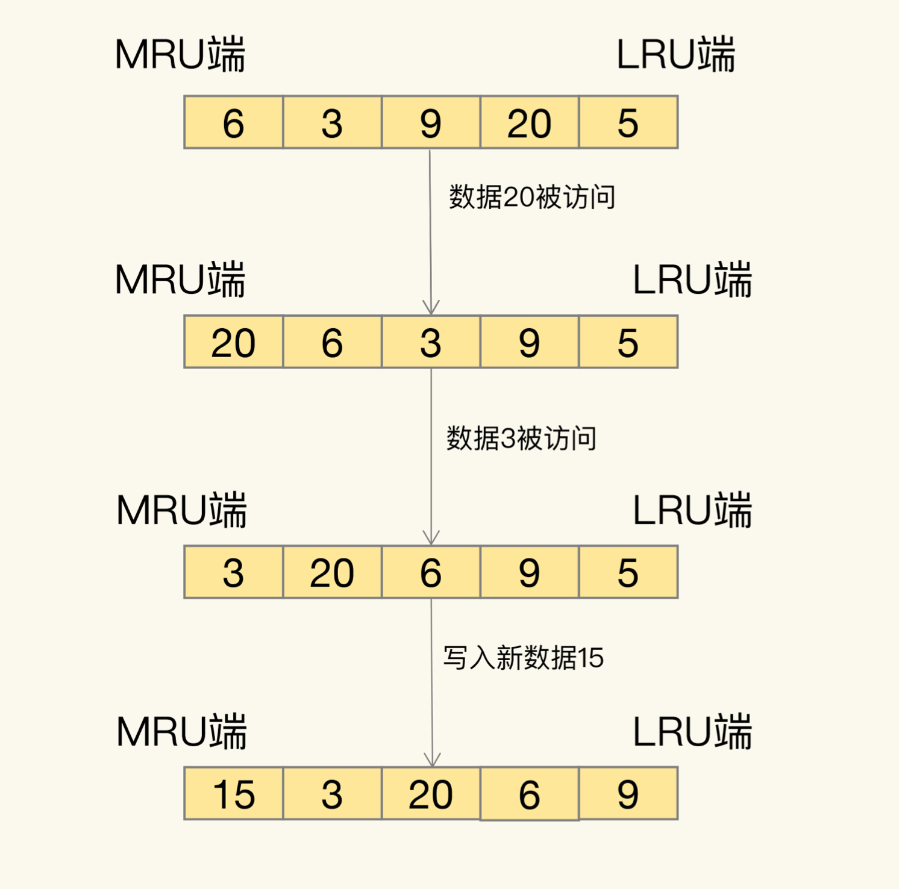

# Redis 缓存有哪些淘汰策略?

Redis 4.0 之前一共实现了 6 种内存淘汰策略，在 4.0 之后，又增加了 2 种策略。我们可 以按照是否会进行数据淘汰把它们分成两类:

- 不进行数据淘汰的策略，只有 noeviction 这一种。
- 会进行淘汰的 7 种其他策略。

会进行淘汰的 7 种策略，我们可以再进一步根据淘汰候选数据集的范围把它们分成两类:

- 在设置了过期时间的数据中进行淘汰，包括 volatile-random、volatile-ttl、volatile- lru、volatile-lfu(Redis 4.0 后新增)四种。
- 在所有数据范围内进行淘汰，包括 allkeys-lru、allkeys-random、allkeys-lfu(Redis 4.0 后新增)三种。

volatile-random、volatile-ttl、volatile-lru 和 volatile-lfu 这四种淘汰策略它们筛选的候选数据范围，被限制在已经设置了过期时间的键值对上。

- volatile-ttl 在筛选时，会针对设置了过期时间的键值对，根据过期时间的先后进行删 除，越早过期的越先被删除。
- volatile-random 就像它的名称一样，在设置了过期时间的键值对中，进行随机删除。 
- volatile-lru 会使用 LRU 算法筛选设置了过期时间的键值对。
- volatile-lfu 会使用 LFU 算法选择设置了过期时间的键值对。

allkeys-lru、allkeys-random、allkeys-lfu 这三种淘汰策略的备选 淘汰数据范围，就扩大到了所有键值对，无论这些键值对是否设置了过期时间。它们筛选 数据进行淘汰的规则是:

- allkeys-random 策略，从所有键值对中随机选择并删除数据; 
- allkeys-lru 策略，使用 LRU 算法在所有数据中进行筛选。
- allkeys-lfu 策略，使用 LFU 算法在所有数据中进行筛选。

# LRU 算法

LRU 会把所有的数据组织成一个链表，链表的头和尾分别表示 MRU 端和 LRU 端，分别代表最近最常使用的数据和最近最不常用的数据。下面是一个例子。

LRU 算法在实际实现时，需要用链表管理所有的缓存数据，这会带来额外的空间开 销。而且，当有数据被访问时，需要在链表上把该数据移动到 MRU 端，如果有大量数据被访问，就会带来很多链表移动操作，会很耗时，进而会降低 Redis 缓存性能。

所以，在 Redis 中，LRU 算法被做了简化，以减轻数据淘汰对缓存性能的影响。具体来说，Redis 默认会记录每个数据的最近一次访问的时间戳(由键值对数据结构 RedisObject 中的 lru 字段记录)。然后，Redis 在决定淘汰的数据时，第一次会随机选出 N 个数据，把它们作为一个候选集合。接下来，Redis 会比较这 N 个数据的 lru 字段，把 lru 字段值最小的数据从缓存中淘汰出去。

当需要再次淘汰数据时，Redis 需要挑选数据进入第一次淘汰时创建的候选集合。这儿的 挑选标准是:能进入候选集合的数据的 lru 字段值必须小于候选集合中最小的 lru 值。当有新数据进入候选数据集后，如果候选数据集中的数据个数达到了 maxmemory-samples（可配置），Redis 就把候选数据集中 lru 字段值最小的数据淘汰出去。

这样一来，Redis 缓存不用为所有的数据维护一个大链表，也不用在每次数据访问时都移 动链表项，提升了缓存的性能。

::: tip 使用建议
优先使用 allkeys-lru 策略。这样，可以充分利用 LRU 这一经典缓存算法的优势，把最 近最常访问的数据留在缓存中，提升应用的访问性能。如果你的业务数据中有明显的冷 热数据区分，我建议你使用 allkeys-lru 策略。

如果业务应用中的数据访问频率相差不大，没有明显的冷热数据区分，建议使用 allkeys-random 策略，随机选择淘汰的数据就行。

如果你的业务中有置顶的需求，比如置顶新闻、置顶视频，那么，可以使用 volatile-lru 策略，同时不给这些置顶数据设置过期时间。这样一来，这些需要置顶的数据一直不会 被删除，而其他数据会在过期时根据 LRU 规则进行筛选。
:::

# 缓存污染

在一些场景下，有些数据被访问的次数非常少，甚至只会被访问一次。当这些数据服务完访问请求后，如果还继续留存在缓存中的话，就只会白白占用缓存空间。这种情况，就是缓存污染。

这些缓存淘汰策略中需要针对访问次数来筛选并淘汰数据，所以只有，所以只有 LFU 策略可以解决缓存污染问题。

# LFU 缓存策略的优化

LFU 缓存策略是在 LRU 策略基础上，为每个数据增加了一个计数器，来统计这个数据的访 问次数。当使用 LFU 策略筛选淘汰数据时，首先会根据数据的访问次数进行筛选，把访问 次数最低的数据淘汰出缓存。如果两个数据的访问次数相同，LFU 策略再比较这两个数据 的访问时效性，把距离上一次访问时间更久的数据淘汰出缓存。

LFU 策略是在 LRU 策略上做的优化，为了避免操作链表的开销，Redis 在实现 LRU 策略时使用了两个近似方法:

- Redis 是用 RedisObject 结构来保存数据的，RedisObject 结构中设置了一个 lru 字 段，用来记录数据的访问时间戳;
- Redis 并没有为所有的数据维护一个全局的链表，而是通过随机采样方式，选取一定数 量(例如 10 个)的数据放入候选集合，后续在候选集合中根据 lru 字段值的大小进行筛 选。

在此基础上，Redis 在实现 LFU 策略的时候，只是把原来 24bit 大小的 lru 字段，又进一 步拆分成了两部分。

- ldt 值:lru 字段的前 16bit，表示数据的访问时间戳; 
- counter 值:lru 字段的后 8bit，表示数据的访问次数。

总结一下:当 LFU 策略筛选数据时，Redis 会在候选集合中，根据数据 lru 字段的后 8bit 选择访问次数最少的数据进行淘汰。当访问次数相同时，再根据 lru 字段的前 16bit 值大 小，选择访问时间最久远的数据进行淘汰。

Redis 只使用了 8bit 记录数据的访问次数，而 8bit 记录的最大值是 255。因此，在实现 LFU 策略时，Redis 并没有采用数据每 被访问一次，就给对应的 counter 值加 1 的计数规则，而是采用了一个更优化的计数规则。

简单来说，LFU 策略实现的计数规则是:每当数据被访问一次时，首先，用计数器当前的 值乘以配置项 lfu_log_factor 再加 1，再取其倒数，得到一个 p 值;然后，把这个 p 值和 一个取值范围在(0，1)间的随机数 r 值比大小，只有 p 值大于 r 值时，计数器才加 1。使用了这种计算规则后，我们可以通过设置不同的 lfu_log_factor 配置项，来控制计数器 值增加的速度，避免 counter 值很快就到 255 了。我们在应用 LFU 策略时，一般可以将 lfu_log_factor 取值为 10。

