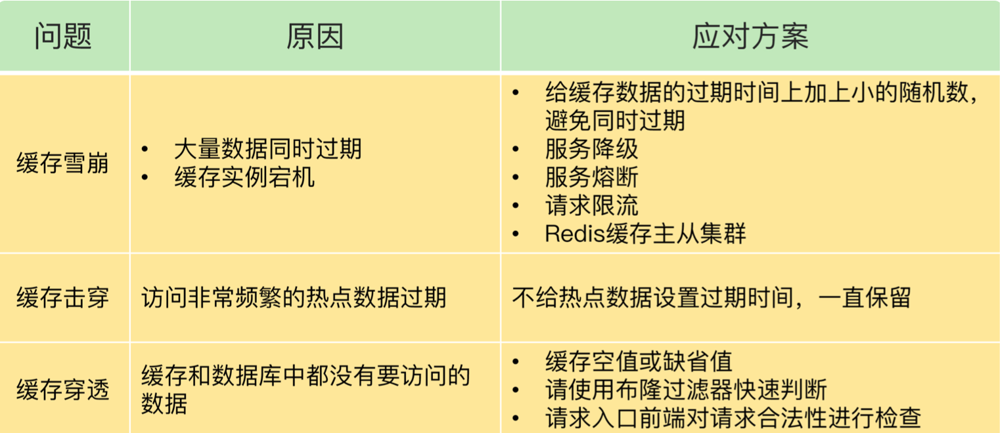

# 如何解决缓存雪崩、击穿、穿透?

# 缓存雪崩

缓存雪崩是指大量的应用请求无法在 Redis 缓存中进行处理，紧接着，应用将大量请求发 送到数据库层，导致数据库层的压力激增。

缓存雪崩一般是由两个原因导致的，第一个原因是:缓存中有大量数据同时过期，导致大量请求无法得到处理。

有两种解决方案，首先，我们可以避免给大量的数据设置相同的过期时间。如果业务层的确要求有些数据同 时失效，你可以在用 EXPIRE 命令给每个数据设置过期时间时，给这些数据的过期时间增 加一个较小的随机数(例如，随机增加 1~3 分钟)

除了微调过期时间，我们还可以通过服务降级，来应对缓存雪崩。所谓的服务降级，是指发生缓存雪崩时，针对不同的数据采取不同的处理方式。

- 当业务应用访问的是非核心数据(例如电商商品属性)时，暂时停止从缓存中查询这些数据，而是直接返回预定义信息、空值或是错误信息;
  
- 当业务应用访问的是核心数据(例如电商商品库存)时，仍然允许查询缓存，如果缓存缺失，也可以继续通过数据库读取。

除了大量数据同时失效会导致缓存雪崩，还有一种情况也会发生缓存雪崩，那就是，Redis 缓存实例发生故障宕机了，无法处理请求，这就会导致大量请求一下子积压到数据库层， 从而发生缓存雪崩。

第一个建议，是在业务系统中实现服务熔断或请求限流机制。第二个建议就是事前预防。

# 缓存击穿

缓存击穿是指，针对某个访问非常频繁的热点数据的请求，无法在缓存中进行处理，紧接着，访问该数据的大量请求，一下子都发送到了后端数据库，导致了数据库压力激增，会影响数据库处理其他请求。缓存击穿的情况，经常发生在热点数据过期失效时。

为了避免缓存击穿给数据库带来的激增压力，我们的解决方法也比较直接，对于访问特别频繁的热点数据，我们就不设置过期时间了。

# 缓存穿透

缓存穿透是指要访问的数据既不在 Redis 缓存中，也不在数据库中，导致请求在访问缓存时，发生缓存缺失，再去访问数据库时，发现数据库中也没有要访问的数据。

我来给你提供三种应对方案。

**第一种方案是，缓存空值或缺省值。**

一旦发生缓存穿透，我们就可以针对查询的数据，在 Redis 中缓存一个空值或是和业务层 协商确定的缺省值(例如，库存的缺省值可以设为 0)。紧接着，应用发送的后续请求再 进行查询时，就可以直接从 Redis 中读取空值或缺省值，返回给业务应用了，避免了把大 量请求发送给数据库处理，保持了数据库的正常运行。但是这个用个问题，如果是黑客攻击，可能会采用uuid去获取，这样会导致无法解决穿透到数据库获取数据的问题，所以我们一般使用布隆过滤器解决。

**第二种方案是，使用布隆过滤器快速判断数据是否存在，避免从数据库中查询数据是否存在，减轻数据库压力。**

**最后一种方案是，在请求入口的前端进行请求检测。** 缓存穿透的一个原因是有大量的恶意 请求访问不存在的数据，所以，一个有效的应对方案是在请求入口前端，对业务系统接收 到的请求进行合法性检测，把恶意的请求(例如请求参数不合理、请求参数是非法值、请 求字段不存在)直接过滤掉，不让它们访问后端缓存和数据库。这样一来，也就不会出现 缓存穿透问题了。

