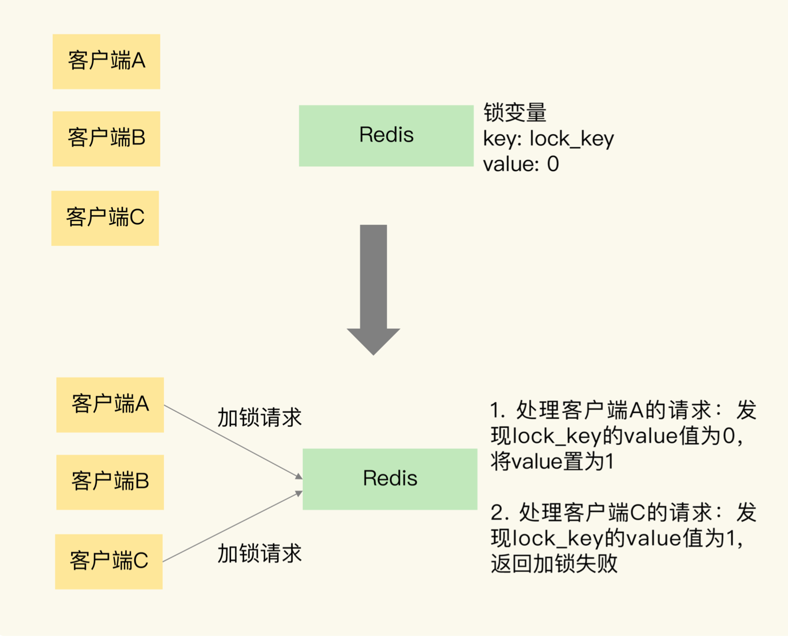
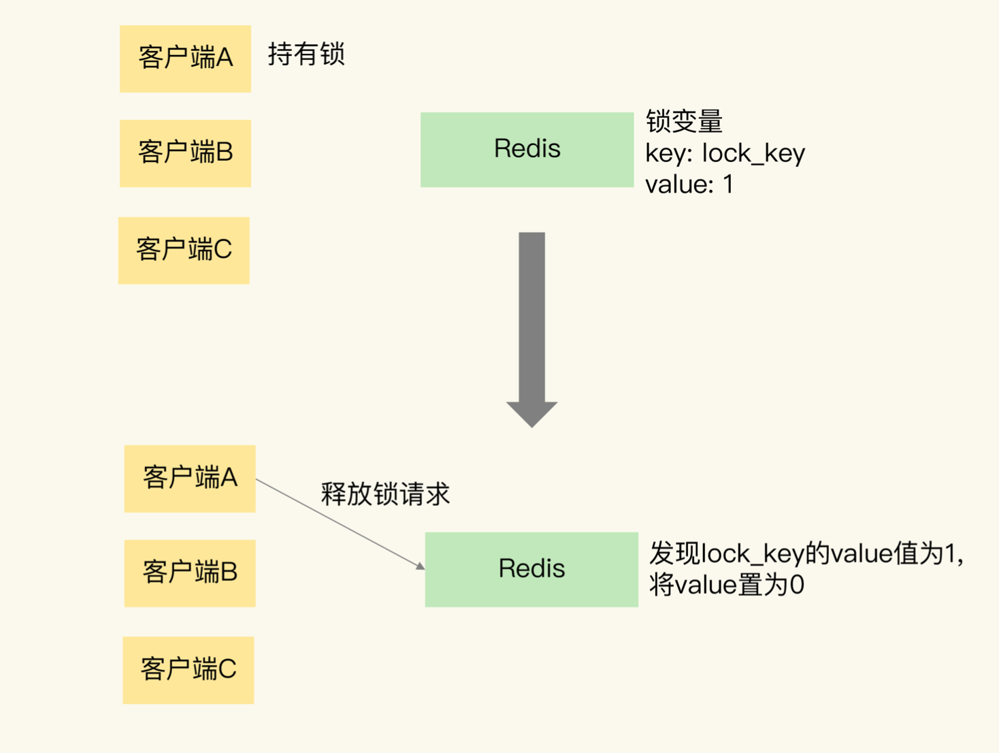
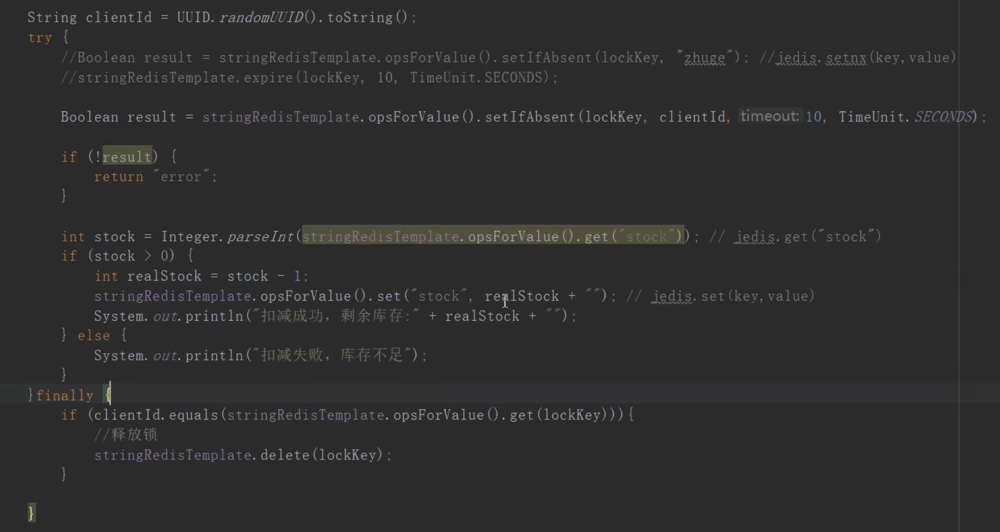

# 如何用Redis实现分布式锁?

# 分布式3种实现

- 基于数据库实现分布式锁，这里的数据库指的是关系型数据库；
  
- 基于缓存实现分布式锁；
  
- 基于 ZooKeeper 实现分布式锁。

# 基于数据库实现分布式锁

要实现分布式锁，最简单的方式就是创建一张锁表，然后通过操作该表中的数据来实现。

当我们要锁住某个资源时，就在该表中增加一条记录，想要释放锁的时候就删除这条记录。数据库对共享资源做了唯一性约束，如果有多个请求被同时提交到数据库的话，数据库会保证只有一个操作可以成功，操作成功的那个线程就获得了访问共享资源的锁，可以进行操作。

基于数据库实现的分布式锁，是最容易理解的。但是，因为数据库需要落到硬盘上，频繁读取数据库会导致 IO 开销大，因此这种分布式锁**适用于并发量低，对性能要求低的场景。**

基于数据库实现分布式锁比较简单，绝招在于创建一张锁表，为申请者在锁表里建立一条记录，记录建立成功则获得锁，消除记录则释放锁。该方法依赖于数据库，主要有两个缺点：

- 单点故障问题。一旦数据库不可用，会导致整个系统崩溃。

- 死锁问题。数据库锁没有失效时间，未获得锁的进程只能一直等待已获得锁的进程主动释放锁。一旦已获得锁的进程挂掉或者解锁操作失败，会导致锁记录一直存在数据库中，其他进程无法获得锁。


设计原则：

分布式锁同样可以用一个变量来实现。客户端加锁和释放锁的操作逻辑，也和单机上的加锁和释放锁操作逻辑一致:加锁时同样需要判断锁变量的值，根据锁变量值来判断能否加锁成功;释放锁时需要把锁变量值设置为 0，表明客户端不再持有锁。

但是，和线程在单机上操作锁不同的是，在分布式场景下，锁变量需要由一个共享存储系统来维护，只有这样，多个客户端才可以通过访问共享存储系统来访问锁变量。相应的， 加锁和释放锁的操作就变成了读取、判断和设置共享存储系统中的锁变量值。

# 基于单个 Redis 节点实现分布式锁



可以看到，Redis 可以使用一个键值对 lock_key:0 来保存锁变量，其中，键是 lock_key， 也是锁变量的名称，锁变量的初始值是 0。

客户端 A 和 C 同时请求加锁。因为 Redis 使用单线程处理请求，所以，即使客户 端 A 和 C 同时把加锁请求发给了 Redis，Redis 也会串行处理它们的请求。



因为加锁包含了三个操作(读取锁变量、判断锁变量值以及把锁变量值设置为 1)，而这 三个操作在执行时需要保证原子性。那怎么保证原子性呢?

我们就可以用 SETNX 和 DEL 命令组合来实现加锁和释放锁操作。SETNX 命令用于设置键值对的值。具体来说，就是这个命令在执行时会判断键值对是否存在，如果不存在，就设置键值对的值，如果存在，就不做任何设置。对于释放锁操作来说，我们可以在执行完业务逻辑后，使用 DEL 命令删除锁变量。

```shell
1 // 加锁
2 SETNX lock_key 1 3 // 业务逻辑
4 DO THINGS
5 // 释放锁
6 DEL lock_key
```

存在两个潜在的风险:

第一个风险是，假如某个客户端在执行了 SETNX 命令、加锁之后，紧接着却在操作共享数 据时发生了异常，结果一直没有执行最后的 DEL 命令释放锁。因此，锁就一直被这个客户 端持有，其它客户端无法拿到锁。针对这个问题，一个有效的解决方法是，给锁变量设置一个过期时间。

第二个风险是如果客户端 A 执行了 SETNX 命令加锁后，假设客户端 B 执行了 DEL 命令释放锁，此时，客户端 A 的锁就被误释放了。如果客户端 C 正好也在申请加锁，就可以成功获得锁，进而开始操作共享数据。这样一来，客户端 A 和 C 同时在对共享数据进行操作，数据就会被修改错误，这也是业务层不能接受的。为了应对这个问题，我们需要能区分来自不同客户端的锁操作。

在使用 SETNX 命令进行加锁的方法中，我们通过把锁变量值设置为 1 或 0，表示是否加锁 成功。1 和 0 只有两种状态，无法表示究竟是哪个客户端进行的锁操作。所以，**我们在加锁操作时，可以让每个客户端给锁变量设置一个唯一值，这里的唯一值就可以用来标识当前操作的客户端。在释放锁操作时，客户端需要判断，当前锁变量的值是否和自己的唯一标识相等，只有在相等的情况下，才能释放锁。这样一来，就不会出现误释放锁的问题了。**

::: tip 举例
上面这种场景举例：比如客户端 A 拿到了锁，但是还未执行完自己的逻辑就已经达到了锁过期时间，这时 Redis 会将锁自动删除，此时，其他客户端就可以获取锁了，而等到客户端 A 执行完自己逻辑后删除锁时，实际上删除的是其他人的锁，而不是自己当初申请的锁。所以在高并发场景下需要给每个客户端增加一个 uuid 似的唯一标识，在删除锁时需要判断当前的 value 是否等于该 uuid，只有相等时才可以删除。
:::



::: tip 锁超时时间如何设置
**可以先给锁超时时间设置为 t ms，然后开协程开启一个定时器 timer，这个定时器每隔 t/3 时间就判断当前客户端的锁是否存在，如果存在就重置锁的超时时间为 t。**
:::

这里，我们现在只用了一个 Redis 实例来保存锁变量，如果这个 Redis 实例发生故障宕机了，那么锁变量就没有了。此时，客户端也无法进行锁操作了，这就会影响到业务的正常执行。这就需要基于多个 Redis 节点实现分布式锁的方式了。

# 基于多个 Redis 节点实现高可靠的分布式锁

为了避免 Redis 实例故障而导致的锁无法工作的问题，Redis 的开发者 Antirez 提出了**分布式锁算法 Redlock。**

Redlock 算法的基本思路，是让客户端和多个独立的 Redis 实例依次请求加锁，如果客户 端能够和半数以上的实例成功地完成加锁操作，那么我们就认为，客户端成功地获得分布 式锁了，否则加锁失败。这样一来，即使有单个 Redis 实例发生故障，因为锁变量在其它 实例上也有保存，所以，客户端仍然可以正常地进行锁操作，锁变量并不会丢失。

**第一步是，客户端获取当前时间。**

**第二步是，客户端按顺序依次向 N 个 Redis 实例执行加锁操作。**

这里的加锁操作和在单实例上执行的加锁操作一样，使用 SET 命令，带上 NX，EX/PX 选 项，以及带上客户端的唯一标识。当然，如果某个 Redis 实例发生故障了，为了保证在这 种情况下，Redlock 算法能够继续运行，我们需要给加锁操作设置一个超时时间。

如果客户端在和一个 Redis 实例请求加锁时，一直到超时都没有成功，那么此时，客户端 会和下一个 Redis 实例继续请求加锁。加锁操作的超时时间需要远远地小于锁的有效时 间，一般也就是设置为几十毫秒。

**第三步是，一旦客户端完成了和所有 Redis 实例的加锁操作，客户端就要计算整个加锁过 程的总耗时。**

客户端只有在满足下面的这两个条件时，才能认为是加锁成功。

- 条件一:客户端从超过半数(大于等于 N/2+1)的 Redis 实例上成功获取到了锁;
- 条件二:客户端获取锁的总耗时没有超过锁的有效时间。

在满足了这两个条件后，我们需要重新计算这把锁的有效时间，计算的结果是锁的最初有效时间减去客户端为获取锁的总耗时。如果锁的有效时间已经来不及完成共享数据的操作
了，我们可以释放锁，以免出现还没完成数据操作，锁就过期了的情况。

当然，如果客户端在和所有实例执行完加锁操作后，没能同时满足这两个条件，那么，客户端向所有 Redis 节点发起释放锁的操作。

在 Redlock 算法中，释放锁的操作和在单实例上释放锁的操作一样，只要执行释放锁的 Lua 脚本就可以了。这样一来，只要 N 个 Redis 实例中的半数以上实例能正常工作，就能保证分布式锁的正常工作了。

由于 Redlock 需要多个实例加锁，所以性能稍微差一点。

::: tip 提示
一般不使用 Redlock，而是使用 Zookeeper 实现分布式锁。
:::

# 基于 Zookeeper 实现分布式锁

基于 RedLock实现分布式锁相对复杂一点，所以在我看来分布式锁应该是一个CP模型，而Redis是AP模型，基于CP模型实现分布式锁的有 Zookeeper 或者 ETCD。


