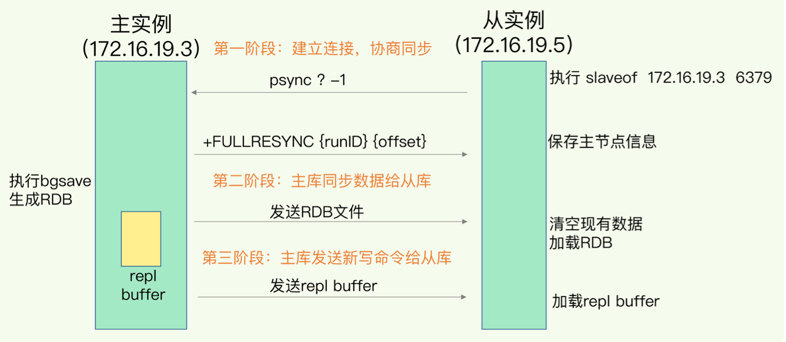
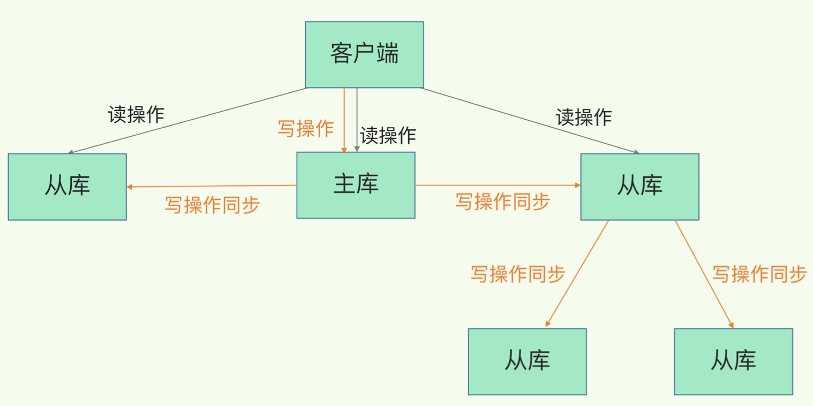
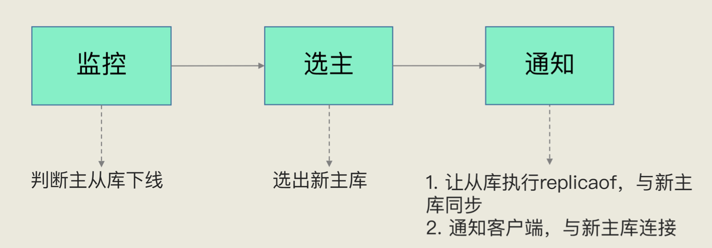
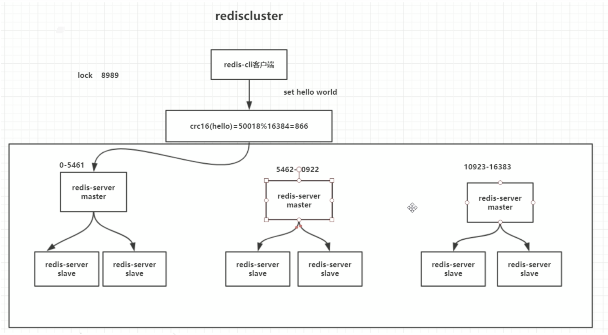

# Redis 架构模式？

# 主从复制

Redis 提供了主从库模式，以保证数据副本的一致，主从库之间采用的是读写分离的方式。

- 读操作:主库、从库都可以接收; 

- 写操作:首先到主库执行，然后，主库将写操作同步给从库。

那么，为什么要采用读写分离的方式呢?

你可以设想一下，不管是主库还是从库，都能接收客户端的写操作，那么，一个直接的问题就是：如果客户端对同一个数据前后修改了三次，每一次的修改请求都发送到不同的实例上，在不同的实例上执行，那么，这个数据在这三个实例上的副本就不一致了。在读取这个数据的时候，就可能读取到旧的值。如果我们非要保持这个数据在三个实例上一致，就要涉及到加锁、实例间协商是否完成修改等一系列操作，但这会带来巨额的开销，当然是不太能接受的。

  
**主从库间如何进行第一次同步?**

第一阶段是主从库间建立连接、协商同步的过程，主要是为全量复制做准备。在这一步，从库和主库建立起连接，并告诉主库即将进行同步，主库确认回复后，主从库间就可以开始同步了。

具体来说，从库给主库发送 psync 命令，表示要进行数据同步，主库根据这个命令的参数 来启动复制。psync 命令包含了主库的 runID 和复制进度 offset 两个参数。

::: tip 提示

runID，是每个 Redis 实例启动时都会自动生成的一个随机 ID，用来唯一标记这个实 例。当从库和主库第一次复制时，因为不知道主库的 runID，所以将 runID 设 为“?”。

offset，此时设为 -1，表示第一次复制。

主库收到 psync 命令后，会用 FULLRESYNC 响应命令带上两个参数:主库 runID 和主库 目前的复制进度 offset，返回给从库。从库收到响应后，会记录下这两个参数。

FULLRESYNC 响应表示第一次复制采用的全量复制，也就是说， 主库会把当前所有的数据都复制给从库。
:::

在第二阶段，主库将所有数据同步给从库。从库收到数据后，在本地完成数据加载。这个过程依赖于内存快照生成的 RDB 文件。

::: tip 提示
具体来说，主库执行 bgsave 命令，生成 RDB 文件，接着将文件发给从库。从库接收到 RDB 文件后，会先清空当前数据库，然后加载 RDB 文件。
:::

在主库将数据同步给从库的过程中，主库不会被阻塞，仍然可以正常接收请求。但是，这些请求中的写操作并没有记录到刚刚生成的 RDB 文件 中。为了保证主从库的数据一致性，主库会在内存中用专门的 replication buffer，记录 RDB 文件生成后收到的所有写操作。

最后，也就是第三个阶段，主库会把第二阶段执行过程中新收到的写命令，再发送给从 库。具体的操作是，当主库完成 RDB 文件发送后，就会把此时 replication buffer 中的修 改操作发给从库，从库再重新执行这些操作。这样一来，主从库就实现同步了。

  
**主从级联模式分担全量复制时的主库压力**

可以通过“主 - 从 - 从”模式将主库生成 RDB 和传输 RDB 的压力， 以级联的方式分散到从库上。

**主从库间网络断了怎么办?**

在 Redis 2.8 之前，如果主从库在命令传播时出现了网络闪断，那么，从库就会和主库重 新进行一次全量复制，开销非常大。从 Redis 2.8 开始，网络断了之后，主从库会采用增量复制的方式继续同步。

当主从库断连后，主库会把断连期间收到的写操作命令，写入 replication buffer，同时也 会把这些操作命令也写入 repl_backlog_buffer 这个缓冲区。

**repl_backlog_buffer 是一个环形缓冲区，主库会记录自己写到的位置，从库则会记录自己 已经读到的位置。**

刚开始的时候，主库和从库的写读位置在一起，这算是它们的起始位置。随着主库不断接 收新的写操作，它在缓冲区中的写位置会逐步偏离起始位置，我们通常用偏移量来衡量这 个偏移距离的大小，对主库来说，对应的偏移量就是 master_repl_offset。主库接收的新 写操作越多，这个值就会越大。

同样，从库在复制完写操作命令后，它在缓冲区中的读位置也开始逐步偏移刚才的起始位 置，此时，从库已复制的偏移量 slave_repl_offset 也在不断增加。正常情况下，这两个偏 移量基本相等。

主从库的连接恢复之后，从库首先会给主库发送 psync 命令，并把自己当前的 slave_repl_offset 发给主库，主库会判断自己的 master_repl_offset 和 slave_repl_offset 之间的差距。主库只用把 master_repl_offset 和 slave_repl_offset 之间的命令操作同步给从库就行。

  
**Redis主从复制会存在以下问题：**

- 一旦主节点宕机，从节点晋升为主节点，同时需要修改应用方的主节点地址，还需要命令所有从节点去复制新的主节点，整个过程需要人工干预。

- 主节点的写能力、存储能力受到单机的限制。

# 哨兵模式

哨兵其实就是一个运行在特殊模式下的 Redis 进程，主从库实例运行的同时，它也在运 行。哨兵主要负责的就是三个任务:监控、选主(选择主库)和通知。

监控是指哨兵进程在运行时，周期性地给所有的主从库发送 PING 命令， 检测它们是否仍然在线运行。如果从库没有在规定时间内响应哨兵的 PING 命令，哨兵就 会把它标记为“下线状态”;同样，如果主库也没有在规定时间内响应哨兵的 PING 命 令，哨兵就会判定主库下线，然后开始自动切换主库的流程。

哨兵机制通常会采用多实例组成的集群模式进行部署，这也被称为哨兵集群。引入多个哨兵实例一起来判断，就可以避免单个哨兵因为自身网络状况不好，而误判主库下线的情况。同时，多个哨兵的网络同时不稳定的概率较小，由它们一起做决策，误判率也能降低。当有 N 个哨兵实例时，最好要有 N/2 + 1 个实例判 断主库为“主观下线”，才能最终判定主库为“客观下线”。这样一来，就可以减少误判的概率，也能避免误判带来的无谓的主从库切换。

  
**如何选定新主库?**

哨兵选择新主库的过程称为“筛选 + 打分”。

筛选就是，在选主时，除了要检查从库的当前在线状态，还要判断它之前的网络连接状态。如果从库总是和主库断连，而且断连次数超出了一定的阈值（配置项 down-after-milliseconds * 10），我们就可以把这个从库筛掉了。

::: tip 提示
如果在 down-after- milliseconds 毫秒内，主从节点都没有通过网络联系上，我们就可以认为主从节点断连 了。如果发生断连的次数超过了 10 次，就说明这个从库的网络状况不好，不适合作为新主库。
:::

打分就是分别按照三个规则依次进行三轮打分，这三个规则分别是从库优先级、从库复制进度以及从库 ID 号。只要在某一轮中，有从库得分最高，那么它就是主库了，选主过程到此结束。如果没有出现得分最高的从库，那么就继续进行下一轮。

**第一轮:优先级最高的从库得分高。**

用户可以通过 slave-priority 配置项，给不同的从库设置不同优先级。

**第二轮:和旧主库同步程度最接近的从库得分高。**

选择和旧主库同步最接近的那个从库作为新主库。（slave_repl_offset 最接近 master_repl_offset 的从库）

**第三轮:ID 号小的从库得分高。**

每个实例都会有一个 ID，在优先级和复制进度都相同的情况下，ID 号最小的从库得分最高，会被选为新主库。

另外，主从切换是由 Leader 哨兵执行的，因此还要进行 Leader 选举。

  
**基于 pub/sub 机制的哨兵集群组成**

这些哨兵实例既然都不知道彼此的地址，又是怎么组成集群的呢？哨兵实例之间可以相互发现，要归功于 Redis 提供的 pub/sub 机制，也就是发布 / 订阅机制。

通过 pub/sub 机制，哨兵之间可以组成集群，同时，哨兵又通过 INFO 命令，获得了从库连接信息，也能和从库建立连接，并进行监控。同时也支持客户端从哨兵这里订阅消息。

在主库出现问题时，任何一个哨兵实例只要自身判断主库“主观下线”后，就会给其他实例发送 is-master-down- by-addr 命令。接着，其他哨兵实例会根据自己和主库的连接情况，做出 Y 或 N 的响应，Y 相 当于赞成票，N 相当于反对票。一个哨兵获得了仲裁所需的赞成票数后，就可以标记主库为“客观下线”。这个所需的赞 成票数是通过哨兵配置文件中的 quorum 配置项设定的。

此时，这个哨兵就可以再给其他哨兵发送命令，表明希望由自己来执行主从切换，并让所有其他哨兵进行投票。这个投票过程称为“Leader 选举”。

在投票过程中，任何一个想成为 Leader 的哨兵，要满足两个条件:第一，拿到半数以上的赞成票;第二，拿到的票数同时还需要大于等于哨兵配置文件中的 quorum 值。

**哨兵模式优缺点：**

- 可以保证高可用，自动故障迁移
  
- 主从模式，切换需要时间，可能丢数据
  
- 没有解决 master 写的压力

# 分片集群

Redis-Cluster采用无中心结构，每个节点保存数据和整个集群状态,每个节点都和其他所有节点连接。

对命令的key进行crc16（hash一致性算法）算法得到一串数字，再对16384取余，结果在哪个区间（槽位）就分配给哪个集群。

具体来说，Redis Cluster 方案采用哈希槽， 来处理数据和实例之间的映射关系。在 Redis Cluster 方案中，一个切片集群共有 16384 个哈希槽，这些哈希槽类似于数据分区，每个键值对都会根据它的 key，被映射到一个哈希槽中。

具体的映射过程分为两大步:首先根据键值对的 key，按照CRC16 算法计算一个 16 bit 的值;然后，再用这个 16bit 值对 16384 取模，得到 0~16383 范围内的模数，每个模数代表一个相应编号的哈希槽。

如果集群中有 N 个实例，那么，每个实例上的槽个数为 16384/N 个。

在集群中，实例和哈希槽的对应关系并不是一成不变的，最常见的变化有两个:

- 在集群中，实例有新增或删除，Redis 需要重新分配哈希槽;
  
- 为了负载均衡，Redis 需要把哈希槽在所有实例上重新分布一遍。

一般来说，客户端和集群实例建立连接后，实例就会把哈希槽的分配信息发给客户端。

此时，分片集群实例之间还可以通过相互传递消息，获得最新的哈希槽分配信息，但是，客户端是无法主动感知这些变化的。这就会导致，它缓存的分配信息和最新的分配信息就不一致了。

Redis Cluster 方案提供了一种重定向机制，所谓的“重定向”，就是指，客户端给一个实 例发送数据读写操作时，这个实例上并没有相应的数据，客户端要再给一个新实例发送操作命令。

::: tip 提示
那客户端又是怎么知道重定向时的新实例的访问地址呢?当客户端把一个键值对的操作请 求发给一个实例时，如果这个实例上并没有这个键值对映射的哈希槽，那么，这个实例就 会给客户端返回下面的 MOVED 命令响应结果，这个结果中就包含了新实例的访问地址。

需要注意的是，如果数据迁移还在进行中，客户端就会收到一条 ASK 报错信息，这个结果中的 ASK 命令就表示，客户端请求的键值对所在的哈希槽 13320，在 172.16.19.5 这个实例上，但是这个哈希槽正在迁移。此时，客户端需要先给 172.16.19.5 这个实例发送一个 ASKING 命令。这个命令的意思是，让这个实例允许执行客户端接下来发送的命令。然后，客户端再向这个实例发送 GET 命令，以读取数据。
:::

**分片集群特点：**

- 无中心架构（不存在哪个节点影响性能瓶颈），少了 proxy 层。
  
- 数据按照 slot 存储分布在多个节点，节点间数据共享，可动态调整数据分布。
  
- 可扩展性，可线性扩展到 1000 个节点，节点可动态添加或删除。

- 高可用性，部分节点不可用时，集群仍可用。通过增加 Slave 做备份数据副本

- 实现故障自动 failover，节点之间通过 gossip 协议交换状态信息，用投票机制完成 Slave到 Master 的角色提升。
