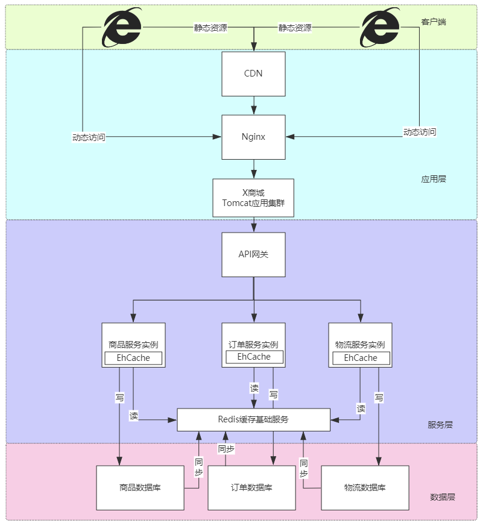
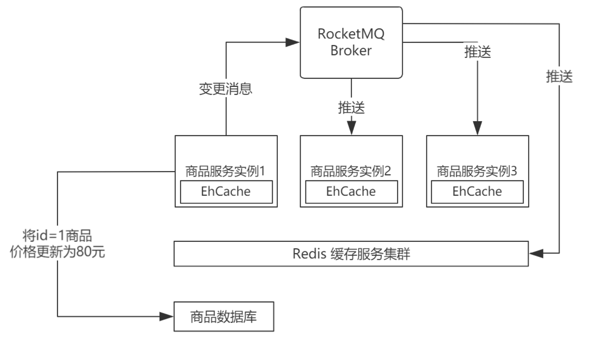

# 为什么用redis而不用map等本地缓存？

本地缓存最主要的特点是轻量而且快速，但是在多实例情况下每个实例都需要各自保存一份缓存，缓存不具有一致性。另外，由于本地缓存是部署在应用服务器中，而我们应用服务器通常会部署多台，当数据更新时，我们不能确定哪台服务器本地中了缓存，更新或者删除所有服务器的缓存不是一个好的选择，所以我们通常会等待缓存过期。因此，这种缓存的有效期很短，通常为分钟或者秒级别，以避免返回前端脏数据。

使用redis做分布式缓存，在多实例情况下，各实例共用同一份缓存数据，缓存具有一致性，缺点是需要保存redis的高可用，程序架构上需要引入其他组件

更多可以参考[王雄宁系统设计课程](http://polygonx.top/wxning-blog/interview/system-design/notes/03/01.html)

****

多级缓存分为：客户端缓冲，cdn缓冲，nginx缓存，服务层缓冲

服务层缓冲又分为本地缓存和redis缓存，可以通过多级缓存加速查询，先去本地缓存中获取数据，如果没有再去redis中获取，如果还没有再去mysql中获取。数据查询后需要对本地缓存和redis双写更新，更新需要考虑缓存一致性问题，最常见的做法是引入消息队列：

什么时候需要引入这种多级缓存的设计呢？

- 第一种情况，缓存的数据是稳定的。(比如邮政编码，地域区块，归档历史数据)

- 第二种情况，瞬时可能会产生极高并发的场景。

- 第三种情况，一定程度上允许数据不一致。

参考：[为什么架构师对多级缓存架构情有独钟？](https://www.bilibili.com/video/BV1Lq4y1975x/?spm_id_from=333.788)