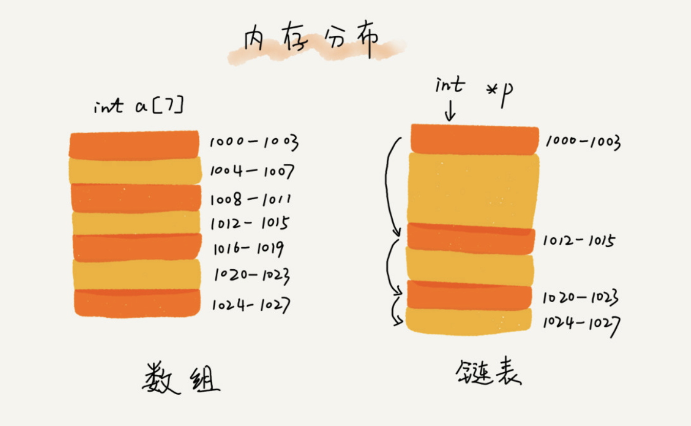
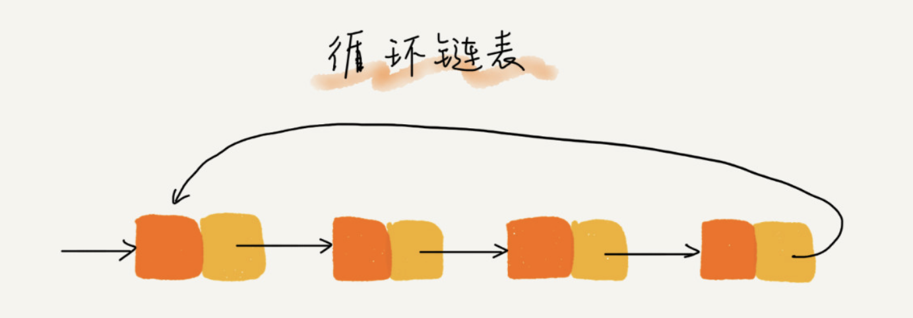
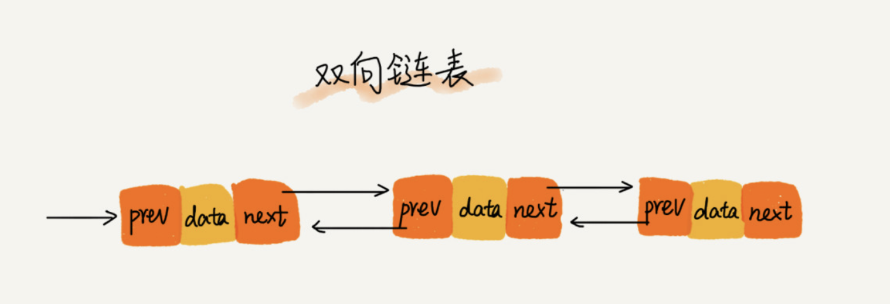
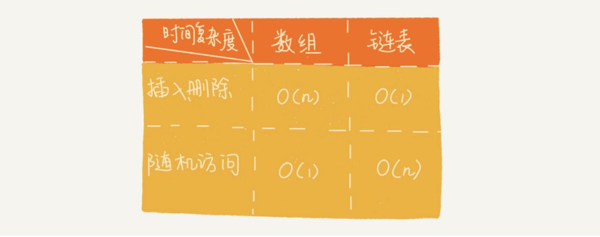

# 链表

先从**底层的存储结构**上来看一看：

数组需要一块**连续的内存空间**来存储，对内存的要求比较高。如果我们申请一个 100MB 大小的数组，当内存中没有连续的、足够大的存储空间时，即便内存的剩余总可用空间大于 100MB，仍然会申请失败。

而链表恰恰相反，它并不需要一块连续的内存空间，它通过“指针”将一组**零散的内存块**串联起来使用，所以如果我们申请的是 100MB 大小的链表，根本不会有问题。

我们知道，在进行数组的插入、删除操作时，为了保持内存数据的连续性，需要做大量的数据搬移，所以时间复杂度是 O(n)。而在链表中插入或者删除一个数据，我们并不需要为了保持内存的连续性而搬移结点，因为链表的存储空间本身就不是连续的。所以，在链表中插入和删除一个数据是非常快速的。

针对链表的插入和删除操作，我们只需要考虑相邻结点的指针改变，所以对应的时间复杂度是 O(1)。

但是，有利就有弊。链表要想随机访问第 k 个元素，就没有数组那么高效了。因为链表中的数据并非连续存储的，所以无法像数组那样，根据首地址和下标，通过寻址公式就能直接计算出对应的内存地址，而是需要根据指针一个结点一个结点地依次遍历，直到找到相应的结点。

## 循环链表

**循环链表是一种特殊的单链表**。它跟单链表唯一的区别就在尾结点。我们知道，单链表的尾结点指针指向空地址，表示这就是最后的结点了。而循环链表的尾结点指针是指向链表的头结点。从我画的循环链表图中，你应该可以看出来，它像一个环一样首尾相连，所以叫作“循环”链表。

和单链表相比，**循环链表**的优点是从链尾到链头比较方便。当要处理的数据具有环型结构特点时，就特别适合采用循环链表。比如著名的[约瑟夫问题](https://zh.wikipedia.org/wiki/约瑟夫斯问题)。尽管用单链表也可以实现，但是用循环链表实现的话，代码就会简洁很多。

## 双向链表

单向链表只有一个方向，结点只有一个后继指针 next 指向后面的结点。而双向链表，顾名思义，它支持两个方向，每个结点不止有一个后继指针 next 指向后面的结点，还有一个前驱指针 prev 指向前面的结点。

从我画的图中可以看出来，双向链表需要额外的两个空间来存储后继结点和前驱结点的地址。所以，如果存储同样多的数据，双向链表要比单链表占用更多的内存空间。虽然两个指针比较浪费存储空间，但可以支持双向遍历，这样也带来了双向链表操作的灵活性。那相比单链表，双向链表适合解决哪种问题呢？

从结构上来看，双向链表可以支持 O(1) 时间复杂度的情况下找到前驱结点，正是这样的特点，也使双向链表在某些情况下的插入、删除等操作都要比单链表简单、高效。

比如删除给定指针指向的结点，我们已经找到了要删除的结点，但是删除某个结点需要知道其前驱结点，单链表并不支持直接获取前驱结点，所以，为了找到前驱结点，我们还是要从头结点开始遍历链表。但是对于双向链表来说，这种情况就比较有优势了。因为双向链表中的结点已经保存了前驱结点的指针，不需要像单链表那样遍历。单链表删除操作需要 O(n) 的时间复杂度，而双向链表只需要在 O(1) 的时间复杂度内就搞定了！

同理，如果我们希望在链表的某个指定结点前面插入一个结点，双向链表比单链表有很大的优势。双向链表可以在 O(1) 时间复杂度搞定，而单向链表需要 O(n) 的时间复杂度。

除了插入、删除操作有优势之外，对于一个有序链表，双向链表的按值查询的效率也要比单链表高一些。因为，我们可以记录上次查找的位置 p，每次查询时，根据要查找的值与 p 的大小关系，决定是往前还是往后查找，所以平均只需要查找一半的数据。

现在，你有没有觉得双向链表要比单链表更加高效呢？这就是为什么在实际的软件开发中，双向链表尽管比较费内存，但还是比单链表的应用更加广泛的原因。如果你熟悉 Java 语言，你肯定用过 LinkedHashMap 这个容器。如果你深入研究 LinkedHashMap 的实现原理，就会发现其中就用到了双向链表这种数据结构。

实际上，这里有一个更加重要的知识点需要你掌握，那就是**用空间换时间**的设计思想。当内存空间充足的时候，如果我们更加追求代码的执行速度，我们就可以选择空间复杂度相对较高、但时间复杂度相对很低的算法或者数据结构。

## 链表 VS 数组性能大比拼

