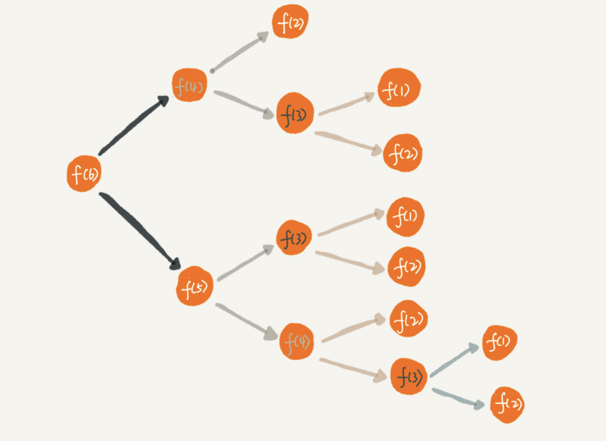

# 递归

## 如何编写递归代码？

写递归代码最关键的是**写出递推公式，找到终止条件**。

假如这里有 n 个台阶，每次你可以跨 1 个台阶或者 2 个台阶，请问走这 n 个台阶有多少种走法？如果有 7 个台阶，你可以 2，2，2，1 这样子上去，也可以 1，2，1，1，2 这样子上去，总之走法有很多，那如何用编程求得总共有多少种走法呢？

实际上，可以根据第一步的走法把所有走法分为两类，第一类是第一步走了 1 个台阶，另一类是第一步走了 2 个台阶。所以 n 个台阶的走法就等于先走 1 阶后，n-1 个台阶的走法 加上先走 2 阶后，n-2 个台阶的走法。用公式表示就是：

```java
f(n) = f(n-1)+f(n-2)
```

我们再来看下终止条件。当有一个台阶时，我们不需要再继续递归，就只有一种走法。所以 f(1)=1。这个递归终止条件足够吗？我们可以用 n=2，n=3 这样比较小的数试验一下。

n=2 时，f(2)=f(1)+f(0)。如果递归终止条件只有一个 f(1)=1，那 f(2) 就无法求解了。所以除了 f(1)=1 这一个递归终止条件外，还要有 f(0)=1，表示走 0 个台阶有一种走法，不过这样子看起来就不符合正常的逻辑思维了。所以，我们可以把 f(2)=2 作为一种终止条件，表示走 2 个台阶，有两种走法，一步走完或者分两步来走。

所以，递归终止条件就是 f(1)=1，f(2)=2。

递归代码如下:

```c
int f(int n) {
  if (n == 1) return 1;
  if (n == 2) return 2;
  return f(n-1) + f(n-2);
}
```

**写递归代码的关键就是找到如何将大问题分解为小问题的规律，并且基于此写出递推公式，然后再推敲终止条件，最后将递推公式和终止条件翻译成代码**。


## 递归代码要警惕堆栈溢出

我在“栈”那一节讲过，函数调用会使用栈来保存临时变量。每调用一个函数，都会将临时变量封装为栈帧压入内存栈，等函数执行完成返回时，才出栈。系统栈或者虚拟机栈空间一般都不大。如果递归求解的数据规模很大，调用层次很深，一直压入栈，就会有堆栈溢出的风险。


## 递归代码要警惕重复计算

刚才我讲的爬楼梯的例子，如果我们把整个递归过程分解一下的话，那就是这样的：



从图中，我们可以直观地看到，想要计算 f(5)，需要先计算 f(4) 和 f(3)，而计算 f(4) 还需要计算 f(3)，因此，f(3) 就被计算了很多次，这就是重复计算问题。

为了避免重复计算，我们可以通过一个数据结构（比如散列表）来保存已经求解过的 f(k)。当递归调用到 f(k) 时，先看下是否已经求解过了。如果是，则直接从散列表中取值返回，不需要重复计算，这样就能避免刚讲的问题了。

按照上面的思路，我们来改造一下刚才的代码：

```java
public int f(int n) {
  if (n == 1) return 1;
  if (n == 2) return 2;
  
  // hasSolvedList 可以理解成一个 Map，key 是 n，value 是 f(n)
  if (hasSolvedList.containsKey(n)) {
    return hasSovledList.get(n);
  }
  
  int ret = f(n-1) + f(n-2);
  hasSovledList.put(n, ret);
  return ret;
}
```


## 怎么将递归代码改写为非递归代码？

递归有利有弊，利是递归代码的表达力很强，写起来非常简洁；而弊就是空间复杂度高、有堆栈溢出的风险、存在重复计算、过多的函数调用会耗时较多等问题。

爬楼梯例子改为非递归的实现方式：

```c
int f(int n) {
  if (n == 1) return 1;
  if (n == 2) return 2;
  
  int ret = 0;
  int pre = 2;
  int prepre = 1;
  for (int i = 3; i <= n; ++i) {
    ret = pre + prepre;
    prepre = pre;
    pre = ret;
  }
  return ret;
}
```

