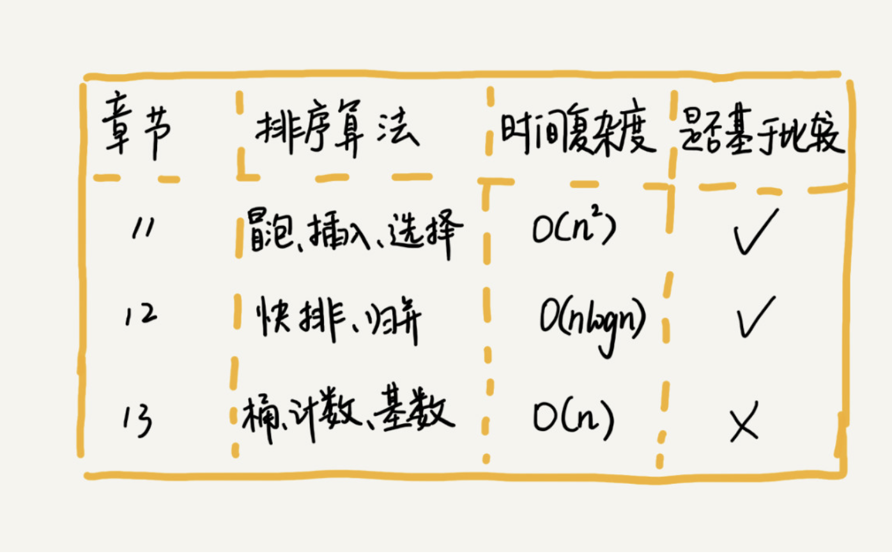
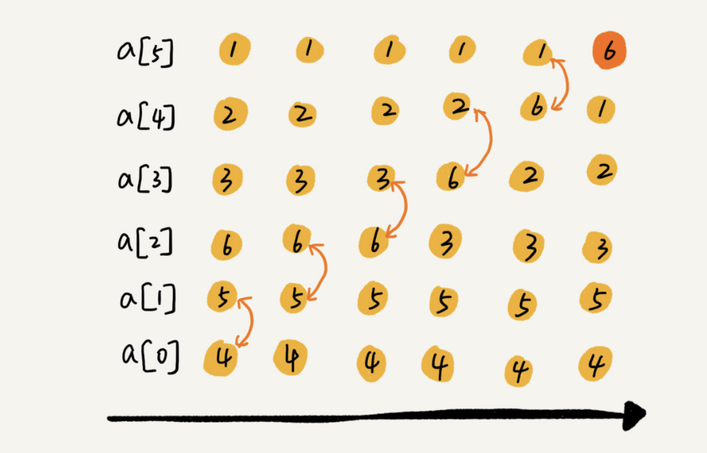
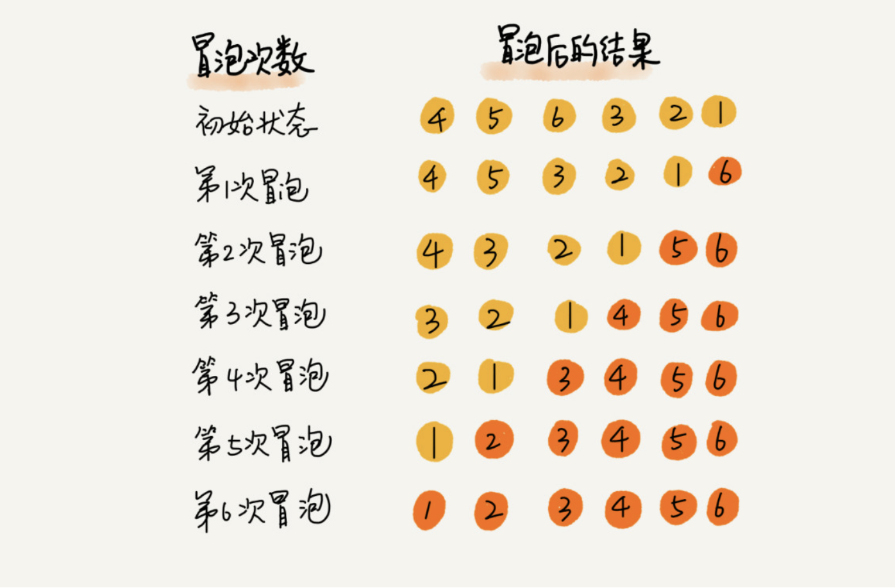

# 冒泡排序



原地排序算法：就是特指空间复杂度是 O(1) 的排序算法。

稳定性：如果待排序的序列中存在值相等的元素，经过排序之后，相等元素之间原有的先后顺序不变。那我们就把这种排序算法叫作**稳定的排序算法**。


冒泡排序只会操作相邻的两个数据。每次冒泡操作都会对相邻的两个元素进行比较，看是否满足大小关系要求。如果不满足就让它俩互换。一次冒泡会让至少一个元素移动到它应该在的位置，重复 n 次，就完成了 n 个数据的排序工作。

我们要对一组数据 4，5，6，3，2，1，从小到到大进行排序。第一次冒泡操作的详细过程就是这样：



可以看出，经过一次冒泡操作之后，6 这个元素已经存储在正确的位置上。要想完成所有数据的排序，我们只要进行 6 次这样的冒泡操作就行了。



实际上，刚讲的冒泡过程还可以优化。当某次冒泡操作已经没有数据交换时，说明已经达到完全有序，不用再继续执行后续的冒泡操作。

```java
// 冒泡排序，a 表示数组，n 表示数组大小
public void bubbleSort(int[] a, int n) {
  if (n <= 1) return;
 
 for (int i = 0; i < n; ++i) {
    // 提前退出冒泡循环的标志位
    boolean flag = false;
    for (int j = 0; j < n - i - 1; ++j) {
      if (a[j] > a[j+1]) { // 交换
        int tmp = a[j];
        a[j] = a[j+1];
        a[j+1] = tmp;
        flag = true;  // 表示有数据交换      
      }
    }
    if (!flag) break;  // 没有数据交换，提前退出
  }
}
```

冒泡的过程只涉及相邻数据的交换操作，只需要常量级的临时空间，所以它的空间复杂度为 O(1)，冒泡排序是原地排序算法。

在冒泡排序中，只有交换才可以改变两个元素的前后顺序。为了保证冒泡排序算法的稳定性，当有相邻的两个元素大小相等的时候，我们不做交换，相同大小的数据在排序前后不会改变顺序，所以冒泡排序是稳定的排序算法。

时间复杂度就是 O(n^2)。