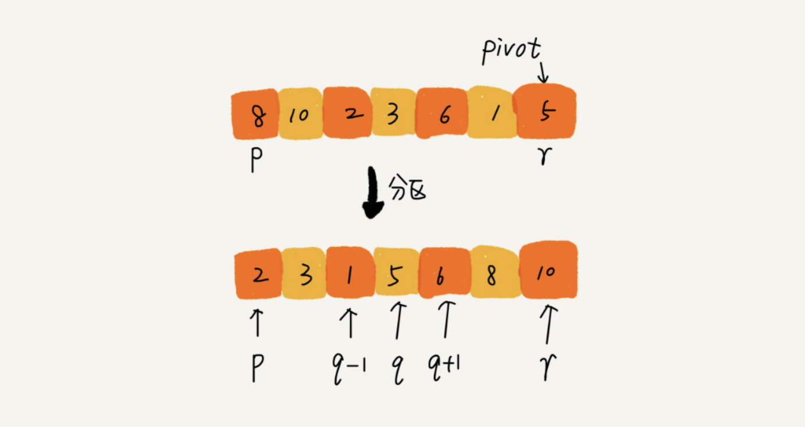
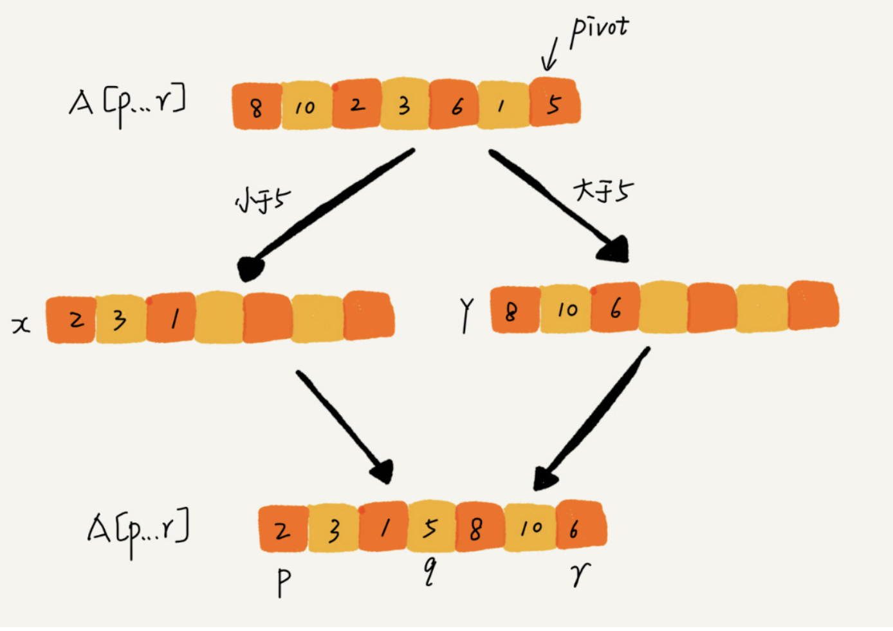
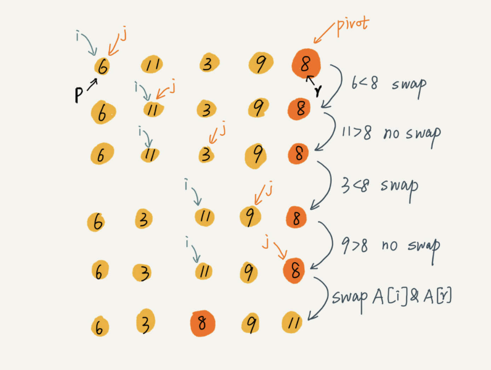

# 快速排序

快排的思想是这样的：如果要排序数组中下标从 p 到 r 之间的一组数据，我们选择 p 到 r 之间的任意一个数据作为 pivot（分区点）。

我们遍历 p 到 r 之间的数据，将小于 pivot 的放到左边，将大于 pivot 的放到右边，将 pivot 放到中间。



根据分治、递归的处理思想，我们可以用递归排序下标从 p 到 q-1 之间的数据和下标从 q+1 到 r 之间的数据，直到区间缩小为 1，就说明所有的数据都有序了。

如果我们用递推公式来将上面的过程写出来的话，就是这样：

```java
递推公式：
quick_sort(p…r) = quick_sort(p…q-1) + quick_sort(q+1, r)
 
终止条件：
p >= r
```

伪代码实现：

```java
// 快速排序，A 是数组，n 表示数组的大小
quick_sort(A, n) {
  quick_sort_c(A, 0, n-1)
}
// 快速排序递归函数，p,r 为下标
quick_sort_c(A, p, r) {
  if p >= r then return
  
  q = partition(A, p, r) // 获取分区点
  quick_sort_c(A, p, q-1)
  quick_sort_c(A, q+1, r)
}
```

归并排序中有一个 merge() 合并函数，我们这里有一个 partition() 分区函数。partition() 分区函数实际上我们前面已经讲过了，就是随机选择一个元素作为 pivot（一般情况下，可以选择 p 到 r 区间的最后一个元素），然后对 A[p…r] 分区，函数返回 pivot 的下标。

如果我们不考虑空间消耗的话，partition() 分区函数可以写得非常简单。我们申请两个临时数组 X 和 Y，遍历 A[p…r]，将小于 pivot 的元素都拷贝到临时数组 X，将大于 pivot 的元素都拷贝到临时数组 Y，最后再将数组 X 和数组 Y 中数据顺序拷贝到 A[p…r]。



但是，如果按照这种思路实现的话，partition() 函数就需要很多额外的内存空间，所以快排就不是原地排序算法了。如果我们希望快排是原地排序算法，那它的空间复杂度得是 O(1)，那 partition() 分区函数就不能占用太多额外的内存空间，我们就需要在 A[p…r] 的原地完成分区操作。

原地分区函数的实现思路非常巧妙，我写成了伪代码，我们一起来看一下。

```c
partition(A, p, r) {
  pivot := A[r]
  i := p
  for j := p to r-1 do {
    if A[j] < pivot {
      swap A[i] with A[j]
      i := i+1
    }
  }
  swap A[i] with A[r]
  return i
```

这里的处理有点类似选择排序。我们通过游标 i 把 A[p…r-1] 分成两部分。A[p…i-1] 的元素都是小于 pivot 的，我们暂且叫它“已处理区间”，A[i…r-1] 是“未处理区间”。我们每次都从未处理的区间 A[i…r-1] 中取一个元素 A[j]，与 pivot 对比，如果小于 pivot，则将其加入到已处理区间的尾部，也就是 A[i] 的位置。

数组的插入操作还记得吗？在数组某个位置插入元素，需要搬移数据，非常耗时。当时我们也讲了一种处理技巧，就是交换，在 O(1) 的时间复杂度内完成插入操作。这里我们也借助这个思想，只需要将 A[i] 与 A[j] 交换，就可以在 O(1) 时间复杂度内将 A[j] 放到下标为 i 的位置。



因为分区的过程涉及交换操作，如果数组中有两个相同的元素，比如序列 6，8，7，6，3，5，9，4，在经过第一次分区操作之后，两个 6 的相对先后顺序就会改变。所以，快速排序是一个原地的、不稳定的排序算法。

快排Golang代码实现：

```go
func quickSort(data []int, p, r int) {
	if p >= r {
		return
	}

	pivot := data[r]
	i := p
	for j := p; j < r; j++ {
		if data[j] < pivot {
			data[i], data[j] = data[j], data[i]
			i++
		}
	}
	data[i], data[r] = data[r], data[i]

	quickSort(data, p, i-1)
	quickSort(data, i+1, r)
}
```


如果每次分区操作，都能正好把数组分成大小接近相等的两个小区间，那快排的时间复杂度递推求解公式跟归并是相同的。所以，快排的时间复杂度也是 O(nlogn)。

```java
T(1) = C；   n=1 时，只需要常量级的执行时间，所以表示为 C。
T(n) = 2*T(n/2) + n； n>1
```

但是，公式成立的前提是每次分区操作，我们选择的 pivot 都很合适，正好能将大区间对等地一分为二。但实际上这种情况是很难实现的。

我举一个比较极端的例子。如果数组中的数据原来已经是有序的了，比如 1，3，5，6，8。如果我们每次选择最后一个元素作为 pivot，那每次分区得到的两个区间都是不均等的。我们需要进行大约 n 次分区操作，才能完成快排的整个过程。每次分区我们平均要扫描大约 n/2 个元素，这种情况下，快排的时间复杂度就从 O(nlogn) 退化成了 O(n^2)。

我们刚刚讲了两个极端情况下的时间复杂度，一个是分区极其均衡，一个是分区极其不均衡。它们分别对应快排的最好情况时间复杂度和最坏情况时间复杂度。那快排的平均情况时间复杂度是多少呢？

我们假设每次分区操作都将区间分成大小为 9:1 的两个小区间。我们继续套用递归时间复杂度的递推公式，就会变成这样：

```java
T(1) = C；   n=1 时，只需要常量级的执行时间，所以表示为 C。
 
T(n) = T(n/10) + T(9*n/10) + n； n>1
```

这个公式的递推求解的过程非常复杂，实际上，递归的时间复杂度的求解方法除了递推公式之外，还有递归树，在树那一节我再讲，这里暂时不说。我这里直接给你结论：T(n) 在大部分情况下的时间复杂度都可以做到 O(nlogn)，只有在极端情况下，才会退化到 O(n^2)。

# 快排和归并区别

快排和归并用的都是分治思想，递推公式和递归代码也非常相似，那它们的区别在哪里呢？


可以发现，归并排序的处理过程是**由下到上**的，先处理子问题，然后再合并。而快排正好相反，它的处理过程是**由上到下**的，先分区，然后再处理子问题。归并排序虽然是稳定的、时间复杂度为 O(nlogn) 的排序算法，但是它是非原地排序算法。我们前面讲过，归并之所以是非原地排序算法，主要原因是合并函数无法在原地执行。快速排序通过设计巧妙的原地分区函数，可以实现原地排序，解决了归并排序占用太多内存的问题。

