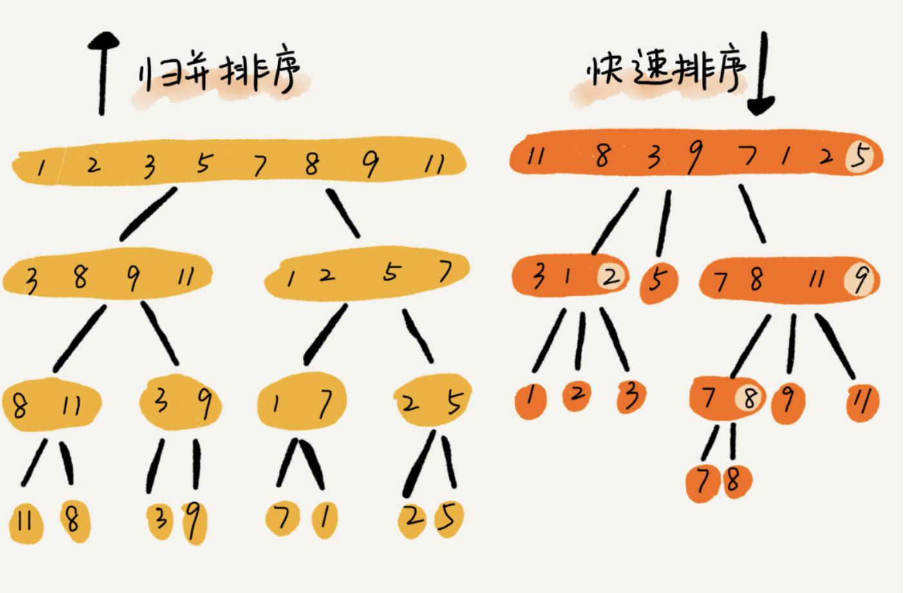

# 快排和归并区别

快排和归并用的都是分治思想，递推公式和递归代码也非常相似，那它们的区别在哪里呢？

可以发现，归并排序的处理过程是**由下到上**的，先处理子问题，然后再合并。而快排正好相反，它的处理过程是**由上到下**的，先分区，然后再处理子问题。归并排序虽然是稳定的、时间复杂度为 O(nlogn) 的排序算法，但是它是非原地排序算法。我们前面讲过，归并之所以是非原地排序算法，主要原因是合并函数无法在原地执行。快速排序通过设计巧妙的原地分区函数，可以实现原地排序，解决了归并排序占用太多内存的问题。

