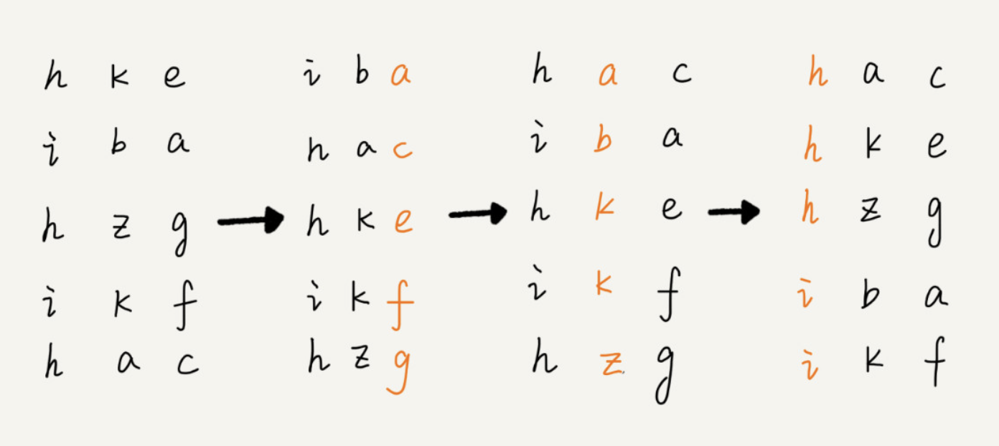

# 基数排序

我们再来看这样一个排序问题。假设我们有 10 万个手机号码，希望将这 10 万个手机号码从小到大排序，你有什么比较快速的排序方法呢？

我们之前讲的快排，时间复杂度可以做到 O(nlogn)，还有更高效的排序算法吗？桶排序、计数排序能派上用场吗？手机号码有 11 位，范围太大，显然不适合用这两种排序算法。针对这个排序问题，有没有时间复杂度是 O(n) 的算法呢？现在我就来介绍一种新的排序算法，基数排序。

刚刚这个问题里有这样的规律：假设要比较两个手机号码 a，b 的大小，如果在前面几位中，a 手机号码已经比 b 手机号码大了，那后面的几位就不用看了。

借助稳定排序算法，这里有一个巧妙的实现思路。还记得我们在阐述排序算法的稳定性的时候举的订单的例子吗？我们这里也可以借助相同的处理思路，先按照最后一位来排序手机号码，然后，再按照倒数第二位重新排序，以此类推，最后按照第一位重新排序。经过 11 次排序之后，手机号码就都有序了。

手机号码稍微有点长，画图比较不容易看清楚，我用字符串排序的例子，画了一张基数排序的过程分解图，你可以看下。

注意，这里按照每位来排序的排序算法要是稳定的，否则这个实现思路就是不正确的。因为如果是非稳定排序算法，那最后一次排序只会考虑最高位的大小顺序，完全不管其他位的大小关系，那么低位的排序就完全没有意义了。

根据每一位来排序，我们可以用刚讲过的桶排序或者计数排序，它们的时间复杂度可以做到 O(n)。如果要排序的数据有 k 位，那我们就需要 k 次桶排序或者计数排序，总的时间复杂度是 O(k*n)。当 k 不大的时候，比如手机号码排序的例子，k 最大就是 11，所以基数排序的时间复杂度就近似于 O(n)。

**基数排序对要排序的数据是有要求的，需要可以分割出独立的“位”来比较，而且位之间有递进的关系，如果 a 数据的高位比 b 数据大，那剩下的低位就不用比较了。除此之外，每一位的数据范围不能太大，要可以用线性排序算法来排序，否则，基数排序的时间复杂度就无法做到 O(n) 了**。