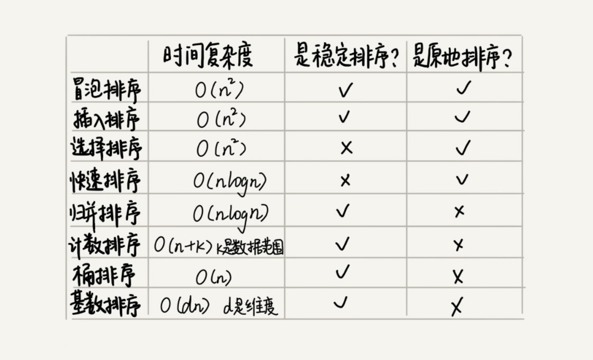

# 如何选择合适的排序算法？

线性排序算法的时间复杂度比较低，适用场景比较特殊。所以如果要写一个通用的排序函数，不能选择线性排序算法。

如果对小规模数据进行排序，可以选择时间复杂度是 O(n^2) 的算法；如果对大规模数据进行排序，时间复杂度是 O(nlogn) 的算法更加高效。所以，为了兼顾任意规模数据的排序，一般都会首选时间复杂度是 O(nlogn) 的排序算法来实现排序函数。

时间复杂度是 O(nlogn) 的排序算法不止一个，我们已经讲过的有归并排序、快速排序，后面讲堆的时候我们还会讲到堆排序。堆排序和快速排序都有比较多的应用，比如 Java 语言采用堆排序实现排序函数，C 语言使用快速排序实现排序函数。

不知道你有没有发现，使用归并排序的情况其实并不多。我们知道，快排在最坏情况下的时间复杂度是 O(n^2)，而归并排序可以做到平均情况、最坏情况下的时间复杂度都是 O(nlogn)，从这点上看起来很诱人，那为什么它还是没能得到“宠信”呢？

还记得我们上一节讲的归并排序的空间复杂度吗？归并排序并不是原地排序算法，空间复杂度是 O(n)。所以，粗略点、夸张点讲，如果要排序 100MB 的数据，除了数据本身占用的内存之外，排序算法还要额外再占用 100MB 的内存空间，空间耗费就翻倍了。

前面我们讲到，快速排序比较适合来实现排序函数，但是，我们也知道，快速排序在最坏情况下的时间复杂度是 O(n^2)，如何来解决这个“复杂度恶化”的问题呢？

