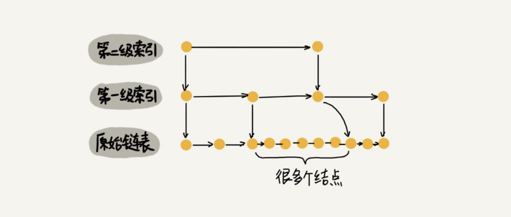
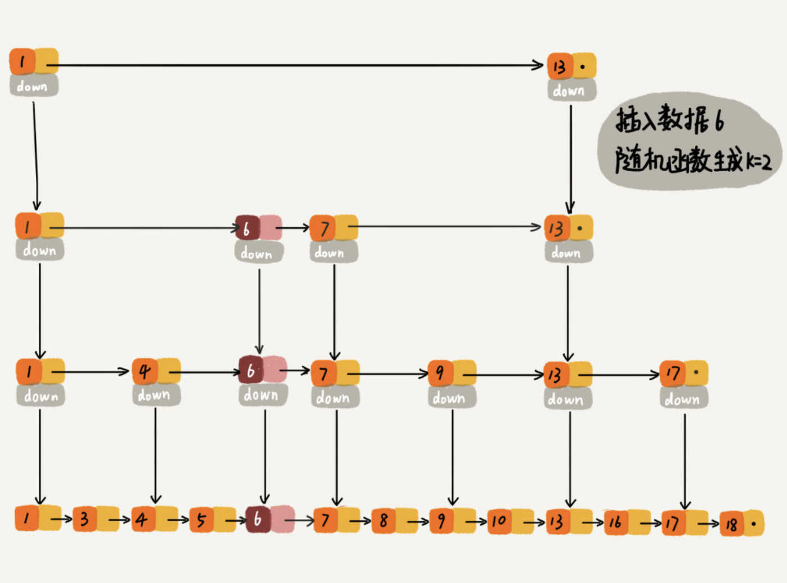

# 跳表索引动态更新

当我们不停地往跳表中插入数据时，如果我们不更新索引，就有可能出现某 2 个索引结点之间数据非常多的情况。极端情况下，跳表还会退化成单链表。

如果你了解红黑树、AVL 树这样平衡二叉树，你就知道它们是通过左右旋的方式保持左右子树的大小平衡，而跳表是通过随机函数来维护前面提到的“平衡性”。

当我们往跳表中插入数据的时候，我们可以选择同时将这个数据插入到部分索引层中。如何选择加入哪些索引层呢？

我们通过一个随机函数，来决定将这个结点插入到哪几级索引中，比如随机函数生成了值 K，那我们就将这个结点添加到第一级到第 K 级这 K 级索引中。

