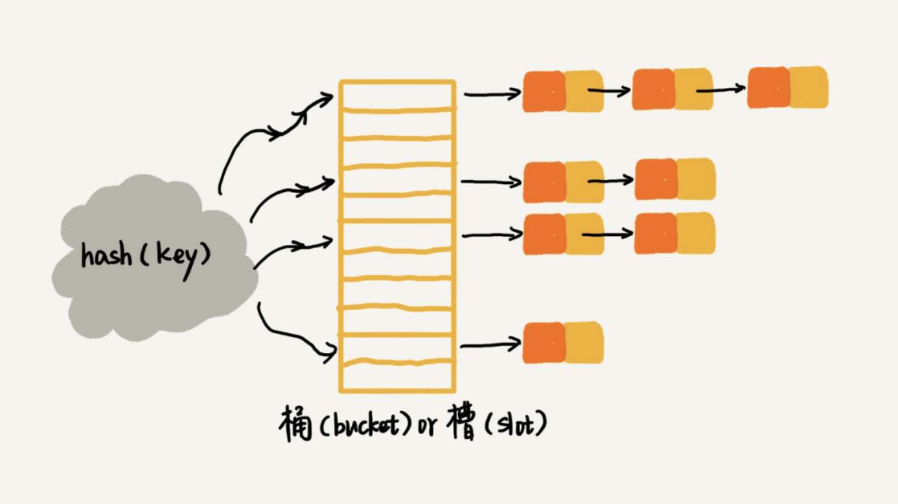
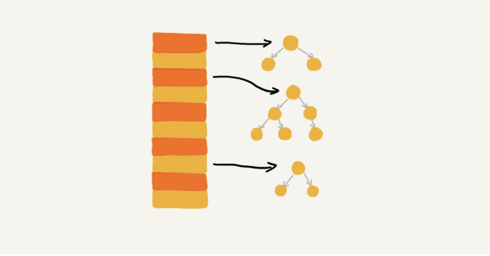

# 散列冲突---链表法

链表法是一种更加常用的散列冲突解决办法，相比开放寻址法，它要简单很多。我们来看这个图，在散列表中，每个“桶（bucket）”或者“槽（slot）”会对应一条链表，所有散列值相同的元素我们都放到相同槽位对应的链表中。

## 链表法优缺点

首先，链表法对内存的利用率比开放寻址法要高。因为链表结点可以在需要的时候再创建，并不需要像开放寻址法那样事先申请好。实际上，这一点也是我们前面讲过的链表优于数组的地方。

链表法比起开放寻址法，对大装载因子的容忍度更高。开放寻址法只能适用装载因子小于 1 的情况。接近 1 时，就可能会有大量的散列冲突，导致大量的探测、再散列等，性能会下降很多。但是对于链表法来说，只要散列函数的值随机均匀，即便装载因子变成 10，也就是链表的长度变长了而已，虽然查找效率有所下降，但是比起顺序查找还是快很多。

还记得我们之前在链表那一节讲的吗？链表因为要存储指针，所以对于比较小的对象的存储，是比较消耗内存的，还有可能会让内存的消耗翻倍。而且，因为链表中的结点是零散分布在内存中的，不是连续的，所以对 CPU 缓存是不友好的，这方面对于执行效率也有一定的影响。

当然，如果我们存储的是大对象，也就是说要存储的对象的大小远远大于一个指针的大小（4 个字节或者 8 个字节），那链表中指针的内存消耗在大对象面前就可以忽略了。

实际上，我们对链表法稍加改造，可以实现一个更加高效的散列表。那就是，我们将链表法中的链表改造为其他高效的动态数据结构，比如跳表、红黑树。这样，即便出现散列冲突，极端情况下，所有的数据都散列到同一个桶内，那最终退化成的散列表的查找时间也只不过是 O(logn)。这样也就有效避免了前面讲到的散列碰撞攻击。

**我总结一下，基于链表的散列冲突处理方法比较适合存储大对象、大数据量的散列表，而且，比起开放寻址法，它更加灵活，支持更多的优化策略，比如用红黑树代替链表**。

