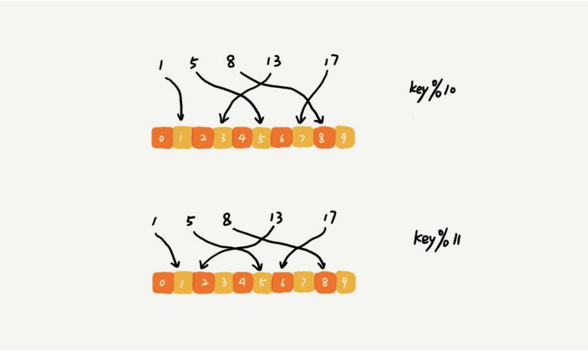

# 应用七：分布式存储

现在互联网面对的都是海量的数据、海量的用户。我们为了提高数据的读取、写入能力，一般都采用分布式的方式来存储数据，比如分布式缓存。我们有海量的数据需要缓存，所以一个缓存机器肯定是不够的。于是，我们就需要将数据分布在多台机器上。

该如何决定将哪个数据放到哪个机器上呢？我们可以借用前面数据分片的思想，即通过哈希算法对数据取哈希值，然后对机器个数取模，这个最终值就是应该存储的缓存机器编号。

但是，如果数据增多，原来的 10 个机器已经无法承受了，我们就需要扩容了，比如扩到 11 个机器，这时候麻烦就来了。因为，这里并不是简单地加个机器就可以了。

原来的数据是通过与 10 来取模的。比如 13 这个数据，存储在编号为 3 这台机器上。但是新加了一台机器中，我们对数据按照 11 取模，原来 13 这个数据就被分配到 2 号这台机器上了。

因此，所有的数据都要重新计算哈希值，然后重新搬移到正确的机器上。这样就相当于，缓存中的数据一下子就都失效了。所有的数据请求都会穿透缓存，直接去请求数据库。这样就可能发生[雪崩效应](https://zh.wikipedia.org/wiki/雪崩效应)，压垮数据库。

所以，我们需要一种方法，使得在新加入一个机器后，并不需要做大量的数据搬移。这时候，一**致性哈希算法**就要登场了。

假设我们有 k 个机器，数据的哈希值的范围是 [0, MAX]。我们将整个范围划分成 m 个小区间（m 远大于 k），每个机器负责 m/k 个小区间。当有新机器加入的时候，我们就将某几个小区间的数据，从原来的机器中搬移到新的机器中。这样，既不用全部重新哈希、搬移数据，也保持了各个机器上数据数量的均衡。

一致性哈希算法的基本思想就是这么简单。除此之外，它还会借助一个虚拟的环和虚拟结点，更加优美地实现出来。这里我就不展开讲了，如果感兴趣，你可以看下这个[介绍](https://en.wikipedia.org/wiki/Consistent_hashing)。

除了我们上面讲到的分布式缓存，实际上，一致性哈希算法的应用非常广泛，在很多分布式存储系统中，都可以见到一致性哈希算法的影子。

关于一致性哈希算法可以查看[系统设计篇/缓存设计/数据分片](http://localhost:8080/wxning-blog/interview/system-design/notes/03/04.html)

