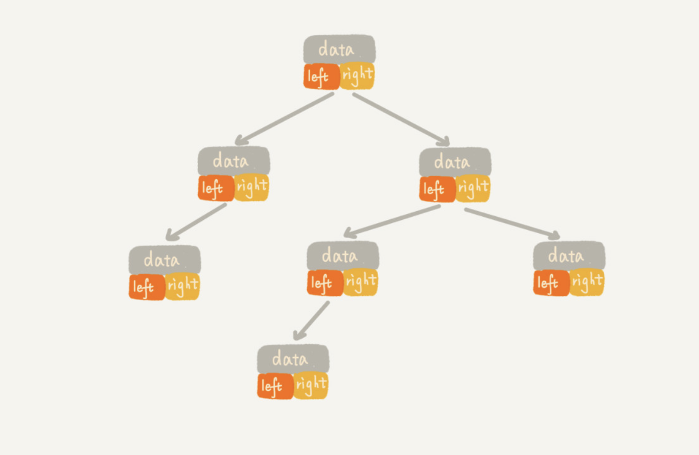
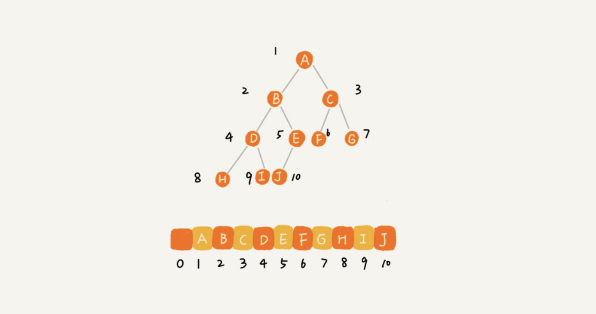
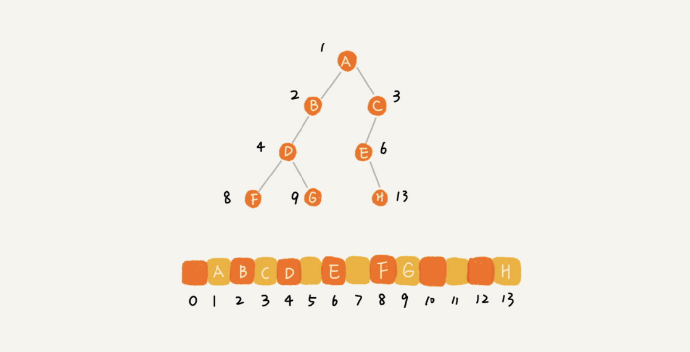

# 二叉树

二叉树，顾名思义，每个节点最多有两个“叉”，也就是两个子节点，分别是**左子节点**和**右子节点**。

叶子节点全都在最底层，除了叶子节点之外，每个节点都有左右两个子节点，这种二叉树就叫作**满二叉树**。

叶子节点都在最底下两层，最后一层的叶子节点都靠左排列，并且除了最后一层，其他层的节点个数都要达到最大，这种二叉树叫作**完全二叉树**。

# 存储一棵二叉树

有两种方法，一种是基于指针或者引用的二叉链式存储法，一种是基于数组的顺序存储法。

我们先来看比较简单、直观的**链式存储法**。从图中你应该可以很清楚地看到，每个节点有三个字段，其中一个存储数据，另外两个是指向左右子节点的指针。我们只要拎住根节点，就可以通过左右子节点的指针，把整棵树都串起来。这种存储方式我们比较常用。大部分二叉树代码都是通过这种结构来实现的。

我们再来看，基于数组的**顺序存储法**。我们把根节点存储在下标 i = 1 的位置，那左子节点存储在下标 2 * i = 2 的位置，右子节点存储在 2 * i + 1 = 3 的位置。以此类推，B 节点的左子节点存储在 2 * i = 2 * 2 = 4 的位置，右子节点存储在 2 * i + 1 = 2 * 2 + 1 = 5 的位置。

我来总结一下，如果节点 X 存储在数组中下标为 i 的位置，下标为 2 * i 的位置存储的就是左子节点，下标为 2 * i + 1 的位置存储的就是右子节点。反过来，下标为 i/2 的位置存储就是它的父节点。通过这种方式，我们只要知道根节点存储的位置，这样就可以通过下标计算，把整棵树都串起来。

不过，我刚刚举的例子是一棵完全二叉树，所以仅仅“浪费”了一个下标为 0 的存储位置。如果是非完全二叉树，其实会浪费比较多的数组存储空间。你可以看我举的下面这个例子。

所以，如果某棵二叉树是一棵完全二叉树，那用数组存储无疑是最节省内存的一种方式。因为数组的存储方式并不需要像链式存储法那样，要存储额外的左右子节点的指针。这也是为什么完全二叉树会单独拎出来的原因，也是为什么完全二叉树要求最后一层的子节点都靠左的原因。

当我们讲到堆和堆排序的时候，你会发现，堆其实就是一种完全二叉树，最常用的存储方式就是数组。