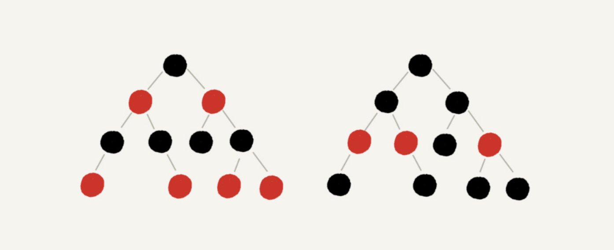
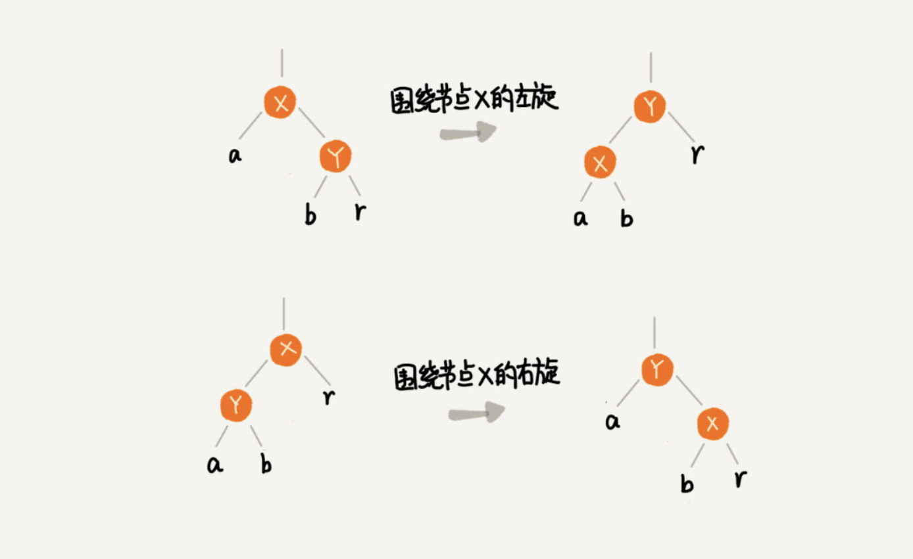

# 红黑树

平衡二叉树的严格定义是这样的：二叉树中任意一个节点的左右子树的高度相差不能大于 1。但是很多平衡二叉查找树其实并没有严格符合上面的定义，比如我们下面要讲的红黑树，它从根节点到各个叶子节点的最长路径，有可能会比最短路径大一倍。

**平衡二叉查找树中“平衡”的意思，其实就是让整棵树左右看起来比较“对称”、比较“平衡”，不要出现左子树很高、右子树很矮的情况。这样就能让整棵树的高度相对来说低一些，相应的插入、删除、查找等操作的效率高一些。**

红黑树的英文是“Red-Black Tree”，简称 R-B Tree。它是一种不严格的平衡二叉查找树，一棵红黑树还需要满足这样几个要求：

- 根节点是黑色的；
- 每个叶子节点都是黑色的空节点（NIL），也就是说，叶子节点不存储数据；
- 任何相邻的节点都不能同时为红色，也就是说，红色节点是被黑色节点隔开的；
- 每个节点，从该节点到达其可达叶子节点的所有路径，都包含相同数目的黑色节点；

这里的第二点要求“叶子节点都是黑色的空节点”，稍微有些奇怪，它主要是为了简化红黑树的代码实现而设置的。**这节我们暂时不考虑这一点**。

两个红黑树的图例：

两个非常重要的操作，**左旋（rotate left）**、**右旋（rotate right）**。左旋全称其实是叫**围绕某个节点的左旋**，那右旋的全称估计你已经猜到了，就叫**围绕某个节点的右旋**。

红黑树的插入、删除操作会破坏红黑树的平衡，所以，红黑树在插入、删除数据之后，需要通过左右旋和改变颜色调整平衡，具体细节不做阐述了，比较复杂。