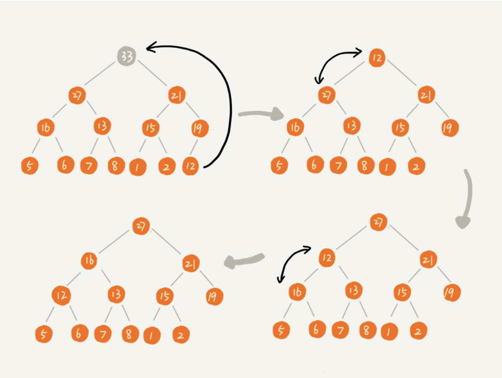

# 实现原理

堆是一个完全二叉树，堆中每一个节点的值都必须大于等于（或小于等于）其子树中每个节点的值。

对于每个节点的值都大于等于子树中每个节点值的堆，我们叫作“大顶堆”。对于每个节点的值都小于等于子树中每个节点值的堆，我们叫作“小顶堆”。


我之前讲过，完全二叉树比较适合用数组来存储。用数组来存储完全二叉树是非常节省存储空间的。因为我们不需要存储左右子节点的指针，单纯地通过数组的下标，就可以找到一个节点的左右子节点和父节点。


# 1. 往堆中插入一个元素

如果我们把新插入的元素放到堆的最后，你可以看我画的这个图，是不是不符合堆的特性了？于是，我们就需要进行调整，让其重新满足堆的特性，这个过程我们起了一个名字，就叫作**堆化**（heapify）。

堆化实际上有两种，从下往上和从上往下。这里我先讲**从下往上**的堆化方法。


堆化非常简单，就是顺着节点所在的路径，向上或者向下，对比，然后交换。

我这里画了一张堆化的过程分解图。我们可以让新插入的节点与父节点对比大小。如果不满足子节点小于等于父节点的大小关系，我们就互换两个节点。一直重复这个过程，直到父子节点之间满足刚说的那种大小关系。


代码实现：

```java
public class Heap {
  private int[] a; // 数组，从下标 1 开始存储数据
  private int n;  // 堆可以存储的最大数据个数
  private int count; // 堆中已经存储的数据个数
 
  public Heap(int capacity) {
    a = new int[capacity + 1];
    n = capacity;
    count = 0;
  }
 
  public void insert(int data) {
    if (count >= n) return; // 堆满了
    ++count;
    a[count] = data;
    int i = count;
    while (i/2 > 0 && a[i] > a[i/2]) { // 自下往上堆化
      swap(a, i, i/2); // swap() 函数作用：交换下标为 i 和 i/2 的两个元素
      i = i/2;
    }
  }
 }
```


# 2. 删除堆顶元素

假设我们构造的是大顶堆，堆顶元素就是最大的元素。当我们删除堆顶元素之后，就需要把第二大的元素放到堆顶，那第二大元素肯定会出现在左右子节点中。然后我们再迭代地删除第二大节点，以此类推，直到叶子节点被删除。

这里我也画了一个分解图。不过这种方法有点问题，就是最后堆化出来的堆并不满足完全二叉树的特性。


实际上，我们稍微改变一下思路，就可以解决这个问题。你看我画的下面这幅图。我们把最后一个节点放到堆顶，然后利用同样的父子节点对比方法。对于不满足父子节点大小关系的，互换两个节点，并且重复进行这个过程，直到父子节点之间满足大小关系为止。这就是**从上往下的堆化方法**。

因为我们移除的是数组中的最后一个元素，而在堆化的过程中，都是交换操作，不会出现数组中的“空洞”，所以这种方法堆化之后的结果，肯定满足完全二叉树的特性。



删除过程代码实现：

```java
public void removeMax() {
  if (count == 0) return -1; // 堆中没有数据
  a[1] = a[count];
  --count;
  heapify(a, count, 1);
}
 
private void heapify(int[] a, int n, int i) { // 自上往下堆化
  while (true) {
    int maxPos = i;
    if (i*2 <= n && a[i] < a[i*2]) maxPos = i*2;
    if (i*2+1 <= n && a[maxPos] < a[i*2+1]) maxPos = i*2+1;
    if (maxPos == i) break;
    swap(a, i, maxPos);
    i = maxPos;
  }
}
```

我们知道，一个包含 n 个节点的完全二叉树，树的高度不会超过 log2n。堆化的过程是顺着节点所在路径比较交换的，所以堆化的时间复杂度跟树的高度成正比，也就是 O(logn)。插入数据和删除堆顶元素的主要逻辑就是堆化，所以，往堆中插入一个元素和删除堆顶元素的时间复杂度都是 O(logn)。