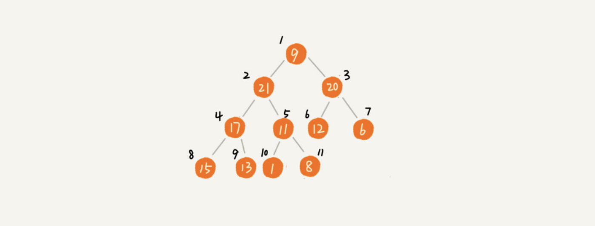
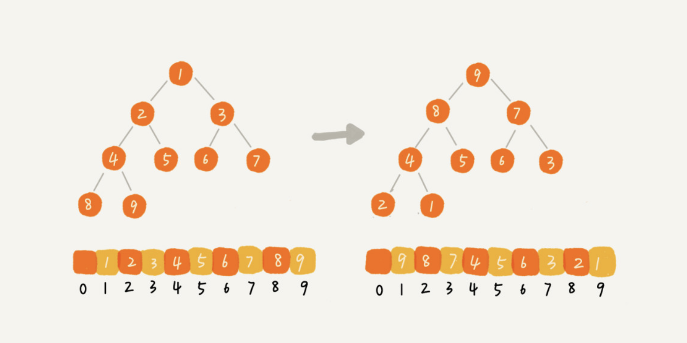

# 为什么快排比堆排序性能好？

# 第一点，堆排序数据访问的方式没有快速排序友好。

对于快速排序来说，数据是顺序访问的。而对于堆排序来说，数据是跳着访问的。 比如，堆排序中，最重要的一个操作就是数据的堆化。比如下面这个例子，对堆顶节点进行堆化，会依次访问数组下标是 1，2，4，8 的元素，而不是像快速排序那样，局部顺序访问，所以，这样对 CPU 缓存是不友好的。

# 第二点，对于同样的数据，在排序过程中，堆排序算法的数据交换次数要多于快速排序。

我们在讲排序的时候，提过两个概念，有序度和逆序度。对于基于比较的排序算法来说，整个排序过程就是由两个基本的操作组成的，比较和交换（或移动）。快速排序数据交换的次数不会比逆序度多。

但是堆排序的第一步是建堆，建堆的过程会打乱数据原有的相对先后顺序，导致原数据的有序度降低。比如，对于一组已经有序的数据来说，经过建堆之后，数据反而变得更无序了。

