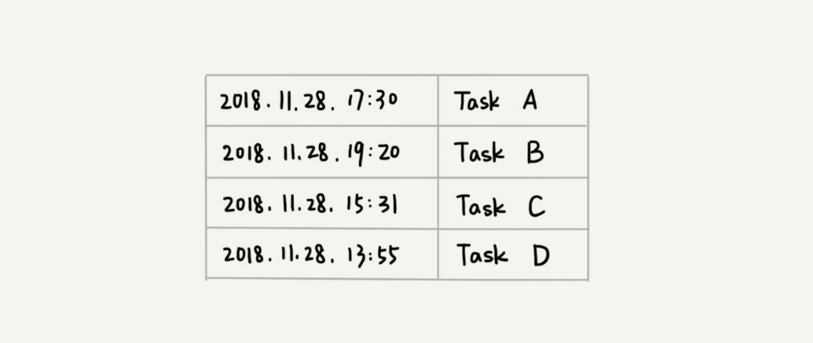

# 堆的应用一：优先级队列

优先级队列，顾名思义，它首先应该是一个队列。我们前面讲过，队列最大的特性就是先进先出。不过，在优先级队列中，数据的出队顺序不是先进先出，而是按照优先级来，优先级最高的，最先出队。

如何实现一个优先级队列呢？方法有很多，但是用堆来实现是最直接、最高效的。这是因为，堆和优先级队列非常相似。一个堆就可以看作一个优先级队列。很多时候，它们只是概念上的区分而已。往优先级队列中插入一个元素，就相当于往堆中插入一个元素；从优先级队列中取出优先级最高的元素，就相当于取出堆顶元素。

你可别小看这个优先级队列，它的应用场景非常多。我们后面要讲的很多数据结构和算法都要依赖它。比如，赫夫曼编码、图的最短路径、最小生成树算法等等。不仅如此，很多语言中，都提供了优先级队列的实现，比如，Java 的 PriorityQueue，C++ 的 priority_queue 等。

只讲这些应用场景比较空泛，现在，我举两个具体的例子，让你感受一下优先级队列具体是怎么用的。

## 1. 合并有序小文件

假设我们有 100 个小文件，每个文件的大小是 100MB，每个文件中存储的都是有序的字符串。我们希望将这些 100 个小文件合并成一个有序的大文件。这里就会用到优先级队列。

整体思路有点像归并排序中的合并函数。我们从这 100 个文件中，各取第一个字符串，放入数组中，然后比较大小，把最小的那个字符串放入合并后的大文件中，并从数组中删除。

假设，这个最小的字符串来自于 13.txt 这个小文件，我们就再从这个小文件取下一个字符串，并且放到数组中，重新比较大小，并且选择最小的放入合并后的大文件，并且将它从数组中删除。依次类推，直到所有的文件中的数据都放入到大文件为止。

这里我们用数组这种数据结构，来存储从小文件中取出来的字符串。每次从数组中取最小字符串，都需要循环遍历整个数组，显然，这不是很高效。有没有更加高效方法呢？

这里就可以用到优先级队列，也可以说是堆。我们将从小文件中取出来的字符串放入到小顶堆中，那堆顶的元素，也就是优先级队列队首的元素，就是最小的字符串。我们将这个字符串放入到大文件中，并将其从堆中删除。然后再从小文件中取出下一个字符串，放入到堆中。循环这个过程，就可以将 100 个小文件中的数据依次放入到大文件中。

我们知道，删除堆顶数据和往堆中插入数据的时间复杂度都是 O(logn)，n 表示堆中的数据个数，这里就是 100。是不是比原来数组存储的方式高效了很多呢？

## 2. 高性能定时器

假设我们有一个定时器，定时器中维护了很多定时任务，每个任务都设定了一个要触发执行的时间点。定时器每过一个很小的单位时间（比如 1 秒），就扫描一遍任务，看是否有任务到达设定的执行时间。如果到达了，就拿出来执行。

但是，这样每过 1 秒就扫描一遍任务列表的做法比较低效，主要原因有两点：第一，任务的约定执行时间离当前时间可能还有很久，这样前面很多次扫描其实都是徒劳的；第二，每次都要扫描整个任务列表，如果任务列表很大的话，势必会比较耗时。

针对这些问题，我们就可以用优先级队列来解决。我们按照任务设定的执行时间，将这些任务存储在优先级队列中，队列首部（也就是小顶堆的堆顶）存储的是最先执行的任务。

这样，定时器就不需要每隔 1 秒就扫描一遍任务列表了。它拿队首任务的执行时间点，与当前时间点相减，得到一个时间间隔 T。

这个时间间隔 T 就是，从当前时间开始，需要等待多久，才会有第一个任务需要被执行。这样，定时器就可以设定在 T 秒之后，再来执行任务。从当前时间点到（T-1）秒这段时间里，定时器都不需要做任何事情。

当 T 秒时间过去之后，定时器取优先级队列中队首的任务执行。然后再计算新的队首任务的执行时间点与当前时间点的差值，把这个值作为定时器执行下一个任务需要等待的时间。

这样，定时器既不用间隔 1 秒就轮询一次，也不用遍历整个任务列表，性能也就提高了。