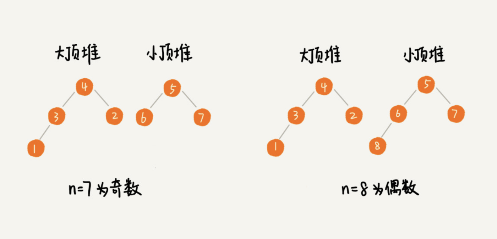
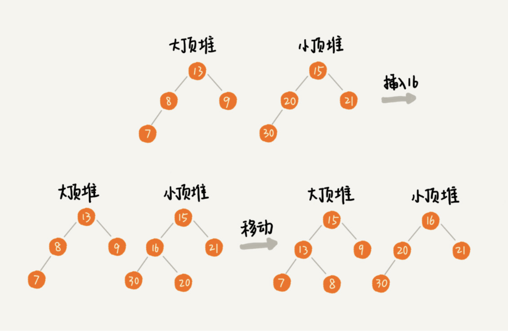

# 堆的应用三：求中位数和P99响应时间

## 求中位数

对于一组**静态数据**，中位数是固定的，我们可以先排序，第 n/2 个数据就是中位数。每次询问中位数的时候，我们直接返回这个固定的值就好了。所以，尽管排序的代价比较大，但是边际成本会很小。但是，如果我们面对的是**动态数据**集合，中位数在不停地变动，如果再用先排序的方法，每次询问中位数的时候，都要先进行排序，那效率就不高了。

**借助堆这种数据结构，我们不用排序，就可以非常高效地实现求中位数操作。我们来看看，它是如何做到的？**

我们需要维护两个堆，一个大顶堆，一个小顶堆。大顶堆中存储前半部分数据，小顶堆中存储后半部分数据，且小顶堆中的数据都大于大顶堆中的数据。

也就是说，如果有 n 个数据，n 是偶数，我们从小到大排序，那前 n/2 个数据存储在大顶堆中，后 n/2 个数据存储在小顶堆中。这样，大顶堆中的堆顶元素就是我们要找的中位数。如果 n 是奇数，情况是类似的，大顶堆就存储 n/2+1 个数据，小顶堆中就存储 n/2 个数据。

我们前面也提到，数据是动态变化的，当新添加一个数据的时候，我们如何调整两个堆，让大顶堆中的堆顶元素继续是中位数呢？

如果新加入的数据小于等于大顶堆的堆顶元素，我们就将这个新数据插入到大顶堆；如果新加入的数据大于等于小顶堆的堆顶元素，我们就将这个新数据插入到小顶堆。

这个时候就有可能出现，两个堆中的数据个数不符合前面约定的情况：如果 n 是偶数，两个堆中的数据个数都是 n/2；如果 n 是奇数，大顶堆有 n/2+1 个数据，小顶堆有 n/2 个数据。这个时候，我们可以从一个堆中不停地将堆顶元素移动到另一个堆，通过这样的调整，来让两个堆中的数据满足上面的约定。

于是，我们就可以利用两个堆，一个大顶堆、一个小顶堆，实现在动态数据集合中求中位数的操作。插入数据因为需要涉及堆化，所以时间复杂度变成了 O(logn)，但是求中位数我们只需要返回大顶堆的堆顶元素就可以了，所以时间复杂度就是 O(1)。

## 求接口99%响应时间

实际上，利用两个堆不仅可以快速求出中位数，还可以快速求其他百分位的数据，原理是类似的。还记得我们之前提到过的这个问题吗？“如何快速求接口的 99% 响应时间？”我们现在就来看下，利用两个堆如何来实现。

在开始这个问题的讲解之前，我先解释一下，什么是“99% 响应时间”。

中位数的概念就是将数据从小到大排列，处于中间位置，就叫中位数，这个数据会大于等于前面 50% 的数据。99 百分位数的概念可以类比中位数，如果将一组数据从小到大排列，这个 99 百分位数就是大于前面 99% 数据的那个数据。

我们维护两个堆，一个大顶堆，一个小顶堆。假设当前总数据的个数是 n，大顶堆中保存 n\*99% 个数据，小顶堆中保存 n\*1% 个数据。大顶堆堆顶的数据就是我们要找的 99% 响应时间。

每次插入一个数据的时候，我们要判断这个数据跟大顶堆和小顶堆堆顶数据的大小关系，然后决定插入到哪个堆中。如果这个新插入的数据比大顶堆的堆顶数据小，那就插入大顶堆；如果这个新插入的数据比小顶堆的堆顶数据大，那就插入小顶堆。

但是，为了保持大顶堆中的数据占 99%，小顶堆中的数据占 1%，在每次新插入数据之后，我们都要重新计算，这个时候大顶堆和小顶堆中的数据个数，是否还符合 99:1 这个比例。如果不符合，我们就将一个堆中的数据移动到另一个堆，直到满足这个比例。

通过这样的方法，每次插入数据，可能会涉及几个数据的堆化操作，所以时间复杂度是 O(logn)。每次求 99% 响应时间的时候，直接返回大顶堆中的堆顶数据即可，时间复杂度是 O(1)。