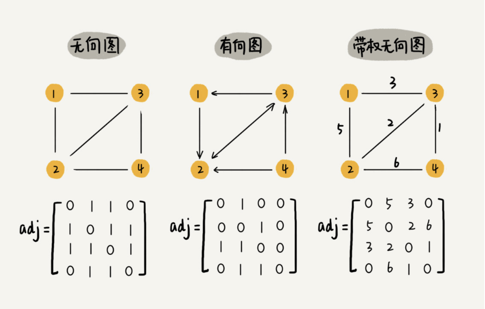

# 邻接矩阵存储方法

图最直观的一种存储方法就是，**邻接矩阵**（Adjacency Matrix）。

邻接矩阵的底层依赖一个二维数组。对于无向图来说，如果顶点 i 与顶点 j 之间有边，我们就将 A[i][j] 和 A[j][i] 标记为 1；对于有向图来说，如果顶点 i 到顶点 j 之间，有一条箭头从顶点 i 指向顶点 j 的边，那我们就将 A[i][j] 标记为 1。同理，如果有一条箭头从顶点 j 指向顶点 i 的边，我们就将 A[j][i] 标记为 1。对于带权图，数组中就存储相应的权重。

用邻接矩阵来表示一个图，虽然简单、直观，但是比较浪费存储空间。为什么这么说呢？

对于无向图来说，如果 A[i][j] 等于 1，那 A[j][i] 也肯定等于 1。实际上，我们只需要存储一个就可以了。也就是说，无向图的二维数组中，如果我们将其用对角线划分为上下两部分，那我们只需要利用上面或者下面这样一半的空间就足够了，另外一半白白浪费掉了。

还有，如果我们存储的是**稀疏图**（Sparse Matrix），也就是说，顶点很多，但每个顶点的边并不多，那邻接矩阵的存储方法就更加浪费空间了。比如微信有好几亿的用户，对应到图上就是好几亿的顶点。但是每个用户的好友并不会很多，一般也就三五百个而已。如果我们用邻接矩阵来存储，那绝大部分的存储空间都被浪费了。

但这也并不是说，邻接矩阵的存储方法就完全没有优点。首先，邻接矩阵的存储方式简单、直接，因为基于数组，所以在获取两个顶点的关系时，就非常高效。其次，用邻接矩阵存储图的另外一个好处是方便计算。这是因为，用邻接矩阵的方式存储图，可以将很多图的运算转换成矩阵之间的运算。比如求解最短路径问题时会提到一个[Floyd-Warshall 算法](https://zh.wikipedia.org/wiki/Floyd-Warshall算法)，就是利用矩阵循环相乘若干次得到结果。