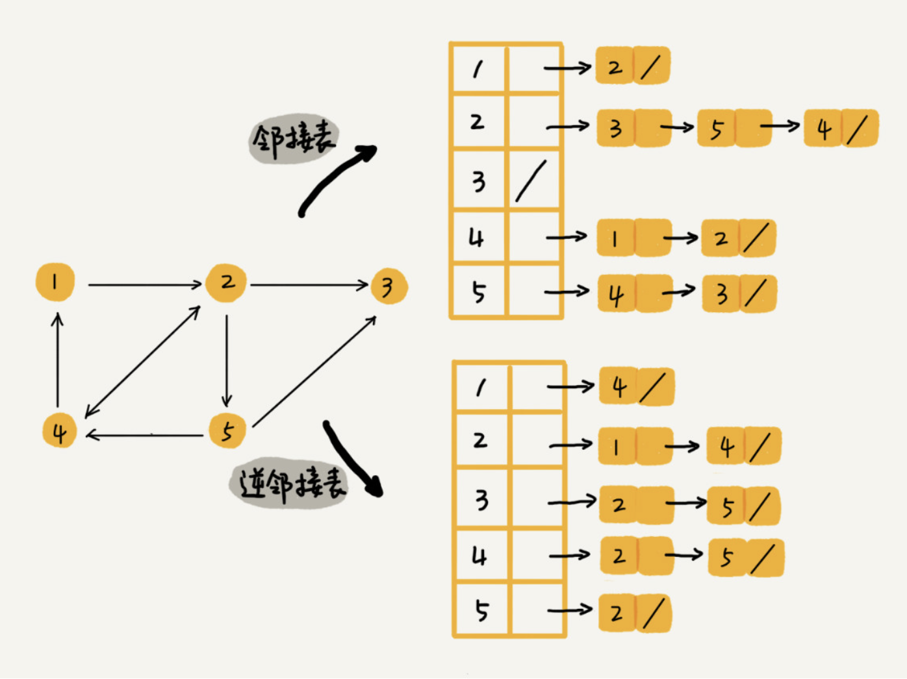
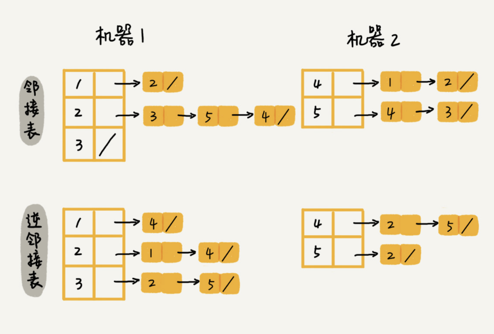
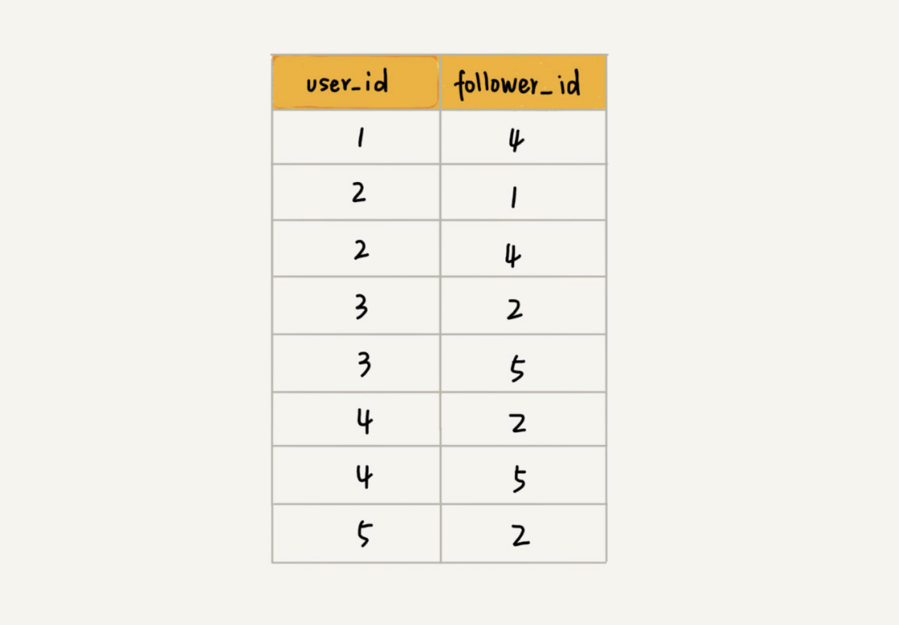

# 如何存储微博、微信的好友关系？

前面我们分析了，微博、微信是两种“图”，前者是有向图，后者是无向图。在这个问题上，两者的解决思路差不多，所以我只拿微博来讲解。

数据结构是为算法服务的，所以具体选择哪种存储方法，与期望支持的操作有关系。针对微博用户关系，假设我们需要支持下面这样几个操作：

- 判断用户 A 是否关注了用户 B；
- 判断用户 A 是否是用户 B 的粉丝；
- 用户 A 关注用户 B；
- 用户 A 取消关注用户 B；
- 根据用户名称的首字母排序，分页获取用户的粉丝列表；
- 根据用户名称的首字母排序，分页获取用户的关注列表。

关于如何存储一个图，前面我们讲到两种主要的存储方法，邻接矩阵和邻接表。因为社交网络是一张稀疏图，使用邻接矩阵存储比较浪费存储空间。所以，这里我们采用邻接表来存储。

不过，用一个邻接表来存储这种有向图是不够的。我们去查找某个用户关注了哪些用户非常容易，但是如果要想知道某个用户都被哪些用户关注了，也就是用户的粉丝列表，是非常困难的。

基于此，我们需要一个逆邻接表。邻接表中存储了用户的关注关系，逆邻接表中存储的是用户的被关注关系。对应到图上，邻接表中，每个顶点的链表中，存储的就是这个顶点指向的顶点，逆邻接表中，每个顶点的链表中，存储的是指向这个顶点的顶点。如果要查找某个用户关注了哪些用户，我们可以在邻接表中查找；如果要查找某个用户被哪些用户关注了，我们从逆邻接表中查找。

基础的邻接表不适合快速判断两个用户之间是否是关注与被关注的关系，所以我们选择改进版本，将邻接表中的链表改为支持快速查找的动态数据结构。选择哪种动态数据结构呢？红黑树、跳表、有序动态数组还是散列表呢？

因为我们需要按照用户名称的首字母排序，分页来获取用户的粉丝列表或者关注列表，用跳表这种结构再合适不过了。这是因为，跳表插入、删除、查找都非常高效，时间复杂度是 O(logn)，空间复杂度上稍高，是 O(n)。最重要的一点，跳表中存储的数据本来就是有序的了，分页获取粉丝列表或关注列表，就非常高效。

如果对于小规模的数据，比如社交网络中只有几万、几十万个用户，我们可以将整个社交关系存储在内存中，上面的解决思路是没有问题的。但是如果像微博那样有上亿的用户，数据规模太大，我们就无法全部存储在内存中了。这个时候该怎么办呢？

我们可以通过哈希算法等数据分片方式，将邻接表存储在不同的机器上。你可以看下面这幅图，我们在机器 1 上存储顶点 1，2，3 的邻接表，在机器 2 上，存储顶点 4，5 的邻接表。逆邻接表的处理方式也一样。当要查询顶点与顶点关系的时候，我们就利用同样的哈希算法，先定位顶点所在的机器，然后再在相应的机器上查找。

除此之外，我们还有另外一种解决思路，就是利用外部存储（比如硬盘），因为外部存储的存储空间要比内存会宽裕很多。数据库是我们经常用来持久化存储关系数据的，所以我这里介绍一种数据库的存储方式。

我用下面这张表来存储这样一个图。为了高效地支持前面定义的操作，我们可以在表上建立多个索引，比如第一列、第二列，给这两列都建立索引。

