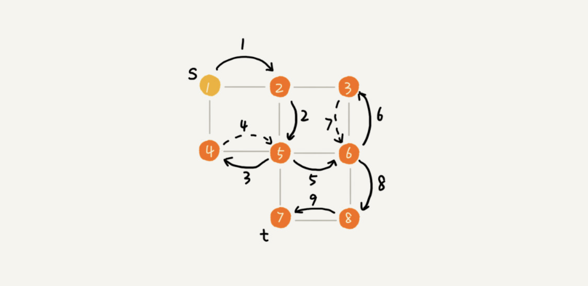

# 深度优先搜索

我们现在再来看下，如何在图中应用深度优先搜索，来找某个顶点到另一个顶点的路径。

你可以看我画的这幅图。搜索的起始顶点是 s，终止顶点是 t，我们希望在图中寻找一条从顶点 s 到顶点 t 的路径。如果映射到迷宫那个例子，s 就是你起始所在的位置，t 就是出口。

我用深度递归算法，把整个搜索的路径标记出来了。这里面实线箭头表示遍历，虚线箭头表示回退。从图中我们可以看出，深度优先搜索找出来的路径，并不是顶点 s 到顶点 t 的最短路径。



实际上，深度优先搜索用的是一种比较著名的算法思想，回溯思想。这种思想解决问题的过程，非常适合用递归来实现。

深度优先搜索代码实现也用到了 prev、visited 变量以及 print() 函数，它们跟广度优先搜索代码实现里的作用是一样的。不过，深度优先搜索代码实现里，有个比较特殊的变量 found，它的作用是，当我们已经找到终止顶点 t 之后，我们就不再递归地继续查找了。

```java
boolean found = false; // 全局变量或者类成员变量
 
public void dfs(int s, int t) {
  found = false;
  boolean[] visited = new boolean[v];
  int[] prev = new int[v];
  for (int i = 0; i < v; ++i) {
    prev[i] = -1;
  }
  recurDfs(s, t, visited, prev);
  print(prev, s, t);
}
 
private void recurDfs(int w, int t, boolean[] visited, int[] prev) {
  if (found == true) return;
  visited[w] = true;
  if (w == t) {
    found = true;
    return;
  }
  for (int i = 0; i < adj[w].size(); ++i) {
    int q = adj[w].get(i);
    if (!visited[q]) {
      prev[q] = w;
      recurDfs(q, t, visited, prev);
    }
  }
}
```

深度优先搜索算法的时间复杂度是 O(E)，E 表示边的个数。空间复杂度就是 O(V)，V 表示顶点的个数。